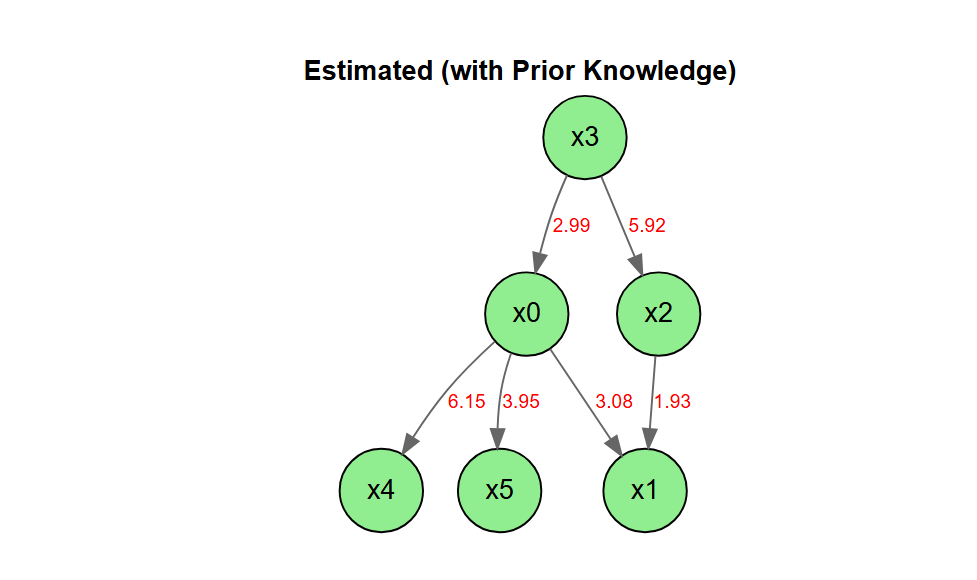

<!-- README.md is generated from README.Rmd. Please edit that file -->

# DirectLiNGAM

<!-- badges: start -->

[](https://lifecycle.r-lib.org/articles/stages.html)
<!-- badges: end -->

LiNGAM is a new method for estimating structural equation models or
linear Bayesian networks. It is based on using the non-Gaussianity of
the data.

This package is a port of the Python lingam package to R.

- [The LiNGAM Project](https://sites.google.com/view/sshimizu06/lingam)
- [lingam](https://github.com/cdt15/lingam)

`DirectLiNGAM` is a port to R of the
[LiNGAM](https://github.com/cdt15/lingam) package (LiNGAM: Linear
Non-Gaussian Acyclic Model), which is available in Python.

This is currently an alpha version under development, and we are
releasing it for the purpose of testing and gathering feedback.

## Features

- Implementation of the Direct LiNGAM algorithm
- Stability assessment of causal structures using the bootstrap method
- Visualization of estimation results using DiagrammeR

## Important Notes

- This package does not include all the features of the Python version.
- This package also includes features that are not present in the Python
  version.

## Installation

You can install the development version of DirectLiNGAM from
[GitHub](https://github.com/) with:

``` r
# install.packages("pak")
pak::pak("morimotoosamu/DirectLiNGAM")
```

## Requirements

- DiagrammeR

## Usage

### Sample Data

``` r
library(DirectLiNGAM)
data(LiNGAM_sample_1000)

m <- matrix(
  c(0.0, 0.0, 0.0, 3.0, 0.0, 0.0,
    3.0, 0.0, 2.0, 0.0, 0.0, 0.0,
    0.0, 0.0, 0.0, 6.0, 0.0, 0.0,
    0.0, 0.0, 0.0, 0.0, 0.0, 0.0,
    8.0, 0.0,-1.0, 0.0, 0.0, 0.0,
    4.0, 0.0, 0.0, 0.0, 0.0, 0.0),
  nrow = 6, byrow = TRUE
  )

colnames(m) <- rownames(m) <- colnames(LiNGAM_sample_1000)

m |>
  plot_adjacency_diagrammer(
  labels      = colnames(LiNGAM_sample_1000),
  graph_label = "True causal structure",
  rankdir     = "TB",
  shape       = "circle"
)
```


### Causal Discovery

``` r
model <- direct_lingam(LiNGAM_sample_1000)
```

### Causal Order

``` r
# index number
model$causal_order
#> [1] 4 1 3 2 5 6

# variable name
colnames(LiNGAM_sample_1000)[model$causal_order]
#> [1] "x3" "x0" "x2" "x1" "x4" "x5"
```

### Estimated Adjacency Matrix

``` r
B_hat <- model$adjacency_matrix
colnames(B_hat) <- rownames(B_hat) <- colnames(LiNGAM_sample_1000)
round(B_hat, 3)
#>       x0     x1     x2     x3     x4 x5
#> x0 0.000  0.000  0.000  2.994  0.000  0
#> x1 2.996  0.000  1.996 -0.022  0.000  0
#> x2 0.060  0.000  0.000  5.776  0.000  0
#> x3 0.000  0.000  0.000  0.000  0.000  0
#> x4 8.100 -0.033 -0.932 -0.056  0.000  0
#> x5 4.377 -0.057  0.084 -0.120 -0.022  0
```

### Plot The Estimated Causal Graph

Only paths with a coefficient of 0.5 or greater are being drawn.

``` r
B_hat |>
  plot_adjacency_diagrammer(
      threshold = 0.5,
      labels = colnames(LiNGAM_sample_1000),
      graph_label = "Estimated Causal Structure (Direct LiNGAM)",
      rankdir = "TB",
      shape = "ellipse",
      fillcolor = "lightgreen"
      )
```


### Calculating The Total Causal Effect

``` r
LiNGAM_sample_1000 |>
  estimate_all_total_effects(model) |>
  round(3)
#>       x0     x1     x2     x3     x4 x5
#> x0 0.000  0.000  0.000  2.994  0.000  0
#> x1 3.116  0.000  1.996 20.836  0.000  0
#> x2 0.060  0.000  0.000  5.957  0.000  0
#> x3 0.000  0.000  0.000  0.000  0.000  0
#> x4 7.941 -0.033 -0.997 17.957  0.000  0
#> x5 4.028 -0.056 -0.007 11.898 -0.022  0
```

### Inference Based On Prior Knowledge

#### Specify In The Index

- x3 is an exogenous variable.
- x1, x4, and x5 are sink_variables.

``` r
pk1 <- make_prior_knowledge(
  n_variables         = 6,
  exogenous_variables = 4,
  sink_variables = c(2, 5, 6)
)

pk1
#>      [,1] [,2] [,3] [,4] [,5] [,6]
#> [1,]   -1    0   -1   -1    0    0
#> [2,]   -1   -1   -1   -1    0    0
#> [3,]   -1    0   -1   -1    0    0
#> [4,]    0    0    0   -1    0    0
#> [5,]   -1    0   -1   -1   -1    0
#> [6,]   -1    0   -1   -1    0   -1
```

``` r
model_pk1 <- LiNGAM_sample_1000 |>
  direct_lingam(prior_knowledge = pk1)

cat("Causal Order: ", colnames(LiNGAM_sample_1000)[model_pk1$causal_order], "\n")
#> Causal Order:  x3 x0 x2 x1 x4 x5
```

``` r
B_pk <- model_pk1$adjacency_matrix
colnames(B_pk) <- rownames(B_pk) <- colnames(LiNGAM_sample_1000)
round(B_pk, 3)
#>       x0 x1     x2     x3 x4 x5
#> x0 0.000  0  0.000  2.994  0  0
#> x1 2.996  0  1.996 -0.022  0  0
#> x2 0.060  0  0.000  5.776  0  0
#> x3 0.000  0  0.000  0.000  0  0
#> x4 8.002  0 -0.997 -0.056  0  0
#> x5 4.028  0 -0.007 -0.118  0  0

plot_adjacency_diagrammer(
  B_pk,
  threshold = 0.5,
  labels      = colnames(LiNGAM_sample_1000),
  graph_label = "Estimated (with Prior Knowledge)",
  rankdir     = "TB",
  shape       = "circle",
  fillcolor   = "lightgreen"
)
```


#### Specify By Variable Name

- x3 is an exogenous variable.
- x1, x4, and x5 are sink_variables.
- There is a path from x3 to x0 and from x3 to x2.
- There is no path from x3 to x5.

``` r
pk2 <- make_prior_knowledge(
  n_variables         = 6,
  exogenous_variables = "x3",
  sink_variables = c("x1", "x4", "x5"),
  paths = list(c("x3", "x0"), c("x3", "x2")),
  no_paths = list(c("x3", "x5")),
  labels = c("x0", "x1", "x2", "x3", "x4", "x5")
)

pk2
#>    x0 x1 x2 x3 x4 x5
#> x0 -1  0 -1  1  0  0
#> x1 -1 -1 -1 -1  0  0
#> x2 -1  0 -1  1  0  0
#> x3  0  0  0 -1  0  0
#> x4 -1  0 -1 -1 -1  0
#> x5 -1  0 -1  0  0 -1
```

``` r
model_pk2 <- LiNGAM_sample_1000 |>
  direct_lingam(prior_knowledge = pk2)

cat("Causal Order: ", colnames(LiNGAM_sample_1000)[model_pk2$causal_order], "\n")
#> Causal Order:  x3 x0 x2 x1 x4 x5
```

``` r
B_pk <- model_pk2$adjacency_matrix
colnames(B_pk) <- rownames(B_pk) <- colnames(LiNGAM_sample_1000)
round(B_pk, 3)
#>       x0 x1     x2     x3 x4 x5
#> x0 0.000  0  0.000  2.994  0  0
#> x1 2.996  0  1.996 -0.022  0  0
#> x2 0.060  0  0.000  5.776  0  0
#> x3 0.000  0  0.000  0.000  0  0
#> x4 8.002  0 -0.997 -0.056  0  0
#> x5 4.021  0 -0.023  0.000  0  0

B_pk |>
  plot_adjacency_diagrammer(
    threshold = 0.5,
    labels      = colnames(LiNGAM_sample_1000),
    graph_label = "Estimated (with Prior Knowledge)",
    rankdir     = "TB",
    shape       = "circle",
    fillcolor   = "lightgreen"
)
```



### Independence between error variables

Calculation of the p-value (default: Spearman)

``` r
result <- LiNGAM_sample_1000 |>
  direct_lingam()

p_vals <- LiNGAM_sample_1000 |>
  get_error_independence_p_values(result)
round(p_vals, 3)
#>       x0    x1    x2    x3    x4    x5
#> x0    NA 0.962 0.984 0.976 0.977 0.952
#> x1 0.962    NA 0.998 0.988 0.997 0.966
#> x2 0.984 0.998    NA 0.958 0.966 0.998
#> x3 0.976 0.988 0.958    NA 0.970 0.902
#> x4 0.977 0.997 0.966 0.970    NA 0.995
#> x5 0.952 0.966 0.998 0.902 0.995    NA
```

Calculate using Kendall

``` r
p_vals_k <- LiNGAM_sample_1000 |>
  get_error_independence_p_values(result, method = "kendall")
round(p_vals_k, 3)
#>       x0    x1    x2    x3    x4    x5
#> x0    NA 0.969 0.982 0.963 0.971 0.964
#> x1 0.969    NA 0.984 0.986 0.996 0.948
#> x2 0.982 0.984    NA 0.920 0.996 0.995
#> x3 0.963 0.986 0.920    NA 0.983 0.898
#> x4 0.971 0.996 0.996 0.983    NA 0.998
#> x5 0.964 0.948 0.995 0.898 0.998    NA
```

## Licence

MIT License

Original work: Copyright (c) 2019 T.Ikeuchi, G.Haraoka, M.Ide,
W.Kurebayashi, S.Shimizu

Portions of this work: Copyright (c) 2026 O.Morimoto

## Feedback

Please submit bug reports and feature requests via GitHub Issues.
