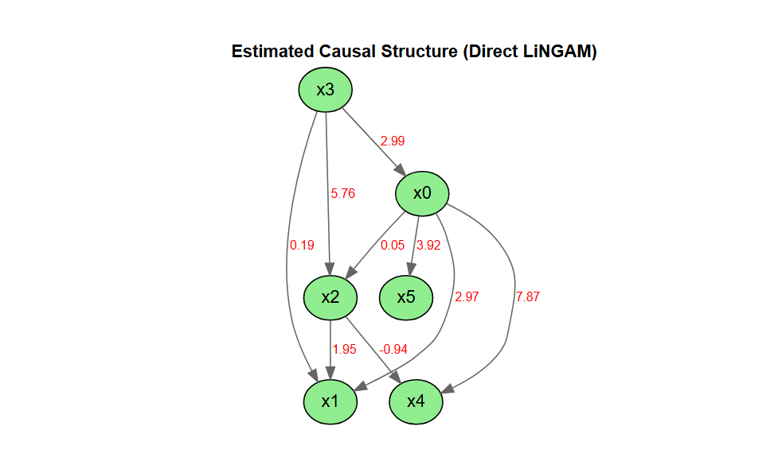
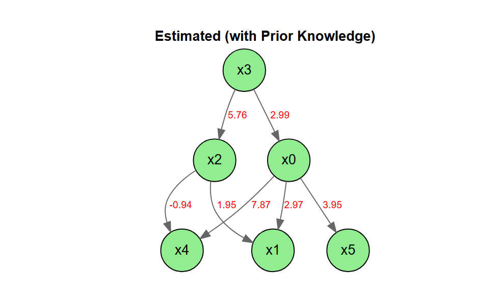
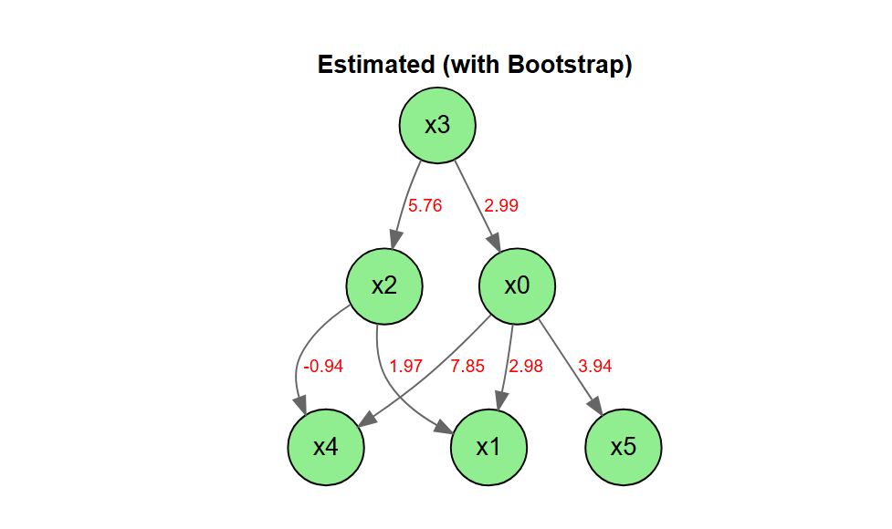
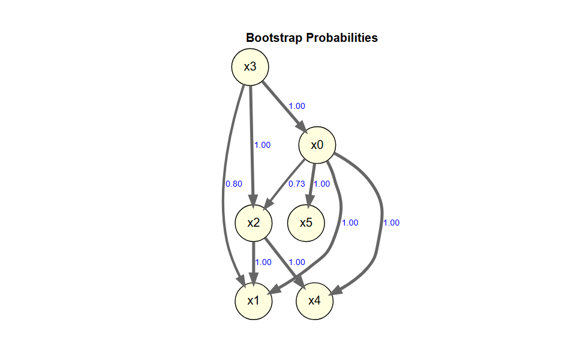

<!-- README.md is generated from README.Rmd. Please edit that file -->

# DirectLiNGAM

<!-- badges: start -->

[](https://lifecycle.r-lib.org/articles/stages.html)
<!-- badges: end -->

LiNGAM is a new method for estimating structural equation models or
linear Bayesian networks. It is based on using the non-Gaussianity of
the data.

This package is a port of the Python lingam package to R.

- [The LiNGAM Project](https://sites.google.com/view/sshimizu06/lingam)
- [lingam](https://github.com/cdt15/lingam)

`DirectLiNGAM` is a port to R of the
[LiNGAM](https://github.com/cdt15/lingam) package (LiNGAM: Linear
Non-Gaussian Acyclic Model), which is available in Python.

This is currently an alpha version under development, and we are
releasing it for the purpose of testing and gathering feedback.

## Features

- Implementation of the Direct LiNGAM algorithm
- Stability assessment of causal structures using the bootstrap method
- Visualization of estimation results using DiagrammeR

## Important Notes

- This package does not include all the features of the Python version.
- This package also includes features that are not present in the Python
  version.

## Installation

You can install the development version of DirectLiNGAM from
[GitHub](https://github.com/) with:

``` r
# install.packages("pak")
pak::pak("morimotoosamu/DirectLiNGAM")
```

## Requirements

- DiagrammeR
- glmnet

## Usage

### Sample Data

``` r
library(DirectLiNGAM)
data(LiNGAM_sample_1000)

m <- matrix(
  c(0.0, 0.0, 0.0, 3.0, 0.0, 0.0,
    3.0, 0.0, 2.0, 0.0, 0.0, 0.0,
    0.0, 0.0, 0.0, 6.0, 0.0, 0.0,
    0.0, 0.0, 0.0, 0.0, 0.0, 0.0,
    8.0, 0.0,-1.0, 0.0, 0.0, 0.0,
    4.0, 0.0, 0.0, 0.0, 0.0, 0.0),
  nrow = 6, byrow = TRUE
  )

colnames(m) <- rownames(m) <- colnames(LiNGAM_sample_1000)

m |>
  plot_adjacency_diagrammer(
  labels      = colnames(LiNGAM_sample_1000),
  graph_label = "True causal structure",
  rankdir     = "TB",
  shape       = "circle"
)
```


### Causal Discovery

独立性の評価はデフォルトでは相互情報量(mutual infomation)を用います。

HSIC(Hilbert-Schmidt Independence Criterion)を使いたい場合は引数で
`measure = "kernel"` を指定します。

係数の算出はデフォルトではLASSOを用い、ラムダの選択はAICcを用います。

``` r
model <- direct_lingam(LiNGAM_sample_1000)
```

### Causal Order

推定された因果の順序を確認します。

``` r
# index number
model$causal_order
#> [1] 4 1 3 2 5 6

# variable name
colnames(LiNGAM_sample_1000)[model$causal_order]
#> [1] "x3" "x0" "x2" "x1" "x4" "x5"
```

### Estimated Adjacency Matrix

推定された効果の量を確認します。

``` r
B_hat <- model$adjacency_matrix
colnames(B_hat) <- rownames(B_hat) <- colnames(LiNGAM_sample_1000)
round(B_hat, 3)
#>       x0 x1     x2    x3    x4 x5
#> x0 0.000  0  0.000 2.994 0.000  0
#> x1 2.970  0  1.951 0.192 0.000  0
#> x2 0.052  0  0.000 5.763 0.000  0
#> x3 0.000  0  0.000 0.000 0.000  0
#> x4 7.874  0 -0.940 0.000 0.000  0
#> x5 3.920  0  0.000 0.000 0.006  0
```

### Plot The Estimated Causal Graph

推定された隣接行列に基づいて、因果グラフを描きます。

余計なpath(x3 to x1, x0 to
x2)が推定されていますが、係数はとても小さいです。

Only paths with a coefficient of 0.5 or greater are being drawn.

``` r
B_hat |>
  plot_adjacency_diagrammer(
      labels = colnames(LiNGAM_sample_1000),
      graph_label = "Estimated Causal Structure (Direct LiNGAM)",
      rankdir = "TB",
      shape = "ellipse",
      fillcolor = "lightgreen"
      )
```



### Calculating The Total Causal Effect

推定されたすべての総合効果を算出します。

``` r
LiNGAM_sample_1000 |>
  estimate_all_total_effects(model) |>
  round(3)
#>       x0 x1     x2     x3    x4 x5
#> x0 0.000  0  0.000  2.994 0.000  0
#> x1 3.102  0  1.985 20.836 0.000  0
#> x2 0.056  0  0.000  5.957 0.000  0
#> x3 0.000  0  0.000  0.000 0.000  0
#> x4 7.804  0 -0.940 17.957 0.000  0
#> x5 3.954  0  0.000 11.898 0.024  0
```

### Inference Based On Prior Knowledge

事前知識を用いた実行例です。

#### Specify In The Index

- x3 is an exogenous variable.
- x1, x4, and x5 are sink_variables.

``` r
pk1 <- make_prior_knowledge(
  n_variables         = 6,
  exogenous_variables = 4,
  sink_variables = c(2, 5, 6)
)

pk1
#>      [,1] [,2] [,3] [,4] [,5] [,6]
#> [1,]   -1    0   -1   -1    0    0
#> [2,]   -1   -1   -1   -1    0    0
#> [3,]   -1    0   -1   -1    0    0
#> [4,]    0    0    0   -1    0    0
#> [5,]   -1    0   -1   -1   -1    0
#> [6,]   -1    0   -1   -1    0   -1
```

Direct LiNGAM を実行する際に、引数 `prior_knowledge`
に事前知識を指定します。

``` r
model_pk1 <- LiNGAM_sample_1000 |>
  direct_lingam(prior_knowledge = pk1)

cat("Causal Order: ", colnames(LiNGAM_sample_1000)[model_pk1$causal_order], "\n")
#> Causal Order:  x3 x0 x2 x1 x4 x5
```

結果の隣接行列に基づいて因果グラフを描きます。今度は真の因果構造に非常に近い結果が得られました

``` r
B_pk <- model_pk1$adjacency_matrix
colnames(B_pk) <- rownames(B_pk) <- colnames(LiNGAM_sample_1000)
round(B_pk, 3)
#>       x0 x1     x2    x3 x4 x5
#> x0 0.000  0  0.000 2.994  0  0
#> x1 2.970  0  1.951 0.192  0  0
#> x2 0.052  0  0.000 5.763  0  0
#> x3 0.000  0  0.000 0.000  0  0
#> x4 7.874  0 -0.940 0.000  0  0
#> x5 3.954  0  0.000 0.000  0  0

plot_adjacency_diagrammer(
  B_pk,
  threshold = 0.5,
  labels      = colnames(LiNGAM_sample_1000),
  graph_label = "Estimated (with Prior Knowledge)",
  rankdir     = "TB",
  shape       = "circle",
  fillcolor   = "lightgreen"
)
```



### Independence between error variables

Calculation of the p-value (default: Spearman)

``` r
result <- LiNGAM_sample_1000 |>
  direct_lingam()

p_vals <- LiNGAM_sample_1000 |>
  get_error_independence_p_values(result)
round(p_vals, 3)
#>       x0    x1    x2    x3    x4    x5
#> x0    NA 0.458 0.766 0.976 0.000 0.046
#> x1 0.458    NA 0.150 0.000 0.279 0.164
#> x2 0.766 0.150    NA 0.273 0.077 0.990
#> x3 0.976 0.000 0.273    NA 0.635 0.080
#> x4 0.000 0.279 0.077 0.635    NA 0.575
#> x5 0.046 0.164 0.990 0.080 0.575    NA
```

### Bootstrap Direct LiNGAM

``` r
bs_model <- LiNGAM_sample_1000 |>
  bootstrap_lingam(n_sampling = 30L, seed = 42)
#> Bootstrap: 30 iterations, method=lasso
#>   iteration 1 / 30
#>   iteration 10 / 30
#>   iteration 20 / 30
#>   iteration 30 / 30
#> Completed in 8.4 seconds.
```

``` r
bs_model
#> BootstrapResult: 30 samplings, 6 features
```

ブートストラップの結果

係数

``` r
bs_model |>
  get_causal_direction_counts(labels = names(LiNGAM_sample_1000))
#>    from to count proportion  mean_effect median_effect   sd_effect
#> 1     1  2    30 1.00000000  2.973715308   2.977065196 0.025463914
#> 2     1  5    30 1.00000000  7.830171466   7.853288797 0.074895133
#> 3     1  6    30 1.00000000  3.924455210   3.942078556 0.048796338
#> 4     3  2    30 1.00000000  1.959182997   1.969840069 0.026104314
#> 5     3  5    30 1.00000000 -0.938503738  -0.938447357 0.015511022
#> 6     4  1    30 1.00000000  2.990307232   2.993976045 0.028665229
#> 7     4  3    30 1.00000000  5.747522456   5.756637473 0.090094084
#> 8     4  2    24 0.80000000  0.158534129   0.120231948 0.136485993
#> 9     1  3    22 0.73333333  0.058453357   0.063943661 0.022194228
#> 10    6  5    14 0.46666667  0.022242402   0.008877478 0.024617750
#> 11    5  6    12 0.40000000  0.011937721   0.010036025 0.007362506
#> 12    6  3     3 0.10000000  0.017986872   0.013178288 0.014496182
#> 13    6  2     2 0.06666667  0.002001541   0.002001541 0.002120645
#>         ci_lower     ci_upper from_name to_name
#> 1   2.935756e+00  3.019636706        x0      x1
#> 2   7.640998e+00  7.911689069        x0      x4
#> 3   3.800512e+00  3.975075301        x0      x5
#> 4   1.905172e+00  1.989865233        x2      x1
#> 5  -9.667722e-01 -0.908993637        x2      x4
#> 6   2.927646e+00  3.032869969        x3      x0
#> 7   5.570001e+00  5.887032132        x3      x2
#> 8   1.083173e-02  0.428662586        x3      x1
#> 9   2.009557e-02  0.098143307        x0      x2
#> 10  9.925136e-05  0.065113735        x5      x4
#> 11  4.153843e-03  0.027681109        x4      x5
#> 12  6.839627e-03  0.033221415        x5      x2
#> 13  5.769942e-04  0.003426087        x5      x1
```

平均因果効果の隣接行列

``` r
bs_adjacency_matrix <- bs_model |>
  get_adjacency_matrix_summary(stat = "median")

bs_adjacency_matrix |>
  round(3)
#>       [,1] [,2]   [,3]  [,4] [,5]  [,6]
#> [1,] 0.000    0  0.000 2.994 0.00 0.000
#> [2,] 2.977    0  1.970 0.120 0.00 0.002
#> [3,] 0.064    0  0.000 5.757 0.00 0.013
#> [4,] 0.000    0  0.000 0.000 0.00 0.000
#> [5,] 7.853    0 -0.938 0.000 0.00 0.009
#> [6,] 3.942    0  0.000 0.000 0.01 0.000
```

係数の可視化（係数0.5以上のパスを描画）

``` r
bs_adjacency_matrix |>
  plot_adjacency_diagrammer(
    threshold = 0.5,
    labels      = colnames(LiNGAM_sample_1000),
    graph_label = "Estimated (with Bootstrap)",
    rankdir     = "TB",
    shape       = "circle",
    fillcolor   = "lightgreen"
    )
```



ブートストラップ確率の行列

``` r
bs_model |>
  get_probabilities() 
#>           [,1] [,2] [,3] [,4] [,5]       [,6]
#> [1,] 0.0000000    0    0  1.0  0.0 0.00000000
#> [2,] 1.0000000    0    1  0.8  0.0 0.06666667
#> [3,] 0.7333333    0    0  1.0  0.0 0.10000000
#> [4,] 0.0000000    0    0  0.0  0.0 0.00000000
#> [5,] 1.0000000    0    1  0.0  0.0 0.46666667
#> [6,] 1.0000000    0    0  0.0  0.4 0.00000000
```

平均総合効果

``` r
bs_model |>
  get_total_causal_effects()
#>    from to       effect probability
#> 1     1  2  3.118805812  1.00000000
#> 2     1  5  7.804692177  1.00000000
#> 3     1  6  3.956184583  1.00000000
#> 4     3  2  1.987827389  1.00000000
#> 5     4  1  2.993976045  1.00000000
#> 6     4  2 20.804708031  1.00000000
#> 7     4  3  5.951748073  1.00000000
#> 8     4  5 17.970266627  1.00000000
#> 9     4  6 11.899558201  1.00000000
#> 10    1  3  0.068929588  0.90000000
#> 11    3  5 -0.934002972  0.80000000
#> 12    6  5  0.136979641  0.53333333
#> 13    5  6  0.030563285  0.46666667
#> 14    3  6  0.051333262  0.16666667
#> 15    6  2  0.012482999  0.10000000
#> 16    6  3  0.025401185  0.06666667
#> 17    2  6  0.002689721  0.03333333
```

bootstrapの結果を因果グラフに

デフォルトでは50%以上出現しているパスを表示

``` r
bs_model |>
  plot_bootstrap_probabilities()
```



## Licence

MIT License

Original work: Copyright (c) 2019 T.Ikeuchi, G.Haraoka, M.Ide,
W.Kurebayashi, S.Shimizu

Portions of this work: Copyright (c) 2026 O.Morimoto

## Feedback

Please submit bug reports and feature requests via GitHub Issues.
