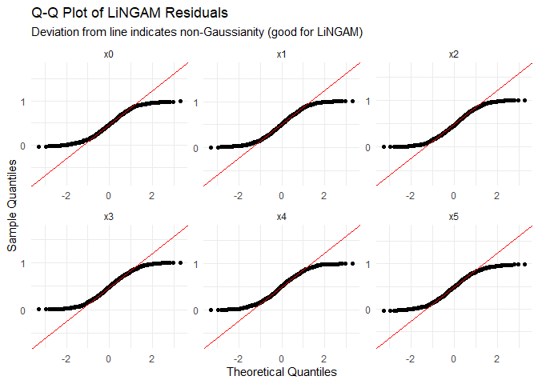
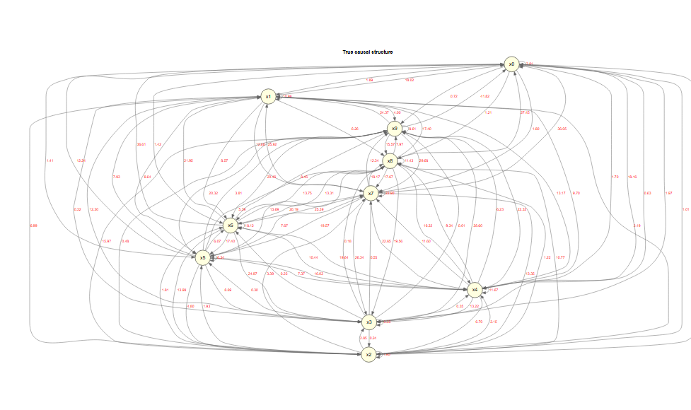

<!-- README.md is generated from README.Rmd. Please edit that file -->

# DirectLiNGAM

<!-- badges: start -->

[](https://lifecycle.r-lib.org/articles/stages.html)
<!-- badges: end -->

LiNGAM is a new method for estimating structural equation models or
linear Bayesian networks. It is based on using the non-Gaussianity of
the data.

This package is a port of the Python lingam package to R.

- [The LiNGAM Project](https://sites.google.com/view/sshimizu06/lingam)
- [lingam](https://github.com/cdt15/lingam)

`DirectLiNGAM` is a port to R of the
[LiNGAM](https://github.com/cdt15/lingam) package (LiNGAM: Linear
Non-Gaussian Acyclic Model), which is available in Python.

This is currently an alpha version under development, and we are
releasing it for the purpose of testing and gathering feedback.

## Features

- Implementation of the Direct LiNGAM algorithm
- Stability assessment of causal structures using the bootstrap method
- Visualization of estimation results using DiagrammeR

## Important Notes

- This package does not include all the features of the Python version.
- This package also includes features that are not present in the Python
  version.

## Installation

You can install the development version of DirectLiNGAM from
[GitHub](https://github.com/) with:

``` r
# install.packages("pak")
pak::pak("morimotoosamu/DirectLiNGAM")
```

## Requirements

- DiagrammeR
- glmnet

## Usage

``` r
library(DirectLiNGAM)
```

### Sample Data

``` r
x1k <- generate_lingam_sample_6(n = 1000)

x1k$true_adjacency |>
  plot_adjacency_diagrammer(
  labels  = colnames(x1k$data),
  title   = "True causal structure",
  rankdir = "TB",
  shape   = "circle"
)
```


### Causal Discovery

独立性の評価はデフォルトでは相互情報量(mutual infomation)を用います。

パス係数の算出には適応的LASSO回帰が使われます。

``` r
model <- x1k$data |> direct_lingam()
```

### Causal Order

推定された因果の順序を確認します。

``` r
# index number
model$causal_order
#> [1] 4 3 1 5 6 2

# variable name
colnames(x1k$data)[model$causal_order]
#> [1] "x3" "x2" "x0" "x4" "x5" "x1"
```

### Estimated Adjacency Matrix

推定された効果の量を確認します。

``` r
round(model$adjacency_matrix, 3)
#>       x0 x1     x2    x3 x4 x5
#> x0 0.000  0  0.000 3.033  0  0
#> x1 2.988  0  2.002 0.000  0  0
#> x2 0.000  0  0.000 5.993  0  0
#> x3 0.000  0  0.000 0.000  0  0
#> x4 8.017  0 -1.009 0.000  0  0
#> x5 4.015  0  0.000 0.000  0  0
```

### Plot The Estimated Causal Graph

推定された隣接行列に基づいて、因果グラフを描きます。

``` r
model$adjacency_matrix |>
  plot_adjacency_diagrammer(
      labels = colnames(model$adjacency_matrix),
      title = "Estimated Causal Structure (Direct LiNGAM)",
      rankdir = "TB",
      shape = "ellipse",
      fillcolor = "lightgreen"
      )
```


### Calculating The Total Causal Effect

推定されたすべての総合効果を算出します。

``` r
x1k$data |>
  estimate_all_total_effects(model) |>
  round(3)
#>       x0 x1     x2     x3    x4    x5
#> x0 0.000  0  0.000  3.033 0.000 0.000
#> x1 2.909  0  1.889 21.059 0.000 0.155
#> x2 0.000  0  0.000  5.993 0.000 0.000
#> x3 0.000  0  0.000  0.000 0.000 0.000
#> x4 8.001  0 -1.309 18.276 0.000 0.000
#> x5 4.014  0  0.000 12.179 0.003 0.000
```

### Inference Based On Prior Knowledge

事前知識を用いた実行例です。

#### Specify In The Index

- 変数の数は6個
- x3 is an exogenous variable.
- x1, x4, and x5 are sink_variables.
- x0 to x2 are no path.

``` r
pk1 <- make_prior_knowledge(
  n_variables         = 6,
  exogenous_variables = 4,
  sink_variables = c(2, 5, 6),
  no_paths = list(c(3, 1), c(1, 3))
)

pk1
#>      [,1] [,2] [,3] [,4] [,5] [,6]
#> [1,]   -1    0    0   -1    0    0
#> [2,]   -1   -1   -1   -1    0    0
#> [3,]    0    0   -1   -1    0    0
#> [4,]    0    0    0   -1    0    0
#> [5,]   -1    0   -1   -1   -1    0
#> [6,]   -1    0   -1   -1    0   -1
```

Direct LiNGAM を実行する際に、引数 `prior_knowledge`
に事前知識を指定します。

``` r
model_pk1 <- x1k$data |>
  direct_lingam(prior_knowledge = pk1, lambda = "BIC")

cat("Causal Order: ", colnames(x1k$data)[model_pk1$causal_order], "\n")
#> Causal Order:  x3 x2 x0 x4 x5 x1
```

結果の隣接行列に基づいて因果グラフを描きます。

``` r
round(model_pk1$adjacency_matrix, 3)
#>       x0 x1     x2    x3 x4 x5
#> x0 0.000  0  0.000 3.033  0  0
#> x1 2.988  0  2.002 0.000  0  0
#> x2 0.000  0  0.000 5.993  0  0
#> x3 0.000  0  0.000 0.000  0  0
#> x4 8.017  0 -1.009 0.000  0  0
#> x5 4.015  0  0.000 0.000  0  0

model_pk1$adjacency_matrix |>
  plot_adjacency_diagrammer(
    labels      = colnames(model_pk1$adjacency_matrix),
    title = "Estimated (with Prior Knowledge)",
    rankdir     = "TB",
    shape       = "circle",
    fillcolor   = "lightgreen"
    )
```


### Independence between error variables

LiNGAMでは残差が独立であることを仮定している。

get_error_independence_p_values関数は残差間の独立性の検定のp値を返す。

Calculation of the p-value (default: Spearman)

``` r
result <- x1k$data |>
  direct_lingam()

p_vals <- x1k$data |>
  get_error_independence_p_values(result)

round(p_vals, 3)
#>       x0    x1    x2    x3    x4    x5
#> x0    NA 0.988 0.214 0.976 0.484 0.954
#> x1 0.988    NA 0.986 0.991 0.323 0.882
#> x2 0.214 0.986    NA 0.919 0.100 0.124
#> x3 0.976 0.991 0.919    NA 0.806 0.974
#> x4 0.484 0.323 0.100 0.806    NA 0.643
#> x5 0.954 0.882 0.124 0.974 0.643    NA
```

### 正規性の検定

残差の正規性の検定を行う

``` r
# Shapiro-Wilk (default)
x1k$data |>
  test_residual_normality(result)
#> === Residual Normality Test ===
#> Method:         shapiro
#> Sample size:    1000
#> Significance:   0.050
#> Non-Gaussian:   6 / 6 variables
#> 
#>  variable statistic   p_value is_non_gauss skewness kurtosis
#>        x0    0.9516 < 2.2e-16         TRUE    0.061   -1.215
#>        x1    0.9521 < 2.2e-16         TRUE    0.026   -1.213
#>        x2    0.9557 < 2.2e-16         TRUE    0.083   -1.170
#>        x3    0.9578  2.25e-16         TRUE    0.025   -1.163
#>        x4    0.9546 < 2.2e-16         TRUE   -0.003   -1.205
#>        x5    0.9536 < 2.2e-16         TRUE   -0.052   -1.206
#> 
#> Interpretation:
#>   is_non_gauss = TRUE  -> rejects normality (supports LiNGAM assumption)
#>   is_non_gauss = FALSE -> cannot reject normality (LiNGAM may not fit)
#> 
#> All residuals are non-Gaussian. LiNGAM assumption is supported.
```

QQプロットでも残差の正規性を確認する

``` r
x1k$data |>
  plot_residual_qq(result)
```



### Bootstrap Direct LiNGAM

``` r
bs_model <- x1k$data |>
  bootstrap_lingam(n_sampling = 30L, seed = 42)
#> Bootstrap: 30 iterations, method=adaptive_lasso
#>   iteration 1 / 30
#>   iteration 10 / 30
#>   iteration 20 / 30
#>   iteration 30 / 30
#> Completed in 6.1 seconds.

bs_model
#> BootstrapResult: 30 samplings, 6 features
```

係数

``` r
bs_model |>
  get_causal_direction_counts(labels = names(x1k$data))
#>    from to count proportion mean_effect median_effect   sd_effect    ci_lower
#> 1     1  6    30 1.00000000  4.02010918    4.01886128 0.009510235  4.00298581
#> 2     1  2    29 0.96666667  2.98872289    2.98691378 0.029595289  2.94808621
#> 3     1  5    29 0.96666667  8.02805949    8.03049041 0.030493711  7.97909377
#> 4     3  2    29 0.96666667  2.00133847    2.00270222 0.015820048  1.97089548
#> 5     3  5    29 0.96666667 -1.01545079   -1.01650518 0.015564566 -1.03972182
#> 6     4  1    29 0.96666667  3.03159775    3.03291869 0.035791478  2.96698487
#> 7     4  3    29 0.96666667  6.00046795    6.00363746 0.031652501  5.94254816
#> 8     2  1     1 0.03333333  0.05299398    0.05299398 0.000000000  0.05299398
#> 9     2  3     1 0.03333333  0.40422428    0.40422428 0.000000000  0.40422428
#> 10    2  5     1 0.03333333  0.90679690    0.90679690 0.000000000  0.90679690
#> 11    3  4     1 0.03333333  0.16165370    0.16165370 0.000000000  0.16165370
#> 12    5  1     1 0.03333333  0.10459193    0.10459193 0.000000000  0.10459193
#> 13    5  3     1 0.03333333 -0.13879324   -0.13879324 0.000000000 -0.13879324
#>       ci_upper from_name to_name
#> 1   4.03756004        x0      x5
#> 2   3.04468103        x0      x1
#> 3   8.08567538        x0      x4
#> 4   2.02581141        x2      x1
#> 5  -0.98775234        x2      x4
#> 6   3.09090167        x3      x0
#> 7   6.05479799        x3      x2
#> 8   0.05299398        x1      x0
#> 9   0.40422428        x1      x2
#> 10  0.90679690        x1      x4
#> 11  0.16165370        x2      x3
#> 12  0.10459193        x4      x0
#> 13 -0.13879324        x4      x2
```

平均因果効果の隣接行列

``` r
bs_adjacency_matrix <- bs_model |>
  get_adjacency_matrix_summary(stat = "median")

bs_adjacency_matrix |>
  round(3)
#>       [,1]  [,2]   [,3]  [,4]   [,5] [,6]
#> [1,] 0.000 0.053  0.000 3.033  0.105    0
#> [2,] 2.987 0.000  2.003 0.000  0.000    0
#> [3,] 0.000 0.404  0.000 6.004 -0.139    0
#> [4,] 0.000 0.000  0.162 0.000  0.000    0
#> [5,] 8.030 0.907 -1.017 0.000  0.000    0
#> [6,] 4.019 0.000  0.000 0.000  0.000    0
```

係数の可視化（係数0.5以上のパスを描画）

``` r
bs_adjacency_matrix |>
  plot_adjacency_diagrammer(
    threshold = 0.5,
    labels      = colnames(x1k$data),
    title = "Estimated (with Bootstrap)",
    rankdir     = "TB",
    shape       = "circle",
    fillcolor   = "lightgreen"
    )
```


ブートストラップ確率の行列

``` r
bs_model |>
  get_probabilities() 
#>           [,1]       [,2]       [,3]      [,4]       [,5] [,6]
#> [1,] 0.0000000 0.03333333 0.00000000 0.9666667 0.03333333    0
#> [2,] 0.9666667 0.00000000 0.96666667 0.0000000 0.00000000    0
#> [3,] 0.0000000 0.03333333 0.00000000 0.9666667 0.03333333    0
#> [4,] 0.0000000 0.00000000 0.03333333 0.0000000 0.00000000    0
#> [5,] 0.9666667 0.03333333 0.96666667 0.0000000 0.00000000    0
#> [6,] 1.0000000 0.00000000 0.00000000 0.0000000 0.00000000    0
```

平均総合効果

``` r
bs_model |>
  get_total_causal_effects()
#>    from to      effect probability
#> 1     1  6  4.01907390  1.00000000
#> 2     1  2  2.93210481  0.96666667
#> 3     1  5  8.00575712  0.96666667
#> 4     3  2  1.94023398  0.96666667
#> 5     3  5 -1.18014784  0.96666667
#> 6     4  1  3.03291869  0.96666667
#> 7     4  2 21.05796205  0.96666667
#> 8     4  3  6.00363746  0.96666667
#> 9     4  5 18.27768167  0.96666667
#> 10    4  6 12.18492785  0.96666667
#> 11    6  2  0.19623886  0.06666667
#> 12    2  1  0.14794503  0.03333333
#> 13    2  3  0.27850920  0.03333333
#> 14    2  4  0.04611007  0.03333333
#> 15    2  5  0.90679690  0.03333333
#> 16    2  6  0.59359217  0.03333333
#> 17    3  4  0.16191585  0.03333333
#> 18    3  6 -0.35827083  0.03333333
#> 19    5  1  0.10506715  0.03333333
#> 20    5  3 -0.13869103  0.03333333
#> 21    5  6  0.41846402  0.03333333
```

bootstrapの結果を因果グラフに

デフォルトでは50%以上出現しているパスを表示

``` r
bs_model |>
  plot_bootstrap_probabilities()
```


### sample data 10変数

大きめのデータセット。10変数、1万行。

``` r
x10k <- generate_lingam_sample_10(n = 10000)

x10k$data |>
  plot_adjacency_diagrammer(
  labels  = colnames(x10k$data),
  title   = "True causal structure",
  rankdir = "TB",
  shape   = "circle"
)
```



## Licence

MIT License

Original work: Copyright (c) 2019 T.Ikeuchi, G.Haraoka, M.Ide,
W.Kurebayashi, S.Shimizu

Portions of this work: Copyright (c) 2026 O.Morimoto

## References

### Algorithm

- Shimizu, S. et al. (2011). DirectLiNGAM: A direct method for learning
  a linear non-Gaussian structural equation model. *Journal of Machine
  Learning Research*, 12, 1225-1248. \### Original Implementation
  (Python)
- Ikeuchi, T. et al. (2023). Python package for LiNGAM algorithms.
  *Journal of Machine Learning Research*, 24(14), 1-7.  
  <https://github.com/cdt15/lingam> \### Books
- 清水昌平(2017)『統計的因果探索』講談社.
- 梅津佑太・西村龍映・上田勇祐(2020)『スパース回帰分析とパターン認識』講談社.
- 鈴木譲(2025)『グラフィカルモデルと因果探索100問 with R』共立出版. \###
  R Packages Referenced
- G. Kikuchi (2020). rlingam <https://github.com/gkikuchi/rlingam>

## Feedback

Please submit bug reports and feature requests via GitHub Issues.
