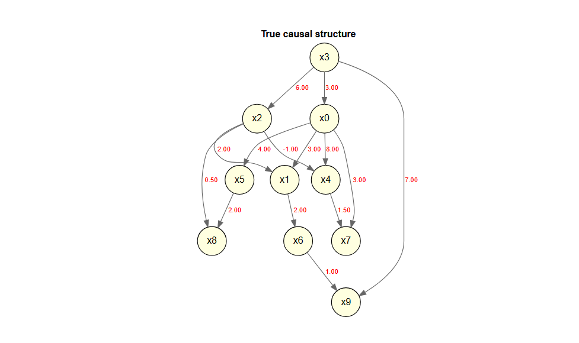

<!-- README.md is generated from README.Rmd. Please edit that file -->

# DirectLiNGAM

<!-- badges: start -->

[](https://lifecycle.r-lib.org/articles/stages.html)
<!-- badges: end -->

LiNGAM is a new method for estimating structural equation models or
linear Bayesian networks. It is based on using the non-Gaussianity of
the data.

This package is a port of the Python lingam package to R.

- [The LiNGAM Project](https://sites.google.com/view/sshimizu06/lingam)
- [lingam](https://github.com/cdt15/lingam)

`DirectLiNGAM` is a port to R of the
[LiNGAM](https://github.com/cdt15/lingam) package (LiNGAM: Linear
Non-Gaussian Acyclic Model), which is available in Python.

This is currently an alpha version under development, and we are
releasing it for the purpose of testing and gathering feedback.

## Features

- Implementation of the Direct LiNGAM algorithm
- Stability assessment of causal structures using the bootstrap method
- Visualization of estimation results using DiagrammeR

## Important Notes

- This package does not include all the features of the Python version.
- This package also includes features that are not present in the Python
  version.

## Installation

You can install the development version of DirectLiNGAM from
[GitHub](https://github.com/) with:

``` r
# install.packages("pak")
pak::pak("morimotoosamu/DirectLiNGAM")
```

## Requirements

- DiagrammeR
- glmnet

## Usage

### Sample Data

``` r
library(DirectLiNGAM)
data(LiNGAM_sample_1000)

m <- matrix(
  c(0.0, 0.0, 0.0, 3.0, 0.0, 0.0,
    3.0, 0.0, 2.0, 0.0, 0.0, 0.0,
    0.0, 0.0, 0.0, 6.0, 0.0, 0.0,
    0.0, 0.0, 0.0, 0.0, 0.0, 0.0,
    8.0, 0.0,-1.0, 0.0, 0.0, 0.0,
    4.0, 0.0, 0.0, 0.0, 0.0, 0.0),
  nrow = 6, byrow = TRUE
  )

colnames(m) <- rownames(m) <- colnames(LiNGAM_sample_1000)

m |>
  plot_adjacency_diagrammer(
  labels      = colnames(LiNGAM_sample_1000),
  title = "True causal structure",
  rankdir     = "TB",
  shape       = "circle"
)
```


### Causal Discovery

独立性の評価はデフォルトでは相互情報量(mutual infomation)を用います。

HSIC(Hilbert-Schmidt Independence Criterion)を使いたい場合は引数で
`measure = "kernel"` を指定します。

係数の算出はデフォルトではLASSOを用い、ラムダの選択はAICを用います。

``` r
model <- direct_lingam(LiNGAM_sample_1000)
```

### Causal Order

推定された因果の順序を確認します。

``` r
# index number
model$causal_order
#> [1] 4 1 3 2 5 6

# variable name
colnames(LiNGAM_sample_1000)[model$causal_order]
#> [1] "x3" "x0" "x2" "x1" "x4" "x5"
```

### Estimated Adjacency Matrix

推定された効果の量を確認します。

``` r
B_hat <- model$adjacency_matrix
colnames(B_hat) <- rownames(B_hat) <- colnames(LiNGAM_sample_1000)
round(B_hat, 3)
#>       x0     x1     x2    x3 x4 x5
#> x0 0.000  0.000  0.000 2.994  0  0
#> x1 2.995  0.000  1.993 0.000  0  0
#> x2 0.037  0.000  0.000 5.846  0  0
#> x3 0.000  0.000  0.000 0.000  0  0
#> x4 7.998  0.000 -1.004 0.000  0  0
#> x5 4.037 -0.009  0.000 0.000  0  0
```

### Plot The Estimated Causal Graph

推定された隣接行列に基づいて、因果グラフを描きます。

余計なpath(x3 to x1, x0 to
x2)が推定されていますが、係数はとても小さいです。

Only paths with a coefficient of 0.5 or greater are being drawn.

``` r
B_hat |>
  plot_adjacency_diagrammer(
      labels = colnames(LiNGAM_sample_1000),
      title = "Estimated Causal Structure (Direct LiNGAM)",
      rankdir = "TB",
      shape = "ellipse",
      fillcolor = "lightgreen"
      )
```


### Calculating The Total Causal Effect

推定されたすべての総合効果を算出します。

``` r
LiNGAM_sample_1000 |>
  estimate_all_total_effects(model) |>
  round(3)
#>       x0 x1     x2     x3    x4 x5
#> x0 0.000  0  0.000  2.994 0.000  0
#> x1 3.116  0  1.993 20.836 0.000  0
#> x2 0.058  0  0.000  5.957 0.000  0
#> x3 0.000  0  0.000  0.000 0.000  0
#> x4 7.908  0 -0.961 17.957 0.000  0
#> x5 3.977  0  0.000 11.898 0.021  0
```

### Inference Based On Prior Knowledge

事前知識を用いた実行例です。

#### Specify In The Index

- x3 is an exogenous variable.
- x1, x4, and x5 are sink_variables.

``` r
pk1 <- make_prior_knowledge(
  n_variables         = 6,
  exogenous_variables = 4,
  sink_variables = c(2, 5, 6)
)

pk1
#>      [,1] [,2] [,3] [,4] [,5] [,6]
#> [1,]   -1    0   -1   -1    0    0
#> [2,]   -1   -1   -1   -1    0    0
#> [3,]   -1    0   -1   -1    0    0
#> [4,]    0    0    0   -1    0    0
#> [5,]   -1    0   -1   -1   -1    0
#> [6,]   -1    0   -1   -1    0   -1
```

Direct LiNGAM を実行する際に、引数 `prior_knowledge`
に事前知識を指定します。

``` r
model_pk1 <- LiNGAM_sample_1000 |>
  direct_lingam(prior_knowledge = pk1)

cat("Causal Order: ", colnames(LiNGAM_sample_1000)[model_pk1$causal_order], "\n")
#> Causal Order:  x3 x0 x2 x1 x4 x5
```

結果の隣接行列に基づいて因果グラフを描きます。今度は真の因果構造に非常に近い結果が得られました

``` r
B_pk <- model_pk1$adjacency_matrix
colnames(B_pk) <- rownames(B_pk) <- colnames(LiNGAM_sample_1000)
round(B_pk, 3)
#>       x0 x1     x2     x3 x4 x5
#> x0 0.000  0  0.000  2.994  0  0
#> x1 2.995  0  1.993  0.000  0  0
#> x2 0.037  0  0.000  5.846  0  0
#> x3 0.000  0  0.000  0.000  0  0
#> x4 7.998  0 -1.005  0.000  0  0
#> x5 4.010  0  0.000 -0.101  0  0

plot_adjacency_diagrammer(
  B_pk,
  threshold = 0.5,
  labels      = colnames(LiNGAM_sample_1000),
  title = "Estimated (with Prior Knowledge)",
  rankdir     = "TB",
  shape       = "circle",
  fillcolor   = "lightgreen"
)
```


### Independence between error variables

Calculation of the p-value (default: Spearman)

``` r
result <- LiNGAM_sample_1000 |>
  direct_lingam()

p_vals <- LiNGAM_sample_1000 |>
  get_error_independence_p_values(result)
round(p_vals, 3)
#>       x0    x1    x2    x3    x4    x5
#> x0    NA 0.998 0.467 0.976 0.874 0.536
#> x1 0.998    NA 0.919 0.999 0.305 0.163
#> x2 0.467 0.919    NA 0.942 0.850 0.736
#> x3 0.976 0.999 0.942    NA 0.960 0.852
#> x4 0.874 0.305 0.850 0.960    NA 0.526
#> x5 0.536 0.163 0.736 0.852 0.526    NA
```

### Bootstrap Direct LiNGAM

``` r
bs_model <- LiNGAM_sample_1000 |>
  bootstrap_lingam(n_sampling = 30L, seed = 42)
#> Bootstrap: 30 iterations, method=lasso
#>   iteration 1 / 30
#>   iteration 10 / 30
#>   iteration 20 / 30
#>   iteration 30 / 30
#> Completed in 6.7 seconds.
```

``` r
bs_model
#> BootstrapResult: 30 samplings, 6 features
```

ブートストラップの結果

係数

``` r
bs_model |>
  get_causal_direction_counts(labels = names(LiNGAM_sample_1000))
#>    from to count proportion  mean_effect median_effect   sd_effect
#> 1     1  2    30 1.00000000  2.992210800   2.995073649 0.026406284
#> 2     1  5    30 1.00000000  7.918350688   7.944696273 0.087049685
#> 3     1  6    30 1.00000000  3.934947146   3.963365678 0.060698533
#> 4     3  2    30 1.00000000  1.981888514   1.985991967 0.021038627
#> 5     3  5    30 1.00000000 -0.982967275  -0.986413245 0.020443844
#> 6     4  1    30 1.00000000  2.990307232   2.993976045 0.028665229
#> 7     4  3    30 1.00000000  5.761166195   5.769512343 0.091812753
#> 8     1  3    23 0.76666667  0.062904830   0.065206045 0.024343556
#> 9     6  5    13 0.43333333  0.023283701   0.012337255 0.025368730
#> 10    5  6    12 0.40000000  0.016564140   0.013903762 0.007888453
#> 11    4  2    11 0.36666667  0.154067202   0.133672503 0.103020691
#> 12    6  2     3 0.10000000  0.005207657   0.004239673 0.005133150
#> 13    6  3     3 0.10000000  0.020267077   0.015054378 0.013997895
#> 14    4  5     1 0.03333333 -0.188012133  -0.188012133 0.000000000
#>         ci_lower    ci_upper from_name to_name
#> 1   2.9478437526  3.03576820        x0      x1
#> 2   7.7005187743  8.01033028        x0      x4
#> 3   3.7920370107  3.99839676        x0      x5
#> 4   1.9358459659  2.00599519        x2      x1
#> 5  -1.0114482193 -0.93780561        x2      x4
#> 6   2.9276455188  3.03286997        x3      x0
#> 7   5.5831702097  5.89820138        x3      x2
#> 8   0.0205645267  0.10558245        x0      x2
#> 9   0.0006351216  0.07032411        x5      x4
#> 10  0.0079145564  0.03268982        x4      x5
#> 11  0.0540131625  0.37961362        x3      x1
#> 12  0.0008080271  0.01043007        x5      x1
#> 13  0.0098949968  0.03506995        x5      x2
#> 14 -0.1880121332 -0.18801213        x3      x4
```

平均因果効果の隣接行列

``` r
bs_adjacency_matrix <- bs_model |>
  get_adjacency_matrix_summary(stat = "median")

bs_adjacency_matrix |>
  round(3)
#>       [,1] [,2]   [,3]   [,4]  [,5]  [,6]
#> [1,] 0.000    0  0.000  2.994 0.000 0.000
#> [2,] 2.995    0  1.986  0.134 0.000 0.004
#> [3,] 0.065    0  0.000  5.770 0.000 0.015
#> [4,] 0.000    0  0.000  0.000 0.000 0.000
#> [5,] 7.945    0 -0.986 -0.188 0.000 0.012
#> [6,] 3.963    0  0.000  0.000 0.014 0.000
```

係数の可視化（係数0.5以上のパスを描画）

``` r
bs_adjacency_matrix |>
  plot_adjacency_diagrammer(
    threshold = 0.5,
    labels      = colnames(LiNGAM_sample_1000),
    title = "Estimated (with Bootstrap)",
    rankdir     = "TB",
    shape       = "circle",
    fillcolor   = "lightgreen"
    )
```


ブートストラップ確率の行列

``` r
bs_model |>
  get_probabilities() 
#>           [,1] [,2] [,3]       [,4] [,5]      [,6]
#> [1,] 0.0000000    0    0 1.00000000  0.0 0.0000000
#> [2,] 1.0000000    0    1 0.36666667  0.0 0.1000000
#> [3,] 0.7666667    0    0 1.00000000  0.0 0.1000000
#> [4,] 0.0000000    0    0 0.00000000  0.0 0.0000000
#> [5,] 1.0000000    0    1 0.03333333  0.0 0.4333333
#> [6,] 1.0000000    0    0 0.00000000  0.4 0.0000000
```

平均総合効果

``` r
bs_model |>
  get_total_causal_effects()
#>    from to       effect probability
#> 1     1  2  3.133411748  1.00000000
#> 2     1  5  7.907186715  1.00000000
#> 3     1  6  3.977701958  1.00000000
#> 4     3  2  1.991148052  1.00000000
#> 5     3  5 -0.962325362  1.00000000
#> 6     4  1  2.993976045  1.00000000
#> 7     4  2 20.804708031  1.00000000
#> 8     4  3  5.951748073  1.00000000
#> 9     4  5 17.970266627  1.00000000
#> 10    4  6 11.899558201  1.00000000
#> 11    1  3  0.071686861  0.83333333
#> 12    6  5  0.122966585  0.53333333
#> 13    5  6  0.027469509  0.46666667
#> 14    6  2 -0.081290856  0.26666667
#> 15    3  6  0.041296061  0.13333333
#> 16    6  3  0.023111672  0.06666667
#> 17    2  6  0.003230067  0.03333333
```

bootstrapの結果を因果グラフに

デフォルトでは50%以上出現しているパスを表示

``` r
bs_model |>
  plot_bootstrap_probabilities()
```


### sample data 10000

``` r
data(LiNGAM_sample_10000)

m <- matrix(c(
  0, 0, 0, 3, 0, 0, 0, 0, 0, 0,
  3, 0, 2, 0, 0, 0, 0, 0, 0, 0,
  0, 0, 0, 6, 0, 0, 0, 0, 0, 0,
  0, 0, 0, 0, 0, 0, 0, 0, 0, 0,
  8, 0, -1, 0, 0, 0, 0, 0, 0, 0,
  4, 0, 0, 0, 0, 0, 0, 0, 0, 0,
  0, 2, 0, 0, 0, 0, 0, 0, 0, 0,
  3, 0, 0, 0, 1.5, 0, 0, 0, 0, 0,
  0, 0, 0.5, 0, 0, 2, 0, 0, 0, 0,
  0, 0, 0, 7, 0, 0, 1, 0, 0, 0
  ),
  nrow = 10, byrow = TRUE
  )

colnames(m) <- rownames(m) <- colnames(LiNGAM_sample_10000)

m |>
  plot_adjacency_diagrammer(
  labels      = colnames(LiNGAM_sample_10000),
  title = "True causal structure",
  rankdir     = "TB",
  shape       = "circle"
)
```



## Licence

MIT License

Original work: Copyright (c) 2019 T.Ikeuchi, G.Haraoka, M.Ide,
W.Kurebayashi, S.Shimizu

Portions of this work: Copyright (c) 2026 O.Morimoto

## Feedback

Please submit bug reports and feature requests via GitHub Issues.
