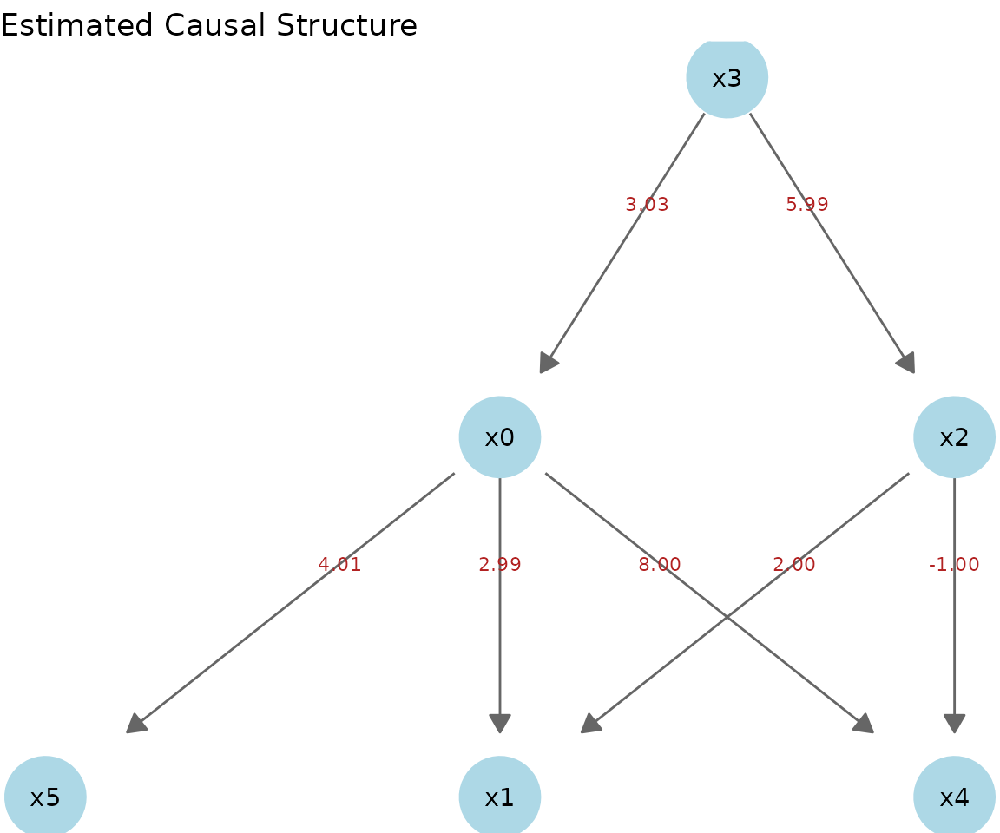
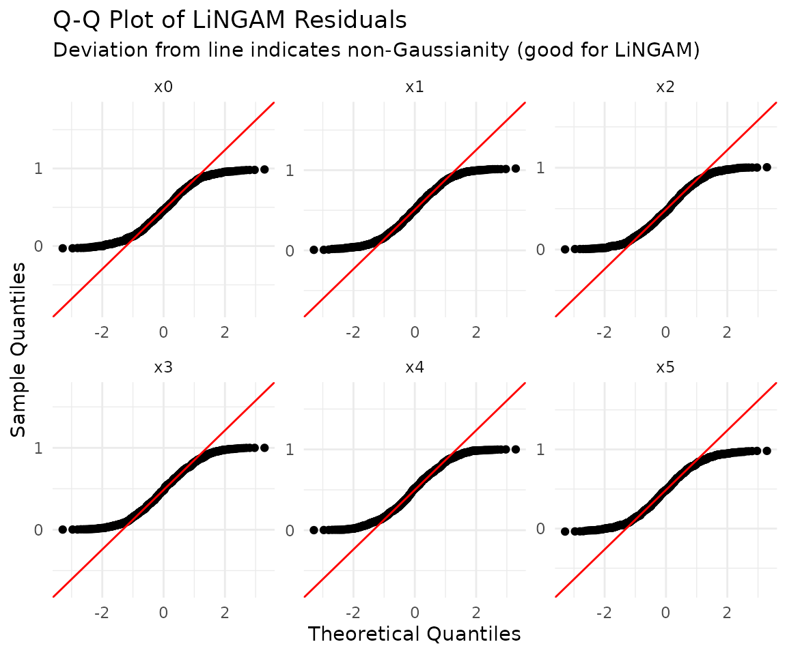

# lingamr detailed tutorial (Japanese)

この vignette では、サンプルデータを使いながら `lingamr`
による因果探索の一連の流れを 順を追って解説する。

``` r

library(lingamr)
```

## サンプルデータ

`lingamr` は5種類のサンプルデータ生成関数を提供する。いずれも
`data`（データフレーム） と
`true_adjacency`（真の隣接行列）を含むリストを返す。

| 関数 | 変数数 | デフォルトn | 特徴 |
|----|:--:|:--:|----|
| [`generate_lingam_sample_6()`](https://morimotoosamu.github.io/lingamr/reference/generate_lingam_sample_6.md) | 6 | 1,000 | 標準的な固定構造。本 vignette の主な例 |
| [`generate_lingam_sample_10()`](https://morimotoosamu.github.io/lingamr/reference/generate_lingam_sample_10.md) | 10 | 1,000 | 6変数ケースの拡張版（[より大きなデータセット（10変数）](#a-larger-dataset-10-variables) で使用） |
| [`generate_lingam_hard_sample()`](https://morimotoosamu.github.io/lingamr/reference/generate_lingam_hard_sample.md) | 9 | 200 | 強い多重共線性を持つ難しい設定 |
| [`generate_lingam_large_sample()`](https://morimotoosamu.github.io/lingamr/reference/generate_lingam_large_sample.md) | 可変 | 1,000 | 任意の変数数を持つランダムなスパースDAG（[変数が多い場合：スケーラビリティの壁](#when-there-are-many-variables-the-scalability-wall) で使用） |
| [`generate_lingam_paradox_data()`](https://morimotoosamu.github.io/lingamr/reference/generate_lingam_paradox_data.md) | 4 | 2,000 | 測定誤差パラドックス（[パラドックスの例](#a-case-where-directlingam-struggles-the-measurement-error-paradox) で使用） |

### generate_lingam_sample_6()

[`generate_lingam_sample_6()`](https://morimotoosamu.github.io/lingamr/reference/generate_lingam_sample_6.md)
は、6変数のLiNGAMモデルに従う人工データを、真の隣接行列
とともに返す。データは `data` に、隣接行列は `true_adjacency`
に格納される。

``` r

x1k <- generate_lingam_sample_6(n = 1000)

x1k$data |>
  head()
#>         x0        x1       x2        x3        x4        x5
#> 1 2.814924 18.017120 4.543655 0.6333728 18.160090 12.236660
#> 2 1.889685 10.956005 2.188091 0.3175366 13.172754  7.932657
#> 3 1.008905  6.990652 1.953131 0.2409218  6.702107  4.797122
#> 4 1.965690 12.296763 2.847148 0.3784141 13.224002  8.685252
#> 5 1.698178  9.698147 2.145058 0.3521443 11.673495  7.366258
#> 6 1.412372  8.640107 1.929980 0.2977585 10.024075  6.340899
```

``` r

x1k$true_adjacency
#>    x0 x1 x2 x3 x4 x5
#> x0  0  0  0  3  0  0
#> x1  3  0  2  0  0  0
#> x2  0  0  0  6  0  0
#> x3  0  0  0  0  0  0
#> x4  8  0 -1  0  0  0
#> x5  4  0  0  0  0  0
```

[`plot_adjacency()`](https://morimotoosamu.github.io/lingamr/reference/plot_adjacency.md)
は隣接行列に基づいて因果グラフを描画する。

``` r

x1k$true_adjacency |>
  plot_adjacency(
    labels  = colnames(x1k$data),
    title   = "True causal structure",
    rankdir = "TB",
    shape   = "circle"
  )
```

## 因果探索

[`lingam_direct()`](https://morimotoosamu.github.io/lingamr/reference/lingam_direct.md)
はDirect LiNGAMを実行する。デフォルトでは、独立性の評価に相互情報量
が用いられ、パス係数はadaptive LASSO回帰で計算される。

``` r

model <- x1k$data |>
  lingam_direct()
```

独立性の評価にHSICを使うには、`measure` 引数を “kernel”
に設定する。HSICは計算コスト が高いため、`n > 1000` では
[`lingam_direct()`](https://morimotoosamu.github.io/lingamr/reference/lingam_direct.md)
は自動的に低ランク近似に切り替わる。

### 因果順序

推定された因果順序は、インデックス番号として `causal_order`
に格納される。

``` r

# index number
model$causal_order
#> [1] 4 3 1 5 6 2

# variable name
colnames(x1k$data)[model$causal_order]
#> [1] "x3" "x2" "x0" "x4" "x5" "x1"
```

### 推定された隣接行列

推定された効果の大きさを確認する。デフォルトでは、adaptive
LASSO回帰による回帰係数 が使われる。

``` r

model$adjacency_matrix |>
  round(3)
#>       x0 x1     x2    x3 x4 x5
#> x0 0.000  0  0.000 3.033  0  0
#> x1 2.988  0  2.002 0.000  0  0
#> x2 0.000  0  0.000 5.993  0  0
#> x3 0.000  0  0.000 0.000  0  0
#> x4 8.000  0 -1.000 0.000  0  0
#> x5 4.015  0  0.000 0.000  0  0
```

### 因果グラフの描画

Direct LiNGAMで推定した隣接行列に基づいて因果グラフを描画する。

``` r

model$adjacency_matrix |>
  plot_adjacency(
    labels    = colnames(model$adjacency_matrix),
    title     = "Estimated Causal Structure (Direct LiNGAM)",
    rankdir   = "TB",
    shape     = "ellipse",
    fillcolor = "lightgreen"
  )
```

### 推定構造と真の構造の比較

サンプルデータのように真の構造が既知の場合、[`plot_adjacency()`](https://morimotoosamu.github.io/lingamr/reference/plot_adjacency.md)
の `true_B` 引数に
真の隣接行列を渡すことで、推定されたエッジを真の構造と比較して色分けできる。これに
より推定精度を一目で評価でき、手法の検証や教育目的に有用である。

- **緑（実線）**: 正しく検出されたエッジ（推定・真とも存在）
- **赤（実線）**: 誤って検出されたエッジ（推定にはあるが真にはない）
- **オレンジ（破線）**:
  見逃されたエッジ（真にはあるが推定されなかった。真の係数を表示）

``` r

model$adjacency_matrix |>
  plot_adjacency(
    labels  = colnames(model$adjacency_matrix),
    true_B  = x1k$true_adjacency,
    title   = "Estimated vs. True Structure",
    rankdir = "TB",
    shape   = "ellipse"
  )
```

### ggplot2による静的プロット

[`plot_adjacency()`](https://morimotoosamu.github.io/lingamr/reference/plot_adjacency.md)
はDiagrammeRによるインタラクティブなHTML図を返すのに対し、
[`autoplot()`](https://ggplot2.tidyverse.org/reference/autoplot.html)
は同じ因果構造をggplot2ベースの静的な図として描画する。これはR Markdown
/ Quartoでの画像・PDF出力で安定しており、後からggplot2の関数を重ねて
テーマやタイトルを設定することもできる。ノードの配置は `igraph`
の階層レイアウトで
計算されるため、因果の流れはおおむね上から下へと向かう。

[`autoplot()`](https://ggplot2.tidyverse.org/reference/autoplot.html)
はggplot2のジェネリック関数なので、[`ggplot2::autoplot()`](https://ggplot2.tidyverse.org/reference/autoplot.html)
として呼ぶか、 あらかじめ
[`library(ggplot2)`](https://ggplot2.tidyverse.org)
で読み込んでおく（プロットには `ggplot2` と `igraph` が必要）。

``` r

ggplot2::autoplot(model)
```



## 総因果効果

**総因果効果**とは、ある変数を1単位変化させたときの全体的な影響であり、直接効果と
すべての間接効果（媒介変数を経由するパス）を合わせたものを指す。

``` r

total_effects <- x1k$data |>
  estimate_all_total_effects(model)

round(total_effects, 3)
#>       x0 x1     x2     x3 x4 x5
#> x0 0.000  0  0.000  3.033  0  0
#> x1 2.872  0  1.937 21.059  0  0
#> x2 0.000  0  0.000  5.993  0  0
#> x3 0.000  0  0.000  0.000  0  0
#> x4 7.910  0 -1.129 18.276  0  0
#> x5 4.015  0  0.000 12.179  0  0
```

### 重回帰係数との比較

媒介変数が存在する場合、重回帰係数と総因果効果は一致しない。

[`generate_lingam_sample_6()`](https://morimotoosamu.github.io/lingamr/reference/generate_lingam_sample_6.md)
の真の因果構造では、x3からx1へのパスが2つ存在する
（x3からx1への**直接**エッジは存在しない）。

- x3 -\> x0 -\> x1（間接効果: 3.0 x 3.0 = **9.0**）
- x3 -\> x2 -\> x1（間接効果: 6.0 x 2.0 = **12.0**）
- **x3のx1への総因果効果 = 9.0 + 12.0 = 21.0**

x1を予測するためにすべての変数を含むOLS回帰の係数を、[`estimate_all_total_effects()`](https://morimotoosamu.github.io/lingamr/reference/estimate_all_total_effects.md)
の結果と比較する。

``` r

# Multiple regression: include all variables to predict x1
lm_coefs <- coef(lm(x1 ~ ., data = x1k$data))

# Comparison (variables causally related to x1: x0, x2, x3)
data.frame(
  variable           = c("x0", "x2", "x3"),
  OLS_coefficient    = round(lm_coefs[c("x0", "x2", "x3")], 3),
  total_causal_effect = round(total_effects["x1", c("x0", "x2", "x3")], 3)
)
#>    variable OLS_coefficient total_causal_effect
#> x0       x0           3.237               2.872
#> x2       x2           1.965               1.937
#> x3       x3           0.014              21.059
```

x3のOLS係数はほぼ**0**である。これは、媒介変数であるx0とx2をモデルに含めることで、
x3の「媒介を通じた効果」がx0とx2の係数に吸収されてしまうためである。

一方、[`estimate_all_total_effects()`](https://morimotoosamu.github.io/lingamr/reference/estimate_all_total_effects.md)
によるx3の値は**約21**であり、x3を1単位動かした
ときにx1が最終的にどれだけ変化するかを正しく表している。

| 問い                                                     | 使うべき指標  |
|----------------------------------------------------------|---------------|
| 「x0とx2を固定したまま、x3を動かすとx1はどう変化するか」 | OLS重回帰係数 |
| 「すべてのパスを通じて、x3を動かすとx1はどう変化するか」 | 総因果効果    |

「ある変数に介入したときの最終的な影響」を知りたい場合は、重回帰係数ではなく総因果
効果を使う。

## 事前知識を用いた推定

[`make_prior_knowledge()`](https://morimotoosamu.github.io/lingamr/reference/make_prior_knowledge.md)
を使うと、変数間の因果関係に関するドメイン知識をDirect
LiNGAMに組み込むことができる。これにより探索空間が狭まり、推定が安定化する。

### 事前知識行列の形式

[`make_prior_knowledge()`](https://morimotoosamu.github.io/lingamr/reference/make_prior_knowledge.md)
は $`p \times p`$ の整数行列を返す。**行 = 結果変数（to）、 列 =
原因変数（from）**というインデックス規約は、隣接行列と同じである。

| 値   | 意味                                              |
|------|---------------------------------------------------|
| `-1` | 不明（デフォルト。Direct LiNGAMが自由に探索する） |
| `0`  | このエッジは存在しない                            |
| `1`  | このエッジは確実に存在する                        |

以下は、各引数が行列にどう反映されるかを示す。

| 引数 | 設定される値 | 意味 |
|----|----|----|
| `exogenous_variables` | 指定した変数の**行**全体 -\> `0` | どの変数からも影響を受けない（root変数） |
| `sink_variables` | 指定した変数の**列**全体 -\> `0` | どの変数にも影響を及ぼさない（sink変数） |
| `paths` | `pk[to, from] = 1` | このエッジが存在することを指定 |
| `no_paths` | `pk[to, from] = 0` | このエッジが存在しないことを指定 |

変数は**1始まりのインデックス**、または（`labels`
引数を渡せば）**変数名**で指定 できる。

### 使用例

[`generate_lingam_sample_6()`](https://morimotoosamu.github.io/lingamr/reference/generate_lingam_sample_6.md)
の真の構造に関するドメイン知識を与える。

- **x3**（インデックス4）は外生変数であり、他のどの変数からも影響を受けない
- **x1, x4, x5**（インデックス2, 5,
  6）はsink変数であり、他の変数に影響を及ぼさない
- **x0とx2の間**にはパスが存在しない（どちら向きにも）

#### インデックスによる指定

``` r

pk1 <- make_prior_knowledge(
  n_variables         = 6,
  exogenous_variables = 4,          # x3
  sink_variables      = c(2, 5, 6), # x1, x4, x5
  no_paths            = list(c(3, 1), c(1, 3)) # no x2<->x0
)

pk1
#>      [,1] [,2] [,3] [,4] [,5] [,6]
#> [1,]   -1    0    0   -1    0    0
#> [2,]   -1   -1   -1   -1    0    0
#> [3,]    0    0   -1   -1    0    0
#> [4,]    0    0    0   -1    0    0
#> [5,]   -1    0   -1   -1   -1    0
#> [6,]   -1    0   -1   -1    0   -1
```

行列の読み方: `pk1["x1", "x3"]` が `-1`
なら「x3-\>x1は不明（LiNGAMが探索する）」、 `0`
なら「x3-\>x1は存在しない」ことを意味する。

#### 変数名による指定

`labels`
を渡すことで変数名による指定ができる。可読性が向上し、列の追加や並び替え
にも頑健になる。

``` r

pk1_named <- make_prior_knowledge(
  n_variables         = 6,
  exogenous_variables = "x3",
  sink_variables      = c("x1", "x4", "x5"),
  no_paths            = list(c("x2", "x0"), c("x0", "x2")),
  labels              = colnames(x1k$data)
)

# Equivalent in content to pk1
identical(pk1, pk1_named)
#> [1] FALSE
```

### 事前知識を用いたDirect LiNGAMの実行

`prior_knowledge` 引数に渡すだけで、探索に反映される。

``` r

model_pk1 <- x1k$data |>
  lingam_direct(prior_knowledge = pk1, lambda = "BIC")

cat("Causal Order: ", colnames(x1k$data)[model_pk1$causal_order], "\n")
#> Causal Order:  x3 x2 x0 x4 x5 x1
```

``` r

model_pk1$adjacency_matrix |>
  round(3)
#>       x0 x1     x2    x3 x4 x5
#> x0 0.000  0  0.000 3.033  0  0
#> x1 2.988  0  2.002 0.000  0  0
#> x2 0.000  0  0.000 5.993  0  0
#> x3 0.000  0  0.000 0.000  0  0
#> x4 8.000  0 -1.000 0.000  0  0
#> x5 4.015  0  0.000 0.000  0  0

model_pk1$adjacency_matrix |>
  plot_adjacency(
    labels    = colnames(model_pk1$adjacency_matrix),
    title     = "Estimated (with Prior Knowledge)",
    rankdir   = "TB",
    shape     = "circle",
    fillcolor = "lightgreen"
  )
```

## 回帰手法の選択（reg_method）

Direct
LiNGAMでは、因果順序が決定された後に回帰によって隣接行列が推定される。
`reg_method` 引数はその回帰手法を選択する。

| `reg_method` | `glmnet` | スパース化 | 特徴 |
|----|----|----|----|
| `"ols"` | 不要 | なし | すべてのエッジを推定する。健全性チェックやパッケージのない環境向け |
| `"lasso"` | 必要 | あり | 弱いエッジを0に縮小する |
| `"adaptive_lasso"` | 必要 | あり（強力） | **デフォルト**。真に0であるエッジを確実に0にできるoracle性を持つ |
| `"ridge"` | 必要 | なし | $`\ell_2`$正則化で係数を安定化させる。多重共線性に頑健。スパース化はしない |

oracle性とは「サンプルサイズが増えるにつれて真の構造を確実に復元できる」という
理論的保証であり、通常は `"adaptive_lasso"` が推奨される。

### 4手法の比較

``` r

fit_ols    <- lingam_direct(x1k$data, reg_method = "ols")
fit_lasso  <- lingam_direct(x1k$data, reg_method = "lasso",          lambda = "BIC")
fit_alasso <- lingam_direct(x1k$data, reg_method = "adaptive_lasso", lambda = "BIC")
fit_ridge  <- lingam_direct(x1k$data, reg_method = "ridge",          lambda = "BIC")

# Compare the adjacency matrices side by side
round(fit_ols$adjacency_matrix,    3)
#>       x0 x1     x2     x3     x4    x5
#> x0 0.000  0 -0.040  3.274  0.000 0.000
#> x1 3.237  0  1.965  0.014 -0.034 0.006
#> x2 0.000  0  0.000  5.993  0.000 0.000
#> x3 0.000  0  0.000  0.000  0.000 0.000
#> x4 7.992  0 -1.062  0.394  0.000 0.000
#> x5 3.873  0  0.069 -0.315  0.018 0.000
round(fit_lasso$adjacency_matrix,  3)
#>       x0 x1     x2    x3 x4 x5
#> x0 0.000  0  0.000 3.030  0  0
#> x1 2.939  0  1.965 0.185  0  0
#> x2 0.000  0  0.000 5.993  0  0
#> x3 0.000  0  0.000 0.000  0  0
#> x4 7.924  0 -0.960 0.000  0  0
#> x5 3.975  0  0.000 0.000  0  0
round(fit_alasso$adjacency_matrix, 3)
#>       x0 x1     x2    x3 x4 x5
#> x0 0.000  0  0.000 3.033  0  0
#> x1 2.988  0  2.002 0.000  0  0
#> x2 0.000  0  0.000 5.993  0  0
#> x3 0.000  0  0.000 0.000  0  0
#> x4 8.000  0 -1.000 0.000  0  0
#> x5 4.015  0  0.000 0.000  0  0
round(fit_ridge$adjacency_matrix,  3)
#>       x0 x1     x2     x3    x4    x5
#> x0 0.000  0 -0.017  3.132 0.000 0.000
#> x1 1.863  0  1.987  0.656 0.071 0.127
#> x2 0.000  0  0.000  5.993 0.000 0.000
#> x3 0.000  0  0.000  0.000 0.000 0.000
#> x4 7.927  0 -0.997  0.203 0.000 0.000
#> x5 2.407  0  0.254 -0.251 0.197 0.000
```

OLSとRidgeはすべてのエッジに非ゼロの係数を残す傾向があるのに対し、LASSOとAdaptive
LASSOは余分なエッジを0に縮小する。Ridgeは係数の**大きさ**を小さくするが、ゼロには
しない。

### lambdaの選択（LASSO / Adaptive LASSO共通）

罰則の強さ $`\lambda`$ の選択は、推定のスパース性を直接左右する。

| `lambda` | 方式 | スパース性 | 用途 |
|----|----|----|----|
| `"BIC"` | 情報量規準 | 最も高い | **デフォルト**。小サンプルでも安定 |
| `"AIC"` | 情報量規準 | 高い | BICよりやや多くのエッジが残る |
| `"lambda.min"` | CV（予測誤差最小） | 低い | 予測精度を優先。エッジが多くなる |
| `"lambda.1se"` | CV（1SEルール） | 中〜高 | CVの頑健なバリエーション |
| `"oracle"` | 解析式（adaptive_lassoのみ） | \- | $`\lambda = 5 / n^{1.75}`$。理論的なoracle性を保証 |

``` r

# Compare BIC (default, sparsest) and lambda.min (minimum prediction error)
fit_bic     <- lingam_direct(x1k$data, lambda = "BIC")
fit_lam_min <- lingam_direct(x1k$data, lambda = "lambda.min")

# Number of nonzero edges
sum(fit_bic$adjacency_matrix     != 0)
#> [1] 7
sum(fit_lam_min$adjacency_matrix != 0)
#> [1] 7
```

## 誤差変数間の独立性

LiNGAMは、残差が独立であると仮定する。[`get_error_independence_p_values()`](https://morimotoosamu.github.io/lingamr/reference/get_error_independence_p_values.md)
は残差間の 独立性検定のp値を返す。

``` r

result <- x1k$data |>
  lingam_direct()

p_vals <- x1k$data |>
  get_error_independence_p_values(result)

round(p_vals, 3)
#>       x0    x1    x2    x3    x4    x5
#> x0    NA 0.988 0.214 0.976 0.876 0.952
#> x1 0.988    NA 0.986 0.991 0.328 0.882
#> x2 0.214 0.986    NA 0.919 0.051 0.124
#> x3 0.976 0.991 0.919    NA 0.934 0.978
#> x4 0.876 0.328 0.051 0.934    NA 0.650
#> x5 0.952 0.882 0.124 0.978 0.650    NA
```

## 非ガウス性の仮定

LiNGAMの理論的な核心は、**誤差項が非ガウス分布に従う**という仮定である。誤差が
ガウス分布に従う場合、因果の**方向**は原理的に識別不能になり（同じ分布を説明する
逆方向のモデルが存在する）、推定結果は信頼できなくなる。

[`generate_lingam_sample_6()`](https://morimotoosamu.github.io/lingamr/reference/generate_lingam_sample_6.md)
の `noise_dist` 引数で誤差分布を切り替え、この違いを
実際に確認する。真の構造は以下の通りである（rootはx3）。

``` r

set.seed(0)
truth <- generate_lingam_sample_6(noise_dist = "uniform")

truth$true_adjacency |>
  round(1)
#>    x0 x1 x2 x3 x4 x5
#> x0  0  0  0  3  0  0
#> x1  3  0  2  0  0  0
#> x2  0  0  0  6  0  0
#> x3  0  0  0  0  0  0
#> x4  8  0 -1  0  0  0
#> x5  4  0  0  0  0  0
```

真の構造の因果グラフ:

``` r

truth$true_adjacency |>
  plot_adjacency(
    labels = colnames(truth$data),
    title  = "True structure"
  )
```

### 非ガウス誤差（一様分布）でうまくいく場合

``` r

fit_uniform <- lingam_direct(truth$data)

# Estimated causal order (the true root x3 comes first)
colnames(truth$data)[fit_uniform$causal_order]
#> [1] "x3" "x2" "x0" "x4" "x5" "x1"

# The estimated adjacency matrix recovers the true structure almost perfectly
fit_uniform$adjacency_matrix |>
  round(1)
#>    x0 x1 x2 x3 x4 x5
#> x0  0  0  0  3  0  0
#> x1  3  0  2  0  0  0
#> x2  0  0  0  6  0  0
#> x3  0  0  0  0  0  0
#> x4  8  0 -1  0  0  0
#> x5  4  0  0  0  0  0
```

推定されたグラフは真の構造とほぼ一致する。エッジは真の構造と比較して色分けされる。
緑 = 正解、赤 = 誤検出、オレンジ破線 = 見逃し。

``` r

fit_uniform$adjacency_matrix |>
  plot_adjacency(
    labels = colnames(truth$data),
    true_B = truth$true_adjacency,
    title  = "Estimated (uniform errors)"
  )
```

### ガウス誤差でうまくいかない場合

同じ因果構造でも、誤差がガウス分布に従うと結果は破綻する。

``` r

gauss <- generate_lingam_sample_6(noise_dist = "gaussian")
fit_gauss <- lingam_direct(gauss$data)

# The causal order does not match the true structure (root x3 does not come first)
colnames(gauss$data)[fit_gauss$causal_order]
#> [1] "x1" "x2" "x5" "x3" "x4" "x0"

fit_gauss$adjacency_matrix |>
  round(1)
#>    x0  x1   x2 x3  x4  x5
#> x0  0 0.1  0.0  0 0.1 0.0
#> x1  0 0.0  0.0  0 0.0 0.0
#> x2  0 0.3  0.0  0 0.0 0.0
#> x3  0 0.0  0.2  0 0.0 0.0
#> x4  0 0.9 -2.6  0 0.0 1.3
#> x5  0 1.2 -2.1  0 0.0 0.0
```

真の構造と比較すると、多くのエッジが誤り（赤）または見逃し（オレンジ破線）に
なっている。色分けは上記と同じである。

``` r

fit_gauss$adjacency_matrix |>
  plot_adjacency(
    labels = colnames(gauss$data),
    true_B = truth$true_adjacency,
    title  = "Estimated (Gaussian errors)"
  )
```

非ガウス誤差では真の隣接行列がそのまま復元されるのに対し、ガウス誤差では因果順序と
係数の両方が真の構造から大きく乖離する。これが「LiNGAMはデータの非ガウス性を利用
して因果の方向を決定する」と言われる理由である。実データに適用する際は、次節のように
**残差の正規性を検定**し、この仮定が成り立っているかを確認することが重要である。

## 残差の正規性検定

残差の正規性を検定する。LiNGAMは非ガウス性を仮定するため、正規性が**棄却される**
（p値が小さい）ことは、モデルの仮定と整合的である。

``` r

# Shapiro-Wilk (default)
x1k$data |>
  test_residual_normality(result)
#> === Residual Normality Test ===
#> Method:         shapiro
#> Sample size:    1000
#> Significance:   0.050
#> Non-Gaussian:   6 / 6 variables
#> 
#>  variable statistic   p_value is_non_gauss skewness kurtosis
#>        x0    0.9516 < 2.2e-16         TRUE    0.061   -1.215
#>        x1    0.9521 < 2.2e-16         TRUE    0.026   -1.213
#>        x2    0.9557 < 2.2e-16         TRUE    0.083   -1.170
#>        x3    0.9578  2.25e-16         TRUE    0.025   -1.163
#>        x4    0.9544 < 2.2e-16         TRUE   -0.003   -1.206
#>        x5    0.9536 < 2.2e-16         TRUE   -0.052   -1.206
#> 
#> Interpretation:
#>   is_non_gauss = TRUE  -> rejects normality (supports LiNGAM assumption)
#>   is_non_gauss = FALSE -> cannot reject normality (LiNGAM may not fit)
#> 
#> All residuals are non-Gaussian. LiNGAM assumption is supported.
```

QQプロットでも残差の正規性を確認する。

``` r

x1k$data |>
  plot_residual_qq(result)
```



## モデルサマリー

[`summary_lingam()`](https://morimotoosamu.github.io/lingamr/reference/summary_lingam.md)
は残差独立性検定と正規性検定をまとめて実行し、LiNGAMが依拠する
2つの仮定（残差が互いに独立であること、残差が非ガウスであること）がどの程度成り立
っているかを一目で確認できるようにする。[`get_error_independence_p_values()`](https://morimotoosamu.github.io/lingamr/reference/get_error_independence_p_values.md)
と
[`test_residual_normality()`](https://morimotoosamu.github.io/lingamr/reference/test_residual_normality.md)
を個別に呼ぶ代わりに、診断結果を一箇所でまとめて見る ことができる。

``` r

x1k$data |>
  summary_lingam(result)
#> === Direct LiNGAM Model Summary ===
#> Variables:    6
#> Observations: 1000
#> Edges:        7
#> Causal order: x3 -> x2 -> x0 -> x4 -> x5 -> x1
#> 
#> --- Assumption 1: Independence of residuals ---
#> Method:           spearman
#> Dependent pairs:  0 / 15  (p < 0.050)
#> Min p-value:      0.0510
#> => Residuals appear mutually independent (assumption supported).
#> 
#> --- Assumption 2: Non-Gaussianity of residuals ---
#> Method:           shapiro
#> Non-Gaussian:     6 / 6  (p <= 0.050)
#> => All residuals are non-Gaussian (assumption supported).
```

## Direct LiNGAMのブートストラップ

ブートストラップ法を用いてモデルの信頼性を評価する。

``` r

bs_model <- x1k$data |>
  lingam_direct_bootstrap(n_sampling = 100L, seed = 42)
#> Bootstrap: 100 iterations, method=adaptive_lasso (sequential)
#>   iteration 1 / 100
#>   iteration 10 / 100
#>   iteration 20 / 100
#>   iteration 30 / 100
#>   iteration 40 / 100
#>   iteration 50 / 100
#>   iteration 60 / 100
#>   iteration 70 / 100
#>   iteration 80 / 100
#>   iteration 90 / 100
#>   iteration 100 / 100
#> Completed in 3.4 seconds.

bs_model
#> BootstrapResult: 100 samplings, 6 features
```

反復回数や変数の数が多い場合は、`parallel = TRUE`
を指定すると複数コアで高速に 実行できる。コア数は `n_cores`
で指定する（未指定時は安全のため2コアに制限される）。

``` r

bs_model <- x1k$data |>
  lingam_direct_bootstrap(
    n_sampling = 100L,
    seed       = 42,
    parallel   = TRUE,
    n_cores    = 4L
  )
```

並列実行ではL’Ecuyerの並列乱数ストリームが使われるため、同じ `seed`
と同じ `n_cores`
であれば結果は再現可能だが、逐次実行（`parallel = FALSE`）の結果とは
数値的に一致しない点に注意する。

### ブートストラップ結果の確認

ブートストラップ結果から、各パスの出現頻度と係数の平均を計算する。

``` r

bs_model |>
  get_causal_direction_counts(labels = names(x1k$data))
#>    from to count proportion mean_effect median_effect  sd_effect    ci_lower
#> 1     1  6   100       1.00  4.01532920    4.01513886 0.01126767  3.99550980
#> 2     1  2    99       0.99  2.98181621    2.97864538 0.02849338  2.92980702
#> 3     1  5    99       0.99  8.00994011    8.00748238 0.02951185  7.95680521
#> 4     3  2    99       0.99  2.00498455    2.00660933 0.01479861  1.97675886
#> 5     3  5    99       0.99 -1.00529230   -1.00485827 0.01523485 -1.03801290
#> 6     4  1    99       0.99  3.03521019    3.03586526 0.03001961  2.97855949
#> 7     4  3    99       0.99  5.99644109    5.99745219 0.03186571  5.94050363
#> 8     2  1     1       0.01  0.05304916    0.05304916 0.00000000  0.05304916
#> 9     2  3     1       0.01  0.40196452    0.40196452 0.00000000  0.40196452
#> 10    2  5     1       0.01  0.90679690    0.90679690 0.00000000  0.90679690
#> 11    3  4     1       0.01  0.16166764    0.16166764 0.00000000  0.16166764
#> 12    5  1     1       0.01  0.10453910    0.10453910 0.00000000  0.10453910
#> 13    5  3     1       0.01 -0.13636255   -0.13636255 0.00000000 -0.13636255
#>       ci_upper from_name to_name
#> 1   4.03698551        x0      x5
#> 2   3.03860193        x0      x1
#> 3   8.07414013        x0      x4
#> 4   2.03193816        x2      x1
#> 5  -0.97488336        x2      x4
#> 6   3.09304642        x3      x0
#> 7   6.06134091        x3      x2
#> 8   0.05304916        x1      x0
#> 9   0.40196452        x1      x2
#> 10  0.90679690        x1      x4
#> 11  0.16166764        x2      x3
#> 12  0.10453910        x4      x0
#> 13 -0.13636255        x4      x2
```

### 平均因果効果の隣接行列

ブートストラップ結果から隣接行列を構築する。

``` r

bs_adjacency_matrix <- bs_model |>
  get_adjacency_matrix_summary(stat = "median")

bs_adjacency_matrix |>
  round(3)
#>       [,1]  [,2]   [,3]  [,4]   [,5] [,6]
#> [1,] 0.000 0.053  0.000 3.036  0.105    0
#> [2,] 2.979 0.000  2.007 0.000  0.000    0
#> [3,] 0.000 0.402  0.000 5.997 -0.136    0
#> [4,] 0.000 0.000  0.162 0.000  0.000    0
#> [5,] 8.007 0.907 -1.005 0.000  0.000    0
#> [6,] 4.015 0.000  0.000 0.000  0.000    0
```

推定した隣接行列を可視化する。

``` r

bs_adjacency_matrix |>
  plot_adjacency(
    labels    = colnames(x1k$data),
    title     = "Estimated (with Bootstrap)",
    rankdir   = "TB",
    shape     = "circle",
    fillcolor = "lightgreen"
  )
```

### パス出現頻度の行列

各パスの出現頻度行列を計算する。

``` r

bs_model |>
  get_probabilities()
#>      [,1] [,2] [,3] [,4] [,5] [,6]
#> [1,] 0.00 0.01 0.00 0.99 0.01    0
#> [2,] 0.99 0.00 0.99 0.00 0.00    0
#> [3,] 0.00 0.01 0.00 0.99 0.01    0
#> [4,] 0.00 0.00 0.01 0.00 0.00    0
#> [5,] 0.99 0.01 0.99 0.00 0.00    0
#> [6,] 1.00 0.00 0.00 0.00 0.00    0
```

### 平均総効果

各パスの平均総効果を計算する。

``` r

bs_model |>
  get_total_causal_effects()
#>    from to      effect probability
#> 1     1  6  4.01520158        1.00
#> 2     1  2  2.87431611        0.99
#> 3     1  5  7.90813117        0.99
#> 4     3  2  1.95874622        0.99
#> 5     3  5 -1.06193484        0.99
#> 6     4  1  3.03586526        0.99
#> 7     4  2 21.07027271        0.99
#> 8     4  3  5.99805118        0.99
#> 9     4  5 18.28272145        0.99
#> 10    4  6 12.18719857        0.99
#> 11    3  6 -0.24574320        0.04
#> 12    2  1  0.14794503        0.01
#> 13    2  3  0.27850920        0.01
#> 14    2  4  0.04611007        0.01
#> 15    2  5  0.90679690        0.01
#> 16    2  6  0.59359217        0.01
#> 17    3  4  0.16192779        0.01
#> 18    5  1  0.10498716        0.01
#> 19    5  3 -0.13625059        0.01
#> 20    5  6  0.42156703        0.01
#> 21    6  2  0.24518629        0.01
```

ブートストラップ結果を因果グラフに変換する。デフォルトでは、サンプルの50%以上で
出現したパスのみが表示される。

``` r

bs_model |>
  plot_bootstrap_probabilities()
```

### 因果順序の安定性

[`get_causal_order_stability()`](https://morimotoosamu.github.io/lingamr/reference/get_causal_order_stability.md)
は各ブートストラップサンプルで推定された因果順序を
集約し、その順序がどれだけ安定しているかを定量化する。各変数の順位分布、変数ペアの
先行確率（`P[i, j]` =
変数iが変数jより上流にあったサンプルの割合）、および全体の
安定性スコア（0 = ランダム、1 = 全サンプルで完全に一致）を返す。

``` r

bs_model |>
  get_causal_order_stability(labels = names(x1k$data))
#> === Causal Order Stability ===
#> Bootstrap samples:       100
#> Overall stability score: 0.736  (0 = random, 1 = fully stable)
#> 
#> Rank summary (sorted by mean rank; 1 = most upstream):
#>  variable mean_rank sd_rank median_rank mode_rank
#>        x3      1.05    0.50           1         1
#>        x0      2.62    0.51           3         3
#>        x2      2.75    0.95           2         2
#>        x5      4.41    1.23           4         3
#>        x4      4.92    0.77           5         5
#>        x1      5.25    0.88           5         6
#> 
#> Precedence probability P[i, j] = P(variable i precedes j):
#>      x0   x1   x2   x3   x4   x5
#> x0 0.00 0.99 0.39 0.01 0.99 1.00
#> x1 0.01 0.00 0.01 0.01 0.38 0.34
#> x2 0.61 0.99 0.00 0.01 0.99 0.65
#> x3 0.99 0.99 0.99 0.00 0.99 0.99
#> x4 0.01 0.62 0.01 0.01 0.00 0.43
#> x5 0.00 0.66 0.35 0.01 0.57 0.00
```

## broomとの連携（tidy / glance）

推定結果は、`broom` 互換の
[`tidy()`](https://generics.r-lib.org/reference/tidy.html) /
[`glance()`](https://generics.r-lib.org/reference/glance.html)
を使ってdata.frameに変換でき、 `ggplot2` や `dplyr`
との連携が容易になる。[`tidy()`](https://generics.r-lib.org/reference/tidy.html)
はエッジリスト（`from`、`to`、
`estimate`）を返し、[`glance()`](https://generics.r-lib.org/reference/glance.html)
はモデル全体の1行サマリーを返す。[`tidy()`](https://generics.r-lib.org/reference/tidy.html)
はブート
ストラップ結果に対しても機能し、その場合は各方向の出現頻度などを返す。

``` r

# Convert the estimated adjacency matrix to an edge list
tidy(model)
#>   from to  estimate
#> 1   x0 x1  2.987705
#> 2   x0 x4  8.000096
#> 3   x0 x5  4.014962
#> 4   x2 x1  2.001708
#> 5   x2 x4 -1.000306
#> 6   x3 x0  3.032952
#> 7   x3 x2  5.992677

# One-row summary of the whole model
glance(model)
#>   n_variables n_edges                     causal_order
#> 1           6       7 x3 -> x2 -> x0 -> x4 -> x5 -> x1

# Direction-wise summary of the bootstrap results (variable names via labels)
tidy(bs_model, labels = names(x1k$data))
#>    from to count proportion mean_effect median_effect  sd_effect    ci_lower
#> 1     1  6   100       1.00  4.01532920    4.01513886 0.01126767  3.99550980
#> 2     1  2    99       0.99  2.98181621    2.97864538 0.02849338  2.92980702
#> 3     1  5    99       0.99  8.00994011    8.00748238 0.02951185  7.95680521
#> 4     3  2    99       0.99  2.00498455    2.00660933 0.01479861  1.97675886
#> 5     3  5    99       0.99 -1.00529230   -1.00485827 0.01523485 -1.03801290
#> 6     4  1    99       0.99  3.03521019    3.03586526 0.03001961  2.97855949
#> 7     4  3    99       0.99  5.99644109    5.99745219 0.03186571  5.94050363
#> 8     2  1     1       0.01  0.05304916    0.05304916 0.00000000  0.05304916
#> 9     2  3     1       0.01  0.40196452    0.40196452 0.00000000  0.40196452
#> 10    2  5     1       0.01  0.90679690    0.90679690 0.00000000  0.90679690
#> 11    3  4     1       0.01  0.16166764    0.16166764 0.00000000  0.16166764
#> 12    5  1     1       0.01  0.10453910    0.10453910 0.00000000  0.10453910
#> 13    5  3     1       0.01 -0.13636255   -0.13636255 0.00000000 -0.13636255
#>       ci_upper from_name to_name
#> 1   4.03698551        x0      x5
#> 2   3.03860193        x0      x1
#> 3   8.07414013        x0      x4
#> 4   2.03193816        x2      x1
#> 5  -0.97488336        x2      x4
#> 6   3.09304642        x3      x0
#> 7   6.06134091        x3      x2
#> 8   0.05304916        x1      x0
#> 9   0.40196452        x1      x2
#> 10  0.90679690        x1      x4
#> 11  0.16166764        x2      x3
#> 12  0.10453910        x4      x0
#> 13 -0.13636255        x4      x2
```

## より大きなデータセット（10変数）

10変数・10,000行という、より大きなデータセットの例を示す。

``` r

x10k <- generate_lingam_sample_10(n = 10000)

x10k$true_adjacency |>
  plot_adjacency(
    labels  = colnames(x10k$data),
    title   = "True causal structure",
    rankdir = "TB",
    shape   = "circle"
  )
```

## ICA-LiNGAMとDirect LiNGAMの比較

[`pcalg::lingam()`](https://rdrr.io/pkg/pcalg/man/LINGAM.html)
はオリジナルのLiNGAMアルゴリズムであり、FastICAで混合行列を推定
することで因果順序と係数を求める（Shimizu et
al. 2006）。[`lingam_direct()`](https://morimotoosamu.github.io/lingamr/reference/lingam_direct.md)
とは 独立したアプローチで同じ問題を解く。

### 両アルゴリズムの実行

同じ6変数データセット（$`n = 1000`$）を両手法で分析する。

``` r

d_cmp <- generate_lingam_sample_6(n = 1000, seed = 42)

t_cmp_direct <- system.time(res_cmp_direct <- lingam_direct(d_cmp$data))
t_cmp_ica    <- system.time(res_cmp_ica    <- pcalg::lingam(as.matrix(d_cmp$data)))

cat(sprintf("Direct LiNGAM : %.2f sec\nICA-LiNGAM    : %.2f sec\n",
            t_cmp_direct["elapsed"], t_cmp_ica["elapsed"]))
#> Direct LiNGAM : 0.01 sec
#> ICA-LiNGAM    : 0.02 sec
```

### 推定係数の比較

`$Bpruned` はlingamrの隣接行列と同じ規約（`B[i, j]` = $`x_j \to x_i`$
の係数）を使う。

``` r

B_ica <- res_cmp_ica$Bpruned
rownames(B_ica) <- colnames(B_ica) <- names(d_cmp$data)

idx_ica  <- which(abs(B_ica) > 0, arr.ind = TRUE)
tidy_ica <- data.frame(
  from  = colnames(B_ica)[idx_ica[, 2]],
  to    = rownames(B_ica)[idx_ica[, 1]],
  ica   = round(B_ica[idx_ica], 3)
)

tidy_dir <- tidy(res_cmp_direct)
tidy_dir <- data.frame(from = tidy_dir$from, to = tidy_dir$to,
                       direct = round(tidy_dir$estimate, 3))

merge(tidy_dir, tidy_ica, by = c("from", "to"), sort = TRUE)
#>   from to direct    ica
#> 1   x0 x1  2.988  3.245
#> 2   x0 x4  8.000  7.999
#> 3   x0 x5  4.015  3.876
#> 4   x2 x1  2.002  1.973
#> 5   x2 x4 -1.000 -1.060
#> 6   x3 x0  3.033  3.027
#> 7   x3 x2  5.993  6.101
```

### DAG構造の比較

すべてのエッジについて完全外部結合（full outer
join）を取り、構造を比較し、真のDAG との整合性を確認する。

``` r

B_true   <- d_cmp$true_adjacency
idx_true <- which(abs(B_true) > 0, arr.ind = TRUE)
true_key <- paste(colnames(B_true)[idx_true[, 2]],
                  rownames(B_true)[idx_true[, 1]], sep = "->")

cmp <- merge(tidy_dir, tidy_ica, by = c("from", "to"), all = TRUE, sort = TRUE)
cmp$truth <- paste(cmp$from, cmp$to, sep = "->") %in% true_key
cmp
#>   from to direct    ica truth
#> 1   x0 x1  2.988  3.245  TRUE
#> 2   x0 x4  8.000  7.999  TRUE
#> 3   x0 x5  4.015  3.876  TRUE
#> 4   x2 x1  2.002  1.973  TRUE
#> 5   x2 x4 -1.000 -1.060  TRUE
#> 6   x3 x0  3.033  3.027  TRUE
#> 7   x3 x2  5.993  6.101  TRUE
```

`direct` または `ica` 列が `NA`
の場合、その手法がそのエッジを検出しなかったことを
意味する。`truth = TRUE` は真のDAGに存在するエッジであることを示す。

------------------------------------------------------------------------

## 変数が多い場合：スケーラビリティの壁

Direct
LiNGAMは各ステップで、残っているすべての変数ペアについて独立性検定を行う。
ステップ数は $`p`$ で、各ステップの検定回数は最大 $`p(p-1)`$
であるため、独立性検定の 総回数はおおよそ

``` math
\sum_{k=1}^{p} k(k-1) \approx \frac{p^3}{3}
```

となり、計算コストは**$`O(p^3)`$**になる。
一方、ICA-LiNGAMが使うFastICAは（BLAS最適化により）$`O(p^2 n)`$なので、変数の数が
増えるほどその差は広がる。

[`generate_lingam_large_sample()`](https://morimotoosamu.github.io/lingamr/reference/generate_lingam_large_sample.md)
は、変数数 `p` を自由に設定できるランダムな
スパースDAGデータを生成する。各変数
$`x_i`$（$`i \ge 1`$）は、$`x_0, \ldots, x_{i-1}`$
の中からランダムに最大 `max_parents`
個の親を持つ。因果順序は必ずインデックス順に
従うため、隣接行列は常に**下三角行列**になる。

### データの生成

``` r

d20 <- generate_lingam_large_sample(p = 20, n = 1000, seed = 42)

dim(d20$data)                    # 1000 rows x 20 columns
#> [1] 1000   20
sum(d20$true_adjacency != 0)     # number of true edges (sparse DAG)
#> [1] 32
d20$true_causal_order            # 0, 1, ..., 19
#>  [1]  0  1  2  3  4  5  6  7  8  9 10 11 12 13 14 15 16 17 18 19
```

### 実行時間の比較

$`p`$ が1.5倍（10 -\> 15）になると、独立性検定の回数は
$`15^3 / 10^3 \approx 3.4`$倍に 増える。

``` r

d10 <- generate_lingam_large_sample(p = 10, n = 500, seed = 42)
d15 <- generate_lingam_large_sample(p = 15, n = 500, seed = 42)

t10 <- system.time({ r10 <- lingam_direct(d10$data) })
t15 <- system.time({ r15 <- lingam_direct(d15$data) })

cat(sprintf(
  "p = 10 : %.2f sec\np = 15 : %.2f sec\ntheoretical factor %.1fx vs. observed %.1fx\n",
  t10["elapsed"],
  t15["elapsed"],
  15^3 / 10^3,
  t15["elapsed"] / max(t10["elapsed"], 0.01)
))
#> p = 10 : 0.03 sec
#> p = 15 : 0.06 sec
#> theoretical factor 3.4x vs. observed 2.1x
```

同じデータでICA-LiNGAMも実行し、速度を直接比較する。

``` r

t10_ica <- system.time({ pcalg::lingam(as.matrix(d10$data)) })
t15_ica <- system.time({ pcalg::lingam(as.matrix(d15$data)) })

cat(sprintf(
  "              p = 10   p = 15\nDirect LiNGAM : %5.2f sec  %5.2f sec\nICA-LiNGAM    : %5.2f sec  %5.2f sec\n",
  t10["elapsed"], t15["elapsed"],
  t10_ica["elapsed"], t15_ica["elapsed"]
))
#>               p = 10   p = 15
#> Direct LiNGAM :  0.03 sec   0.06 sec
#> ICA-LiNGAM    :  0.02 sec   0.03 sec
```

$`p`$ が大きくなるほどDirect
LiNGAMの$`O(p^3)`$コストが支配的になり、両者の差は広がる。
$`p = 30`$や$`p = 50`$のような大規模な設定では、この傾向はさらに顕著になる。

### 推定精度の確認（p = 10）

スパースDAGであっても、**非ガウス誤差**（デフォルト:
一様分布）である限り、Direct LiNGAMは正しい因果順序を復元できる。

``` r

# Estimated causal order
r10$causal_order
#>  [1]  1  2  3  7  4  5  9  8  6 10

# Whether it matches the true causal order 0, 1, ..., 9 exactly
all(r10$causal_order == d10$true_causal_order)
#> [1] FALSE
```

[`tidy()`](https://generics.r-lib.org/reference/tidy.html)
でエッジリストに変換し、推定係数を確認する。

``` r

tidy(r10) |>
  head(10)
#>    from to   estimate
#> 1    x0 x1 -1.3787175
#> 2    x0 x2  1.1069608
#> 3    x0 x3  0.9365537
#> 4    x0 x5  1.2879537
#> 5    x1 x2  0.9099343
#> 6    x1 x3  1.4225647
#> 7    x1 x5 -1.2930266
#> 8    x1 x6  1.4634025
#> 9    x1 x9  1.2511988
#> 10   x2 x3 -1.4992033
```

## 高次元Direct LiNGAM

上で示した$`O(p^3)`$の独立性検定コストは、$`p`$が数十〜数百のオーダーになると実質的な
ボトルネックとなり、$`p > n`$（変数数が観測数を上回る）になると、通常の回帰ベースの
隣接行列推定がそもそも成立しなくなる。

[`lingam_high_dim()`](https://morimotoosamu.github.io/lingamr/reference/lingam_high_dim.md)
は、この領域向けに設計されたHighDimDirectLiNGAM（Wang & Drton
2020）を実装したものである。ペアワイズの独立性検定の代わりに、キャッシュされた
グラム行列から計算される非ガウス性のモーメント統計量を用いて因果順序を探索する。
このアルゴリズムは決定的（ランダムな再試行なし）であり、[`lingam_direct()`](https://morimotoosamu.github.io/lingamr/reference/lingam_direct.md)
と同じ `LingamResult`
オブジェクトを返すため、[`print()`](https://rdrr.io/r/base/print.html)、[`tidy()`](https://generics.r-lib.org/reference/tidy.html)、[`plot_adjacency()`](https://morimotoosamu.github.io/lingamr/reference/plot_adjacency.md)、
[`estimate_total_effect()`](https://morimotoosamu.github.io/lingamr/reference/estimate_total_effect.md)
はすべてそのまま使用できる。

``` r

hd_sample <- generate_lingam_sample_6(n = 500, seed = 1)
hd_result <- lingam_high_dim(hd_sample$data)

hd_result$causal_order
#> [1] 4 3 1 5 2 6
round(hd_result$adjacency_matrix, 3)
#>       x0 x1     x2    x3 x4 x5
#> x0 0.000  0  0.000 2.968  0  0
#> x1 2.970  0  2.013 0.000  0  0
#> x2 0.000  0  0.000 6.010  0  0
#> x3 0.000  0  0.000 0.000  0  0
#> x4 8.023  0 -1.000 0.000  0  0
#> x5 4.013  0  0.000 0.000  0  0
```

`n_samples <= n_features`
の場合、隣接行列の推定に通常のBICベースのAdaptive LASSOは
使えないため、[`lingam_high_dim()`](https://morimotoosamu.github.io/lingamr/reference/lingam_high_dim.md)
は交差検証済みLASSO（[`glmnet::cv.glmnet`](https://glmnet.stanford.edu/reference/cv.glmnet.html)）に
フォールバックし、警告を発する。

``` r

wide_sample <- generate_lingam_large_sample(p = 30, n = 25, seed = 1)
wide_result <- lingam_high_dim(wide_sample$data)
#> Warning: Since n_samples <= n_features, the adjacency matrix is estimated with
#> cross-validated lasso (cv.glmnet) instead of BIC-based lambda selection.
#> Warning: Option grouped=FALSE enforced in cv.glmnet, since < 3 observations per
#> fold
#> Warning: Option grouped=FALSE enforced in cv.glmnet, since < 3 observations per
#> fold
#> Warning: Option grouped=FALSE enforced in cv.glmnet, since < 3 observations per
#> fold
#> Warning: Option grouped=FALSE enforced in cv.glmnet, since < 3 observations per
#> fold
#> Warning: Option grouped=FALSE enforced in cv.glmnet, since < 3 observations per
#> fold
#> Warning: Option grouped=FALSE enforced in cv.glmnet, since < 3 observations per
#> fold
#> Warning: Option grouped=FALSE enforced in cv.glmnet, since < 3 observations per
#> fold
#> Warning: Option grouped=FALSE enforced in cv.glmnet, since < 3 observations per
#> fold
#> Warning: Option grouped=FALSE enforced in cv.glmnet, since < 3 observations per
#> fold
#> Warning: Option grouped=FALSE enforced in cv.glmnet, since < 3 observations per
#> fold
#> Warning: Option grouped=FALSE enforced in cv.glmnet, since < 3 observations per
#> fold
#> Warning: Option grouped=FALSE enforced in cv.glmnet, since < 3 observations per
#> fold
#> Warning: Option grouped=FALSE enforced in cv.glmnet, since < 3 observations per
#> fold
#> Warning: Option grouped=FALSE enforced in cv.glmnet, since < 3 observations per
#> fold
#> Warning: Option grouped=FALSE enforced in cv.glmnet, since < 3 observations per
#> fold
#> Warning: Option grouped=FALSE enforced in cv.glmnet, since < 3 observations per
#> fold
#> Warning: Option grouped=FALSE enforced in cv.glmnet, since < 3 observations per
#> fold
#> Warning: Option grouped=FALSE enforced in cv.glmnet, since < 3 observations per
#> fold
#> Warning: Option grouped=FALSE enforced in cv.glmnet, since < 3 observations per
#> fold
#> Warning: Option grouped=FALSE enforced in cv.glmnet, since < 3 observations per
#> fold
#> Warning: Option grouped=FALSE enforced in cv.glmnet, since < 3 observations per
#> fold
#> Warning: Option grouped=FALSE enforced in cv.glmnet, since < 3 observations per
#> fold
#> Warning: Option grouped=FALSE enforced in cv.glmnet, since < 3 observations per
#> fold
#> Warning: Option grouped=FALSE enforced in cv.glmnet, since < 3 observations per
#> fold
#> Warning: Option grouped=FALSE enforced in cv.glmnet, since < 3 observations per
#> fold
#> Warning: Option grouped=FALSE enforced in cv.glmnet, since < 3 observations per
#> fold
#> Warning: Option grouped=FALSE enforced in cv.glmnet, since < 3 observations per
#> fold
#> Warning: Option grouped=FALSE enforced in cv.glmnet, since < 3 observations per
#> fold

wide_result$causal_order
#>  [1]  2  1  3  8 20 13 27  4  5 12 26  6  7 16  9 15 14 23 10 18 21 11 22 24 29
#> [26] 30 25 19 17 28
```

## DirectLiNGAMが苦手とする例：測定誤差パラドックス

因果探索の手法にはそれぞれ仮定があり、それが破られると正しい構造を復元できないこと
がある。[`generate_lingam_paradox_data()`](https://morimotoosamu.github.io/lingamr/reference/generate_lingam_paradox_data.md)
は、意図的にそうした困難な状況を作り出す
ために設計されたデータセットである。他のサンプル生成関数と同様に、`data`
と `true_adjacency` を含むリストを返す。

このデータの真の構造は単純な直列連鎖 **x0 -\> x1 -\> x2 -\>
x3**（各係数0.8）である。 しかし、注目すべき特徴が2つある。

- **root変数x0に大きな測定誤差が加えられている。**
  これにより、DirectLiNGAMの最初の
  ステップで行われる独立性評価が乱され、rootを誤って選んでしまい、誤差が伝播しやす
  くなる。
- すべての変数が [`scale()`](https://rdrr.io/r/base/scale.html)
  で**標準化**されている（スケールの違いはない）。

``` r

paradox <- generate_lingam_paradox_data(n = 2000L, seed = 42)

head(paradox$data)
#>             x0         x1          x2         x3
#> 1  0.780627610  2.0872183  1.95046049  1.1209218
#> 2  0.529343129  1.1562639  1.86870201  1.6129261
#> 3 -1.193165251 -0.2515850 -0.43614264 -0.9056694
#> 4 -0.056001104  1.6615506  2.07542227  0.7890187
#> 5  0.004312424  1.0175487 -0.02532253 -0.3155891
#> 6  0.658064158  0.4833892  0.25385608  0.0167021

# All variables are standardized (sd = 1)
sapply(paradox$data, sd)
#> x0 x1 x2 x3 
#>  1  1  1  1
```

真の因果グラフを可視化する。係数0.8は、標準化前の潜在スケールにおける構造係数である。

``` r

paradox$true_adjacency |>
  plot_adjacency(
    labels  = colnames(paradox$true_adjacency),
    title   = "True causal chain (x0 -> x1 -> x2 -> x3)",
    rankdir = "LR",
    shape   = "circle"
  )
```

ここでDirect LiNGAMを適用してみる。

``` r

model_p <- lingam_direct(paradox$data)

# Estimated causal order
colnames(paradox$data)[model_p$causal_order]
#> [1] "x1" "x2" "x0" "x3"
```

推定された因果順序の**先頭がx1であり、真のrootであるx0ではない**点に注意する。
rootの測定誤差のせいで、DirectLiNGAMは最初の外生変数としてx0を選ぶことに失敗して
いる。

``` r

model_p$adjacency_matrix |>
  round(3)
#>    x0    x1    x2 x3
#> x0  0 0.558 0.000  0
#> x1  0 0.000 0.000  0
#> x2  0 0.833 0.000  0
#> x3  0 0.000 0.822  0

model_p$adjacency_matrix |>
  plot_adjacency(
    labels    = colnames(model_p$adjacency_matrix),
    title     = "Estimated structure (paradox data)",
    rankdir   = "LR",
    shape     = "circle",
    fillcolor = "lightpink"
  )
```

下流の**x1 -\> x2 -\>
x3**は正しく復元されているものの、**x0とx1の間の方向は逆転**
しており（真はx0 -\> x1だが、推定はx1 -\>
x0）、x0はほとんどsinkのように扱われて しまっている。

このエラーが偶然生じたものか、それとも系統的なものかを、ブートストラップで確認する。

``` r

bs_paradox <- paradox$data |>
  lingam_direct_bootstrap(n_sampling = 100L, seed = 42)
#> Bootstrap: 100 iterations, method=adaptive_lasso (sequential)
#>   iteration 1 / 100
#>   iteration 10 / 100
#>   iteration 20 / 100
#>   iteration 30 / 100
#>   iteration 40 / 100
#>   iteration 50 / 100
#>   iteration 60 / 100
#>   iteration 70 / 100
#>   iteration 80 / 100
#>   iteration 90 / 100
#>   iteration 100 / 100
#> Completed in 1.5 seconds.

# Occurrence probability of each direction (row = to, column = from)
bs_paradox |>
  get_probabilities() |>
  round(2)
#>      [,1] [,2] [,3] [,4]
#> [1,]    0    1 0.05 0.01
#> [2,]    0    0 0.00 0.00
#> [3,]    0    1 0.00 0.00
#> [4,]    0    0 1.00 0.00
```

重要なのは、誤った方向である**x1 -\>
x0**がほぼ100%の確率で再現されている点である。
つまり、このエラーは偶然ではなく**系統的**であり、ブートストラップサンプル全体で
安定して現れる。

> **教訓:**
> ブートストラップの安定性（高い再現確率）は、推定の*正しさ*を保証する
> ものではない。モデルの仮定（ここでは「上流の変数に測定誤差がない」という仮定）が
> 破られている場合、その手法は**安定して**誤った構造を復元してしまうことがある。
> 残差の独立性・正規性の検定や、データ生成過程に関するドメイン知識と併せて、結果を
> 批判的に評価することが重要である。

## VAR-LiNGAM：時系列データの因果探索

Direct
LiNGAMは観測値が**独立同一分布（i.i.d.）**であることを仮定するが、時系列
データはこの要件を満たさない。**VAR-LiNGAM**（Hyvärinen et al.,
2010）は、まず
ベクトル自己回帰（VAR）モデルを当てはめて時間的な自己相関を吸収し、その後VARの残差
にDirect
LiNGAMを適用することで**瞬時**因果構造$`B_0`$を復元することで、定常な時系列
を扱う。モデルは以下の通りである。

``` math
X_t = B_0\,X_t + \sum_{k=1}^{p} B_k\,X_{t-k} + e_t
```

ここで、$`B_0`$は同時点の因果効果（厳密に非巡回）を、$`B_1, \ldots, B_p`$はラグ効果を
表し、$`e_t`$は互いに独立な非ガウス擾乱項である。

### サンプルデータ

[`generate_varlingam_sample()`](https://morimotoosamu.github.io/lingamr/reference/generate_varlingam_sample.md)
は、VAR(1)-LiNGAMモデルから3変数の時系列を生成する。
瞬時構造は$`x_0 \to x_1 \to x_2`$（係数0.6と−0.5）であり、変数をまたぐラグ1効果は
$`x_2(t-1) \to x_0(t)`$（係数0.3）のみである。

``` r

s <- generate_varlingam_sample(n = 1000, seed = 42)

# True instantaneous coefficient matrix B0  (B0[i, j]: x_j -> x_i)
s$true_B0
#>      [,1] [,2] [,3]
#> [1,]  0.0  0.0    0
#> [2,]  0.6  0.0    0
#> [3,]  0.0 -0.5    0

# True lag-1 coefficient matrix  (M1[i, j]: x_j(t-1) -> x_i(t), structural)
s$true_M1
#>      [,1] [,2] [,3]
#> [1,]  0.4  0.0  0.3
#> [2,]  0.0  0.3  0.0
#> [3,]  0.0  0.0  0.5
```

### VAR-LiNGAMのあてはめ

データ行列を
[`lingam_var()`](https://morimotoosamu.github.io/lingamr/reference/lingam_var.md)
に渡す。行は時系列順（最も古い時点が先頭）である必要が ある。

``` r

model <- lingam_var(s$data, lags = 1)
model
#> VAR-LiNGAM Result
#>   Variables : 3
#>   Lag order : 1
#>   Causal order (instantaneous): x0 -> x1 -> x2
#> 
#> Instantaneous adjacency matrix B0 (row = to, col = from):
#>       x0     x1 x2
#> x0 0.000  0.000  0
#> x1 0.576  0.000  0
#> x2 0.000 -0.491  0
#> 
#> Lagged adjacency matrix B1 (row = to, col = from):
#>     x0    x1    x2
#> x0 0.4 0.000 0.309
#> x1 0.0 0.225 0.000
#> x2 0.0 0.000 0.495
```

結果オブジェクトには、`[1 + lags, n_features, n_features]`
の形状を持つ3次元配列 `adjacency_matrices` が含まれる。

- **`[1, , ]`（`"lag0"`）:**
  瞬時行列$`B_0`$。`B0[i, j]`は、*同じ*時点における$`x_j`$
  から$`x_i`$への直接効果。
- **`[k + 1, , ]`（`"lag`*k*`"`）:**
  ラグ行列$`B_k`$。`Bk[i, j]`は、$`x_j(t-k)`$から
  $`x_i(t)`$への直接構造効果。

いずれも次元ラベルで取り出せる。

``` r

B0 <- model$adjacency_matrices["lag0", , ]
B1 <- model$adjacency_matrices["lag1", , ]

round(B0, 2)  # compare with s$true_B0
#>      x0    x1 x2
#> x0 0.00  0.00  0
#> x1 0.58  0.00  0
#> x2 0.00 -0.49  0
round(B1, 2)  # compare with s$true_M1
#>     x0   x1   x2
#> x0 0.4 0.00 0.31
#> x1 0.0 0.23 0.00
#> x2 0.0 0.00 0.50
```

### ラグ次数の選択

デフォルトでは、[`lingam_var()`](https://morimotoosamu.github.io/lingamr/reference/lingam_var.md)
はベイズ情報量規準（`criterion = "bic"`）を用いて `1:lags`
の中からラグ次数を自動選択する。`"aic"`、`"hqic"`、`"fpe"` にも対応して
いる。自動選択を使わず固定のラグ次数を使うには、`criterion = NULL`
を設定する。

``` r

# Fix lag order to 2 without IC-based selection
model_lag2 <- lingam_var(s$data, lags = 2, criterion = NULL)
```

### 定常性の確認

VAR-LiNGAMは**定常**過程を対象に定義される。[`check_var_stationarity()`](https://morimotoosamu.github.io/lingamr/reference/check_var_stationarity.md)
はVARの
コンパニオン行列の固有値を調べる。すべてのモジュラス（絶対値）が**厳密に1未満**
であれば、過程は定常である。

``` r

check_var_stationarity(model)
#> === VAR Stationarity Check ===
#> Lag order:         1
#> Max |eigenvalue|:  0.4942  (threshold 1.00)
#> Stationary:        YES
```

`max_modulus`
が1以上の場合、単位根過程または発散過程であることを示す。その場合は、
分析前に系列を差分することが推奨される。

### 残差診断

LiNGAMは誤差項$`e_t`$が**非ガウス**であることを仮定する。
[`test_varlingam_residual_normality()`](https://morimotoosamu.github.io/lingamr/reference/test_varlingam_residual_normality.md)
は、LiNGAMのイノベーション
$`e_t = (I - B_0)\,n_t`$（$`n_t`$は保存されたVAR残差）が正規性から逸脱しているかを
検定する。p値が小さい（$`H_0`$:
ガウス、を棄却する）ことは、モデルの仮定を支持する。

``` r

test_varlingam_residual_normality(model)
#> === Residual Normality Test ===
#> Method:         shapiro
#> Sample size:    999
#> Significance:   0.050
#> Non-Gaussian:   3 / 3 variables
#> 
#>  variable statistic   p_value is_non_gauss skewness kurtosis
#>        x0    0.9498 < 2.2e-16         TRUE    0.088   -1.220
#>        x1    0.9536 < 2.2e-16         TRUE   -0.007   -1.238
#>        x2    0.9518 < 2.2e-16         TRUE   -0.046   -1.221
#> 
#> Interpretation:
#>   is_non_gauss = TRUE  -> rejects normality (supports LiNGAM assumption)
#>   is_non_gauss = FALSE -> cannot reject normality (LiNGAM may not fit)
#> 
#> All residuals are non-Gaussian. LiNGAM assumption is supported.
```

[`test_varlingam_residual_normality_all()`](https://morimotoosamu.github.io/lingamr/reference/test_varlingam_residual_normality_all.md)
は複数の検定を一度に実行し、歪度と尖度
（超過尖度）の列を追加して概要を素早く把握できるようにする。

``` r

test_varlingam_residual_normality_all(model, methods = c("shapiro", "jb"))
#> Registered S3 method overwritten by 'quantmod':
#>   method            from
#>   as.zoo.data.frame zoo
#>   variable     skewness  kurtosis    p_shapiro         p_jb all_non_gauss
#> 1       x0  0.088013433 -1.219504 6.041150e-18 1.898481e-14          TRUE
#> 2       x1 -0.007060832 -1.238431 3.114110e-17 1.365574e-14          TRUE
#> 3       x2 -0.046381574 -1.220525 1.452023e-17 2.864375e-14          TRUE
```

[`plot_varlingam_residual_qq()`](https://morimotoosamu.github.io/lingamr/reference/plot_varlingam_residual_qq.md)
は変数ごとの正規QQプロットを描画する。直線の基準線
からの逸脱は非ガウス性を示す。

``` r

plot_varlingam_residual_qq(model)
```


### 総因果効果

[`estimate_var_total_effect()`](https://morimotoosamu.github.io/lingamr/reference/estimate_var_total_effect.md)
は、直接パスとすべての媒介パスを積算することで、ある
変数から別の変数への**総**因果効果を推定する。`from_lag`
引数は原因の時点オフセット
を制御する。`from_lag = 0`（デフォルト）は同時点の総効果を、`from_lag = 1`
は $`x_j(t-1)`$から$`x_i(t)`$への1期先の効果を与える。

``` r

# Total effect x0 -> x2 (contemporaneous)
estimate_var_total_effect(s$data, model, from_index = 1, to_index = 3)
#> [1] -0.2582049

# Total effect x0(t-1) -> x2(t) (one-step-ahead)
estimate_var_total_effect(s$data, model, from_index = 1, to_index = 3, from_lag = 1)
#> [1] -0.2752551
```

変数のインデックスは**1始まり**の整数、または文字列としての列名で指定する。

### ブートストラップ

[`lingam_var_bootstrap()`](https://morimotoosamu.github.io/lingamr/reference/lingam_var_bootstrap.md)
は、**残差ブートストラップ**のサンプルに対してVAR-LiNGAMを
再実行することで、推定構造の不確実性を定量化する。（i.i.d.の行をリサンプルする）
Direct
LiNGAMのブートストラップとは異なり、VAR-LiNGAMは当てはめ値を固定したまま
VAR残差のみをリサンプルし、系列の時間的構造を保持する。

``` r

bs_var <- lingam_var_bootstrap(
  s$data,
  n_sampling = 100L,
  seed       = 42,
  verbose    = FALSE
)
```

[`get_var_probabilities()`](https://morimotoosamu.github.io/lingamr/reference/get_var_probabilities.md)
は、各有向エッジがブートストラップサンプルの何割で検出
されたかを返す。列のレイアウトは `adjacency_matrices`
と対応しており、最初の `n_features` 列が瞬時構造（lag 0）に、次の
`n_features` 列がlag 1に対応し、以下 同様に続く。

``` r

round(get_var_probabilities(bs_var), 2)
#>      [,1] [,2] [,3] [,4] [,5] [,6]
#> [1,] 0.00    0    0 1.00    0 1.00
#> [2,] 1.00    0    0 0.01    1 0.01
#> [3,] 0.02    1    0 0.00    0 1.00
```

[`get_var_paths()`](https://morimotoosamu.github.io/lingamr/reference/get_var_paths.md)
は、ブートストラップサンプル全体から見つかった2変数間のすべての
因果パスを、各パスの平均総効果と検出確率とともに列挙する。

``` r

# Paths from x0 to x2 at the same time step (from_lag = 0)
get_var_paths(bs_var, from_index = 1, to_index = 3)
#>      path      effect probability
#> 1 1, 2, 3 -0.28289316        1.00
#> 2    1, 3  0.08085689        0.02
```

``` r

# Paths from x0(t-1) to x2(t)  (from_lag = 1)
get_var_paths(bs_var, from_index = 1, to_index = 3, from_lag = 1)
#>            path       effect probability
#> 1    4, 1, 2, 3 -0.112845948        1.00
#> 2    4, 5, 2, 3 -0.062338986        1.00
#> 3  4, 5, 6,....  0.024970830        1.00
#> 4    4, 5, 6, 3 -0.139242633        1.00
#> 5       4, 1, 3  0.034930592        0.02
#> 6  4, 5, 6,.... -0.007793044        0.02
#> 7  4, 6, 1,.... -0.007793044        0.02
#> 8    4, 6, 1, 3  0.002044126        0.02
#> 9       4, 6, 3  0.040411503        0.02
#> 10      4, 2, 3 -0.068176510        0.01
#> 11 4, 5, 6,.... -0.018273144        0.01
```

## 混合データのためのLiNGAM（LiM）

Direct
LiNGAMはすべての変数が連続であることを仮定する。[`lingam_lim()`](https://morimotoosamu.github.io/lingamr/reference/lingam_lim.md)
はこの仮定を 緩和し、Zeng et al. (2022)
に従って、連続変数と離散変数が混在するデータ
から因果構造を推定する。NOTEARS流の連続最適化（「global」フェーズ）と、エッジの
方向・枝刈り・エッジ追加に関する組合せ的な局所探索（「local」フェーズ）を組み合わせ
たものである。

[`generate_lim_sample()`](https://morimotoosamu.github.io/lingamr/reference/generate_lim_sample.md)
は、連続変数と離散変数からなる既知の因果連鎖`x1`（連続） -\>
`x2`（離散）-\> `x3`（連続）を持つ小規模なデータセットを生成する。

``` r

set.seed(1)
lim_dat <- generate_lim_sample(n = 2000)
head(lim_dat$data)
#>           x1 x2         x3
#> 1  0.1182559  0 -0.8936636
#> 2 -1.8695490  0 -1.2651618
#> 3 -3.3867259  0  2.1530815
#> 4 -0.4395899  1  0.6618645
#> 5  0.3215812  0 -0.4652433
#> 6  1.6721779  0  0.8429619
lim_dat$is_continuous
#> [1]  TRUE FALSE  TRUE
```

[`lingam_lim()`](https://morimotoosamu.github.io/lingamr/reference/lingam_lim.md)
には、各列が連続（`TRUE`）か離散（`FALSE`）かを示す論理ベクトル
`is_continuous`
が必要である。最適化はランダムな初期点から始まるため、再現性を持たせる
には [`set.seed()`](https://rdrr.io/r/base/Random.html) が必要である。

``` r

lim_result <- lingam_lim(lim_dat$data, is_continuous = lim_dat$is_continuous)
print(lim_result)
#> LiM Result
#>   Variables : 3
#>   Variable types: continuous, discrete, continuous
#>   Causal order: x1 -> x2 -> x3
#> 
#> Adjacency matrix (row = to, col = from):
#>    x1    x2 x3
#> x1  0 0.000  0
#> x2  1 0.000  0
#> x3  0 1.657  0
```

[`lingam_direct()`](https://morimotoosamu.github.io/lingamr/reference/lingam_direct.md)
と同様、`adjacency_matrix` は `B[i, j]` = j -\> i という規約 （行 =
to、列 = from）に従い、`causal_order`
は推定されたトポロジカル順序を1始まり のインデックスで並べたものである。

``` r

colnames(lim_dat$data)[lim_result$causal_order]
#> [1] "x1" "x2" "x3"
```

離散変数は既定では二値（0/1）である。`is_poisson = TRUE`
を指定するとポアソン分布に
従うカウント変数として扱われる（localフェーズがポアソン回帰の対数尤度でスコアリング
する）。`generate_lim_sample(is_poisson = TRUE)`
で対応するカウントデータの例を生成
できる。localフェーズのエッジ重みの規約や、Python実装との数値的な違いの詳細は
[`?lingam_lim`](https://morimotoosamu.github.io/lingamr/reference/lingam_lim.md)
を参照のこと。

## MultiGroup Direct LiNGAM

[`lingam_direct()`](https://morimotoosamu.github.io/lingamr/reference/lingam_direct.md)
は単一のデータセットに適用するものである。データが複数のソース
から得られ、同じ因果構造を共有しているが効果の強さは同じではないと考えられる場合
（例えば、同じ研究を複数拠点で実施した場合や、同じプロセスを異なる時期に観測した
場合）、[`lingam_multi_group()`](https://morimotoosamu.github.io/lingamr/reference/lingam_multi_group.md)
はShimizu (2012) に従い、各グループに固有の隣接行列
（構造係数）を許容しつつ、すべてのグループにわたって**共通の因果順序**を同時に推定
する。

[`generate_multi_group_sample()`](https://morimotoosamu.github.io/lingamr/reference/generate_multi_group_sample.md)
は、[`generate_lingam_sample_6()`](https://morimotoosamu.github.io/lingamr/reference/generate_lingam_sample_6.md)
の因果構造を共有
しつつ、グループごとに係数がわずかに異なる2つのデータセットを生成する。

``` r

mg <- generate_multi_group_sample(n = c(1000, 1000), seed = 42)
lapply(mg$data_list, head, 3)
#> $group1
#>         x0        x1       x2        x3        x4        x5
#> 1 2.814924 18.017120 4.543655 0.6333728 18.160090 12.236660
#> 2 1.889685 10.956005 2.188091 0.3175366 13.172754  7.932657
#> 3 1.008905  6.990652 1.953131 0.2409218  6.702107  4.797122
#> 
#> $group2
#>          x0        x1        x2         x3        x4        x5
#> 1 0.7259014  5.482225 0.9301592 0.01259095  5.275903  3.321061
#> 2 2.4321051 17.252303 3.3989705 0.41696287 16.459975 11.368701
#> 3 1.5550457 10.342355 1.8713591 0.24518297 10.520165  7.859683
```

``` r

mg_result <- lingam_multi_group(mg$data_list, reg_method = "ols")
print(mg_result)
#> Multi-Group Direct LiNGAM Result
#>   Groups      : 2 (group1, group2)
#>   Variables   : 6
#>   Causal order (common): x3 -> x0 -> x5 -> x2 -> x4 -> x1
#> 
#> [group1] Adjacency matrix (row = to, col = from):
#>        x0 x1     x2     x3     x4    x5
#> x0  0.000  0  0.000  3.033  0.000 0.000
#> x1  3.237  0  1.965  0.014 -0.034 0.006
#> x2 -0.236  0  0.000  6.112  0.000 0.049
#> x3  0.000  0  0.000  0.000  0.000 0.000
#> x4  7.921  0 -1.063  0.399  0.000 0.018
#> x5  4.016  0  0.000 -0.003  0.000 0.000
#> 
#> [group2] Adjacency matrix (row = to, col = from):
#>       x0 x1     x2     x3    x4     x5
#> x0 0.000  0  0.000  3.504 0.000  0.000
#> x1 2.732  0  2.568  0.083 0.034  0.093
#> x2 0.154  0  0.000  6.322 0.000 -0.024
#> x3 0.000  0  0.000  0.000 0.000  0.000
#> x4 8.483  0 -1.487 -0.110 0.000  0.006
#> x5 4.515  0  0.000 -0.045 0.000  0.000
```

`causal_order` はすべてのグループで共有される。`adjacency_matrices`
はグループ ごとに1つの行列を保持し、それぞれ通常の `B[i, j]` = j -\> i
という規約に従う。

`lingamr`
のシングルグループ向けツール群（総因果効果、独立性検定、プロット）で
単一グループを分析するには、[`get_group_result()`](https://morimotoosamu.github.io/lingamr/reference/get_group_result.md)
で通常の `LingamResult` として 取り出す。

``` r

g1 <- get_group_result(mg_result, "group1")
class(g1)
#> [1] "LingamResult"

estimate_all_total_effects(mg$data_list$group1, g1, method = "ols")
#>             x0 x1        x2        x3          x4          x5
#> x0  0.00000000  0  0.000000  3.033460  0.00000000  0.00000000
#> x1  2.90911952  0  2.001580 21.058733 -0.03397056  0.10299386
#> x2 -0.03933572  0  0.000000  5.992677  0.00000000  0.04894766
#> x3  0.00000000  0  0.000000  0.000000  0.00000000  0.00000000
#> x4  8.03407606  0 -1.062516 18.276121  0.00000000 -0.03416285
#> x5  4.01586857  0  0.000000 12.179395  0.00000000  0.00000000
```

[`lingam_multi_group_bootstrap()`](https://morimotoosamu.github.io/lingamr/reference/lingam_multi_group_bootstrap.md)
も、同じ結合的な方法でブートストラップの安定性
推定を提供する。各反復で各グループを個別にリサンプルした上で、因果順序とグループ
ごとの隣接行列を結合的に再推定する。グループごとの `BootstrapResult`
オブジェクト
からなる名前付きリストを返すため、既存のブートストラップ照会関数をグループごとに
そのまま適用できる。

``` r

mg_bs <- lingam_multi_group_bootstrap(mg$data_list,
  n_sampling = 20L, reg_method = "ols", seed = 1, verbose = FALSE
)
get_probabilities(mg_bs$group1)
#>      [,1] [,2] [,3] [,4] [,5] [,6]
#> [1,]  0.0  0.0 0.30    1 0.00 0.00
#> [2,]  1.0  0.0 1.00    1 0.70 0.80
#> [3,]  0.7  0.0 0.00    1 0.00 0.45
#> [4,]  0.0  0.0 0.00    0 0.00 0.00
#> [5,]  1.0  0.3 1.00    1 0.00 0.55
#> [6,]  1.0  0.2 0.55    1 0.45 0.00
```

[`lingam_multi_group_bootstrap()`](https://morimotoosamu.github.io/lingamr/reference/lingam_multi_group_bootstrap.md)
の総因果効果は、回帰によってではなく、各反復の
隣接行列に対するパス係数の積として計算される点に注意する。これは上流のPython実装
と一致するが、[`lingam_direct_bootstrap()`](https://morimotoosamu.github.io/lingamr/reference/lingam_direct_bootstrap.md)
の回帰ベースの
[`estimate_all_total_effects()`](https://morimotoosamu.github.io/lingamr/reference/estimate_all_total_effects.md)
とは異なる。

## 欠測データによる因果探索

これまでのアルゴリズムはすべて、完全なデータ行列を仮定している。`X`
に欠測値
（`NA`）が含まれる場合、[`bootstrap_with_imputation()`](https://morimotoosamu.github.io/lingamr/reference/bootstrap_with_imputation.md)
はブートストラップリサンプ
リングと多重代入を組み合わせる。各リサンプルは複数の完全なデータセットに補完され、
[`lingam_multi_group()`](https://morimotoosamu.github.io/lingamr/reference/lingam_multi_group.md)（補完されたコピーを、1つの因果順序を共有する「グループ」と
して扱う）を用いて、それらにわたって共通の因果構造が結合的に推定される。これは
Pythonの `lingam.tools.bootstrap_with_imputation()` のR移植版である。

``` r

sample6_na <- generate_lingam_sample_6(n = 1000, seed = 1)
X_na <- sample6_na$data
set.seed(1)
X_na$x5[sample.int(nrow(X_na), size = round(0.1 * nrow(X_na)))] <- NA # MCAR 10% on x5
```

``` r

bwi <- bootstrap_with_imputation(X_na,
  n_sampling = 20L, n_repeats = 5L, seed = 42, verbose = FALSE
)
print(bwi)
#> ImputationBootstrapResult: 20 samplings x 5 repeats, 6 features, 100 missing cells (original data)
```

デフォルトの補完器は
`mice::mice(method = "norm")`（ベイズ線形回帰）であり、上流の
Pythonのデフォルト（`IterativeImputer(sample_posterior = TRUE)`）に最も近い標準的な
R実装である。数値結果はPython実装とは一致しない。補完器と因果探索ステップの両方
とも、`imputer` 引数と `cd_fit` 引数を通じてカスタム `function`
に差し替えることが できる。

各反復で（補完データセットごとに1つずつ）`n_repeats`
個の隣接行列が生成されるため、 結果の形状は
[`lingam_direct_bootstrap()`](https://morimotoosamu.github.io/lingamr/reference/lingam_direct_bootstrap.md)
とは異なる。[`as_bootstrap_result()`](https://morimotoosamu.github.io/lingamr/reference/as_bootstrap_result.md)
は `n_repeats` 次元を（中央値または平均で）集約し、通常の
`BootstrapResult` に変換
するため、既存のブートストラップ照会関数をそのまま適用できる。

``` r

bs_na <- as_bootstrap_result(bwi, aggregate = "median")
get_probabilities(bs_na)
#>    x0 x1 x2 x3 x4 x5
#> x0  0  0  0  1  0  0
#> x1  1  0  1  0  0  0
#> x2  0  0  0  1  0  0
#> x3  0  0  0  0  0  0
#> x4  1  0  1  0  0  0
#> x5  1  0  0  0  0  0
```

[`bootstrap_with_imputation()`](https://morimotoosamu.github.io/lingamr/reference/bootstrap_with_imputation.md)
は総効果を計算しないため、この `BootstrapResult` では
[`get_total_causal_effects()`](https://morimotoosamu.github.io/lingamr/reference/get_total_causal_effects.md)
は利用できない。

## 潜在交絡変数：BottomUpParceLiNGAM

上記のすべてのアルゴリズムは、潜在（未観測の）交絡変数が存在しないことを仮定して
いる。すなわち、観測変数のうち2つ以上に影響を及ぼす変数は、それ自体も観測されて
いなければならない。この仮定が成り立たない場合、[`lingam_direct()`](https://morimotoosamu.github.io/lingamr/reference/lingam_direct.md)
は依然として
完全な因果順序を返すが、それは無言のまま行われる。その一部が誤っている可能性が
あっても、どの部分が誤っているかは示されない。

[`lingam_parce()`](https://morimotoosamu.github.io/lingamr/reference/lingam_parce.md)（BottomUpParceLiNGAM、Tashiro
et al. 2014）は、この状況のために
設計されている。sink（最も下流）側から因果順序を探索し、各ステップで候補変数の
残差が他の変数と独立かどうかを検定する。その検定が棄却された時点で探索は停止し、
まだ配置できていないすべての変数は、単一の**未解決ブロック**としてまとめて返される
–
これは、それらの変数がおそらく潜在交絡変数を共有していることを示すシグナルで
あり、順序に関する（誤っているかもしれない）推測ではない。

[`generate_parce_sample()`](https://morimotoosamu.github.io/lingamr/reference/generate_parce_sample.md)
は、`x6` が `x2` と `x3` の未観測の共通原因である7変数
モデルを生成する。データとして返されるのは `x0`-`x5` のみである。

``` r

# HSIC is O(n^2), so a moderate n keeps this vignette fast to build
confounded <- generate_parce_sample(n = 500, seed = 1)
head(confounded$data)
#>          x0        x1        x2        x3          x4        x5
#> 1 0.6154746 1.7104554 1.0618261 1.0851944  0.57917376 0.8337563
#> 2 1.5905703 2.4770365 1.4291087 1.4325230  0.56022597 0.8686206
#> 3 1.1007549 2.1817888 1.5289901 1.8037643 -0.03671602 1.4001192
#> 4 1.7744689 2.7106515 2.7714036 2.4797583 -0.10133399 1.3102925
#> 5 0.5433612 0.7244786 0.5217204 0.8755981  0.82504738 1.2597767
#> 6 1.7671488 1.8838085 1.8358794 2.7663075  0.90699176 1.3624485
confounded$confounded_pair
#> [1] 3 4
```

``` r

parce_result <- lingam_parce(confounded$data, reg_method = "ols")
print(parce_result)
#> Bottom-Up ParceLiNGAM Result
#>   Variables : 6
#>   Independence measure: hsic
#>   Causal order: (x2, x3) -> x0 -> x4 -> x5 -> x1
#>   (NA entries in the adjacency matrix = unresolved order / suspected latent confounding)
#> 
#> Adjacency matrix (row = to, col = from):
#>       x0 x1     x2     x3    x4     x5
#> x0 0.000  0 -0.010  0.516 0.000  0.000
#> x1 0.479  0  0.447  0.060 0.025 -0.049
#> x2 0.000  0  0.000     NA 0.000  0.000
#> x3 0.000  0     NA  0.000 0.000  0.000
#> x4 0.497  0 -0.490 -0.001 0.000  0.000
#> x5 0.436  0  0.068  0.023 0.050  0.000
```

因果順序の最初の要素は未解決ブロックであり、括弧付きで表示される。ここでは
`x2` と `x3` が正しく含まれている。隣接行列の対応するエントリは `NA`
になり、 残りの完全に解決された変数間のエッジは通常通り推定される。

``` r

parce_result$causal_order[[1]]
#> [1] 3 4
parce_result$adjacency_matrix[confounded$confounded_pair, confounded$confounded_pair]
#>    x2 x3
#> x2  0 NA
#> x3 NA  0
```

交絡された変数の真の親は特定できないため、[`estimate_total_effect_parce()`](https://morimotoosamu.github.io/lingamr/reference/estimate_total_effect_parce.md)
は
未解決ブロック内の変数を*起点*とする総効果を求められた場合には警告を発して
`NA` を 返すが、十分に識別可能なペアについては通常通り推定値を計算する。

``` r

# from a confounded variable: warns and returns NA
estimate_total_effect_parce(confounded$data, parce_result,
  from_index = confounded$confounded_pair[1], to_index = "x1"
)
#> Warning in estimate_total_effect_parce(confounded$data, parce_result,
#> from_index = confounded$confounded_pair[1], : x2 is part of an unresolved
#> causal order (suspected latent confounding); total effect cannot be estimated.
#> [1] NA

# a well-identified pair: a normal numeric estimate
estimate_total_effect_parce(confounded$data, parce_result,
  from_index = "x0", to_index = "x5"
)
#> [1] 0.5121874
```

[`lingam_parce_bootstrap()`](https://morimotoosamu.github.io/lingamr/reference/lingam_parce_bootstrap.md)
は、[`lingam_direct_bootstrap()`](https://morimotoosamu.github.io/lingamr/reference/lingam_direct_bootstrap.md)
と同様のスタイルで ブートストラップの安定性推定を提供する。集約時には
`NA`（未解決）のエッジは存在
しないものとして扱われるため、[`get_probabilities()`](https://morimotoosamu.github.io/lingamr/reference/get_probabilities.md)
などの `BootstrapResult` 照会 関数は通常通り機能する。ただし
[`get_causal_order_stability()`](https://morimotoosamu.github.io/lingamr/reference/get_causal_order_stability.md)
だけは例外で、
ParceLiNGAMのブロック化された因果順序はその固定長フォーマットに合わないためである。

``` r

parce_bs <- lingam_parce_bootstrap(confounded$data,
  n_sampling = 10L, reg_method = "ols", seed = 1, verbose = FALSE
)
get_probabilities(parce_bs)
#>      [,1] [,2] [,3] [,4] [,5] [,6]
#> [1,]  0.0  0.2  0.5  0.4  0.0  0.0
#> [2,]  0.5  0.0  0.5  0.4  0.2  0.3
#> [3,]  0.0  0.0  0.0  0.0  0.0  0.0
#> [4,]  0.1  0.2  0.2  0.0  0.1  0.0
#> [5,]  0.7  0.5  0.7  0.6  0.0  0.3
#> [6,]  0.6  0.4  0.6  0.6  0.4  0.0
```

## 潜在交絡変数：RCD

[`lingam_rcd()`](https://morimotoosamu.github.io/lingamr/reference/lingam_rcd.md)（Repetitive
Causal Discovery; Maeda and Shimizu 2020）は、
[`lingam_parce()`](https://morimotoosamu.github.io/lingamr/reference/lingam_parce.md)
と同じ潜在交絡変数の問題を扱うが、異なる角度からアプローチする。
検定が棄却された時点で**未解決ブロック**として諦めて因果順序を探索するのではなく、
RCDは各変数の**祖先集合**を直接推定し、そのうえで親を持たない個々のペアについて
潜在交絡変数を共有していないかを検定する。この結果、RCDの出力はブロック単位
（順序付けできなかった変数の集合）ではなく、ペア単位（どの特定のペアが交絡されて
いるか）となる。

[`generate_rcd_sample()`](https://morimotoosamu.github.io/lingamr/reference/generate_rcd_sample.md)
は、`x6` が `x2` と `x4` の未観測の共通原因である7変数
モデルを生成する。データとして返されるのは `x0`-`x5` のみである。

``` r

# HSIC is O(n^2), so a moderate n keeps this vignette fast to build
rcd_confounded <- generate_rcd_sample(n = 300, seed = 1)
head(rcd_confounded$data)
#>            x0           x1         x2           x3         x4            x5
#> 1 -0.96839700 -0.023398020 -0.7514703 -0.473147026 -0.9674898 -0.0307310344
#> 2  1.31480945  0.424388510  1.0389688  0.001304296  1.4111680  0.0007741684
#> 3 -0.85973904 -0.025330472 -1.1731736 -0.034157640 -1.3389435 -0.0729373397
#> 4 -0.76463976  0.324413350 -0.7116352  0.078719765 -0.3333176  0.5074829194
#> 5  0.08152383  0.002364107 -0.2546673  0.036715357 -0.2040856  0.0044720536
#> 6 -0.30389184 -0.225029302 -0.5032249 -0.172267536  0.5221642 -0.0690391705
rcd_confounded$confounded_pair
#> [1] 3 5
```

``` r

rcd_result <- lingam_rcd(rcd_confounded$data)
print(rcd_result)
#> RCD Result
#>   Variables : 6
#> 
#> Ancestor sets:
#>   M(x0) = {x1, x3, x5}
#>   M(x1) = {x5}
#>   M(x2) = {x0, x1, x3, x5}
#>   M(x3) = {x5}
#>   M(x4) = {x0, x1, x3, x5}
#>   M(x5) = {}
#> 
#>   (NA entries in the adjacency matrix = suspected shared latent confounder)
#> 
#> Adjacency matrix (row = to, col = from):
#>       x0    x1 x2    x3 x4    x5
#> x0 0.000 1.116  0 0.989  0 0.000
#> x1 0.000 0.000  0 0.000  0 0.588
#> x2 0.810 0.000  0 0.000 NA 0.000
#> x3 0.000 0.000  0 0.000  0 0.449
#> x4 1.015 0.000 NA 0.000  0 0.000
#> x5 0.000 0.000  0 0.000  0 0.000
```

`ancestors_list`
は各変数の推定された祖先を与える（因果順序ではない）。交絡された
ペアの隣接行列エントリは `NA` になる。

``` r

rcd_result$ancestors_list
#> $x0
#> [1] 2 4 6
#> 
#> $x1
#> [1] 6
#> 
#> $x2
#> [1] 1 2 4 6
#> 
#> $x3
#> [1] 6
#> 
#> $x4
#> [1] 1 2 4 6
#> 
#> $x5
#> integer(0)
rcd_result$adjacency_matrix[rcd_confounded$confounded_pair, rcd_confounded$confounded_pair]
#>    x2 x4
#> x2  0 NA
#> x4 NA  0
```

ParceLiNGAMと同様、[`estimate_total_effect_rcd()`](https://morimotoosamu.github.io/lingamr/reference/estimate_total_effect_rcd.md)
は交絡された変数を起点とする総効果 を求められた場合、警告を発して `NA`
を返す。

``` r

# from a confounded variable: warns and returns NA
estimate_total_effect_rcd(rcd_confounded$data, rcd_result,
  from_index = rcd_confounded$confounded_pair[1], to_index = rcd_confounded$confounded_pair[2]
)
#> Warning in estimate_total_effect_rcd(rcd_confounded$data, rcd_result,
#> from_index = rcd_confounded$confounded_pair[1], : x2 is part of a suspected
#> latent confounder pair; total effect cannot be estimated.
#> [1] NA

# a well-identified pair: a normal numeric estimate
estimate_total_effect_rcd(rcd_confounded$data, rcd_result,
  from_index = "x5", to_index = "x0"
)
#>      x5 
#> 1.05674
```

## モデル適合度の評価

[`evaluate_model_fit()`](https://morimotoosamu.github.io/lingamr/reference/evaluate_model_fit.md)
は、推定された隣接行列を構造方程式モデル（SEM）として扱い、 `lavaan`
パッケージ（オプション依存。`install.packages("lavaan")`
でインストール）
経由で標準的なSEM適合度指標（CFI、RMSEA、AIC/BICなど）を報告する。これは、推定
された因果グラフが、どのように推定されたかとは独立に、データとどれだけ整合的かを
判断する際に有用である。

``` r

sample6 <- generate_lingam_sample_6()
fit_result <- lingam_direct(sample6$data, reg_method = "ols")

# fit measures for the estimated graph
evaluate_model_fit(fit_result, sample6$data)
#>   DoF DoF Baseline chi2 chi2 p-value chi2 Baseline CFI GFI AGFI NFI TLI RMSEA
#> 1   0           15    0           NA       23023.7   1   1   NA   1   1     0
#>        AIC      BIC    LogLik
#> 1 1860.598 1958.753 -910.2991
```

すべてのエッジの方向を逆転させると誤指定のモデルになり、その適合度指標は明らかに
悪化する（CFIは低下し、RMSEAは上昇する）。

``` r

reversed_adjacency <- t(fit_result$adjacency_matrix)
evaluate_model_fit(reversed_adjacency, sample6$data)
#>   DoF DoF Baseline         chi2 chi2 p-value chi2 Baseline CFI GFI AGFI NFI TLI
#> 1   0           15 2.664535e-11           NA       23023.7   1   1   NA   1   1
#>   RMSEA       AIC       BIC   LogLik
#> 1     0 -4264.864 -4166.708 2152.432
```

## LiNGAMが使えない場合

LiNGAM（および
`lingamr`）はいくつかの仮定を必要とする。これらが満たされない場合、
推定は失敗するか、あるいは誤った構造を系統的に復元してしまう。

| 仮定 | 問題が生じる場合 | 対処法・代替手段 |
|----|----|----|
| **非ガウス誤差** | すべての誤差がガウス分布に従う場合、因果の方向は識別不能になる | 本vignetteの「非ガウス性の仮定」節を参照。ICA-LiNGAMとDirect LiNGAMは等しく失敗する |
| **非巡回グラフ（DAG）** | フィードバックループ（x -\> y -\> x）が存在する場合 | Cyclic LiNGAM（Python版に実装あり）の使用を検討 |
| **潜在共通原因が存在しない** | 未観測の共通原因（隠れた交絡変数）が存在する場合 | LvLiNGAM（潜在変数LiNGAM）の使用を検討 |
| **線形な因果関係** | 変数間の関係が非線形である場合 | 加法的ノイズモデル（ANM）や非線形ICAの使用を検討 |
| **測定誤差がない（上流の変数）** | rootに近い変数に大きな測定誤差がある場合、方向が系統的に逆転する | 本vignetteの「測定誤差パラドックス」節を参照 |
| **独立同一分布（i.i.d.）** | 時系列データ、階層データ、クラスタ構造がある場合 | VAR-LiNGAM（時系列）、MultiBench（マルチドメイン）などの使用を検討 |
| **十分なサンプルサイズ** | 変数数$`p`$に対して$`n`$が極端に小さい場合（目安: $`n < 10p`$）、推定は不安定になりやすい | 変数の数を減らす。`reg_method = "adaptive_lasso"` でスパース化する |

### 事前に確認すべきチェックリスト

実際の分析を始める前に、以下を確認することを推奨する。

1.  **グラフの非巡回性**：ドメインの専門知識からフィードバックループを排除できるか
2.  **潜在変数の不在**：重要な観測変数はすべて揃っているか
3.  **誤差の非ガウス性**：[`test_residual_normality()`](https://morimotoosamu.github.io/lingamr/reference/test_residual_normality.md)
    で確認できる（ただしこれは
    推定後の診断である）。事前の簡易チェックとして、各変数のヒストグラムと歪度を
    目視で確認する
4.  **測定誤差の有無**：rootに近い変数に測定誤差はあるか。ある場合は解釈に注意する
5.  **サンプルサイズ**：$`n \geq 10p`$
    を目指す。それに満たない場合、結果を過度に 信頼しない

> **まとめ:**
> LiNGAMは、線形性・非巡回性・非ガウス性・潜在変数の不在・i.i.d.という
> 5つの仮定がすべて成り立つ場合に強力である。分析前にドメイン知識と残差診断を通じて
> これらを検証することが、信頼できる因果推論への第一歩である。
