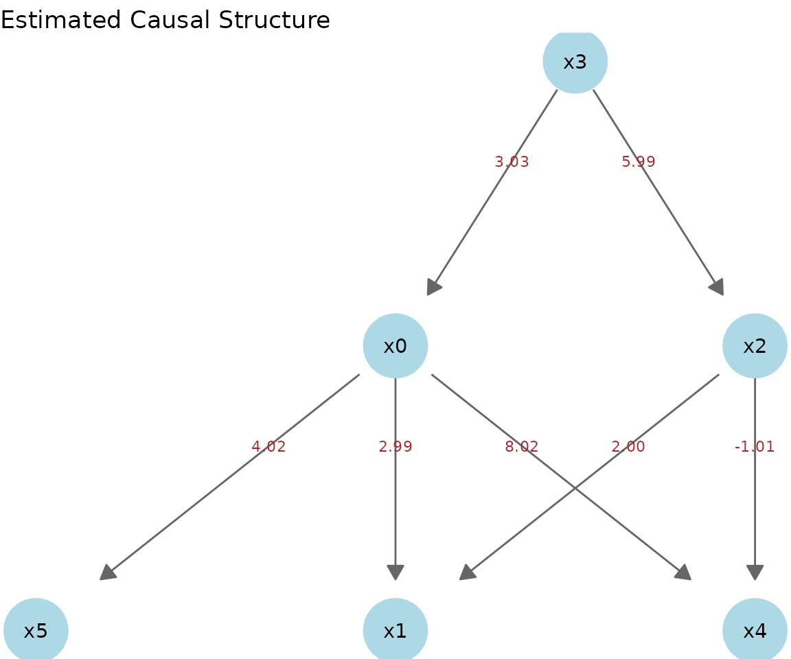
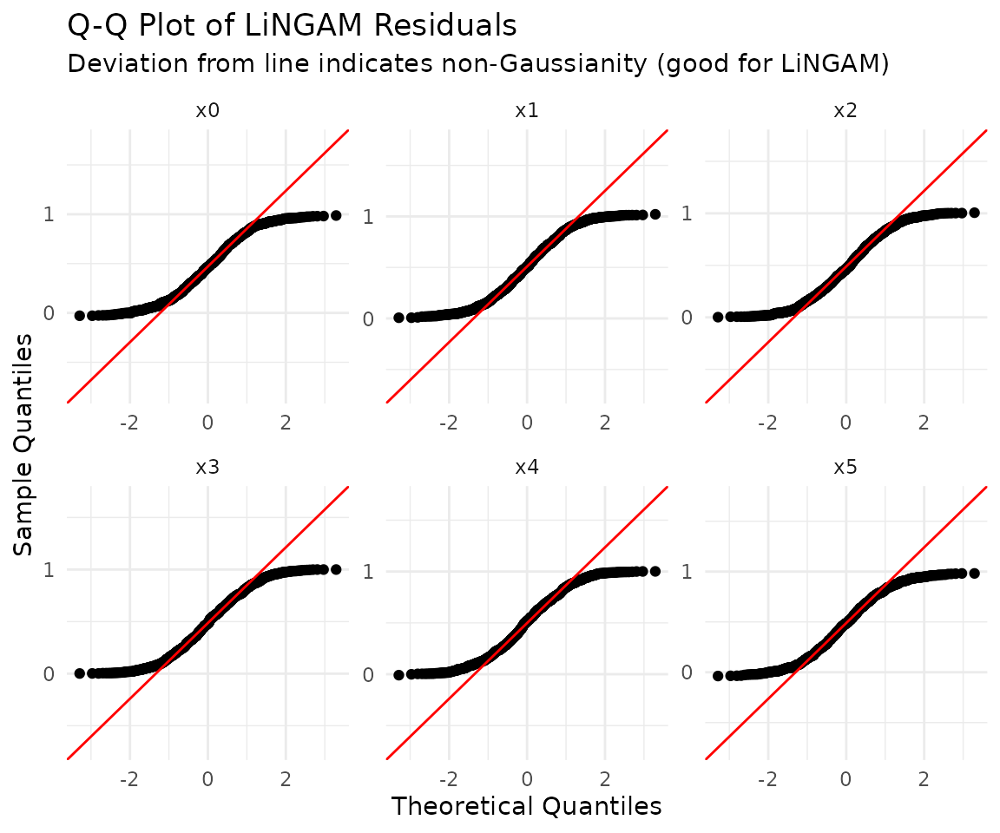
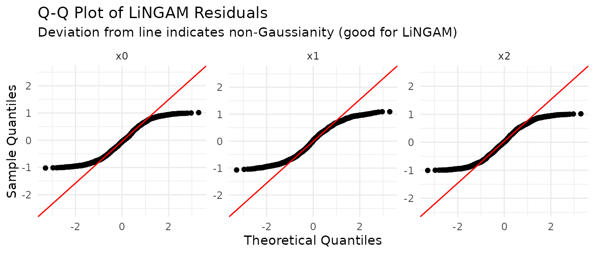

# Causal Discovery with lingamr

This vignette walks through a complete causal discovery workflow with
`lingamr`, step by step, using sample data.

``` r

library(lingamr)
```

## Sample Data

`lingamr` provides five sample data generators. Each returns a list
containing `data` (a data frame) and `true_adjacency` (the true
adjacency matrix).

| Function | Variables | Default n | Characteristics |
|----|:--:|:--:|----|
| [`generate_lingam_sample_6()`](https://morimotoosamu.github.io/lingamr/reference/generate_lingam_sample_6.md) | 6 | 1,000 | Standard fixed structure. The main example in this vignette |
| [`generate_lingam_sample_10()`](https://morimotoosamu.github.io/lingamr/reference/generate_lingam_sample_10.md) | 10 | 1,000 | An extension of the 6-variable case (used in [A Larger Dataset](#a-larger-dataset-10-variables)) |
| [`generate_lingam_hard_sample()`](https://morimotoosamu.github.io/lingamr/reference/generate_lingam_hard_sample.md) | 9 | 200 | A difficult setting with strong multicollinearity |
| [`generate_lingam_large_sample()`](https://morimotoosamu.github.io/lingamr/reference/generate_lingam_large_sample.md) | variable | 1,000 | A random sparse DAG with an arbitrary number of variables (used in [The Scalability Wall](#when-there-are-many-variables-the-scalability-wall)) |
| [`generate_lingam_paradox_data()`](https://morimotoosamu.github.io/lingamr/reference/generate_lingam_paradox_data.md) | 4 | 2,000 | The measurement error paradox (used in [The Paradox Example](#a-case-where-directlingam-struggles-the-measurement-error-paradox)) |

### generate_lingam_sample_6()

[`generate_lingam_sample_6()`](https://morimotoosamu.github.io/lingamr/reference/generate_lingam_sample_6.md)
returns artificial data following a 6-variable LiNGAM model, together
with its true adjacency matrix. The data is stored in `data` and the
adjacency matrix in `true_adjacency`.

``` r

x1k <- generate_lingam_sample_6(n = 1000)

x1k$data |>
  head()
#>         x0        x1       x2        x3        x4        x5
#> 1 2.814924 18.017120 4.543655 0.6333728 18.160090 12.236660
#> 2 1.889685 10.956005 2.188091 0.3175366 13.172754  7.932657
#> 3 1.008905  6.990652 1.953131 0.2409218  6.702107  4.797122
#> 4 1.965690 12.296763 2.847148 0.3784141 13.224002  8.685252
#> 5 1.698178  9.698147 2.145058 0.3521443 11.673495  7.366258
#> 6 1.412372  8.640107 1.929980 0.2977585 10.024075  6.340899
```

``` r

x1k$true_adjacency
#>    x0 x1 x2 x3 x4 x5
#> x0  0  0  0  3  0  0
#> x1  3  0  2  0  0  0
#> x2  0  0  0  6  0  0
#> x3  0  0  0  0  0  0
#> x4  8  0 -1  0  0  0
#> x5  4  0  0  0  0  0
```

[`plot_adjacency()`](https://morimotoosamu.github.io/lingamr/reference/plot_adjacency.md)
draws a causal graph based on the adjacency matrix.

``` r

x1k$true_adjacency |>
  plot_adjacency(
    labels  = colnames(x1k$data),
    title   = "True causal structure",
    rankdir = "TB",
    shape   = "circle"
  )
```

## Causal Discovery

[`lingam_direct()`](https://morimotoosamu.github.io/lingamr/reference/lingam_direct.md)
runs Direct LiNGAM. By default, independence is assessed using mutual
information, and path coefficients are computed with adaptive LASSO
regression.

``` r

model <- x1k$data |>
  lingam_direct()
```

To use HSIC for assessing independence, set the `measure` argument to
“kernel”. Note that HSIC is very computationally expensive.

### Causal Order

The estimated causal order is stored in `causal_order` as index numbers.

``` r

# index number
model$causal_order
#> [1] 4 3 1 5 6 2

# variable name
colnames(x1k$data)[model$causal_order]
#> [1] "x3" "x2" "x0" "x4" "x5" "x1"
```

### Estimated Adjacency Matrix

We inspect the estimated effect magnitudes. By default, the regression
coefficients from adaptive LASSO regression are used.

``` r

model$adjacency_matrix |>
  round(3)
#>       x0 x1     x2    x3 x4 x5
#> x0 0.000  0  0.000 3.033  0  0
#> x1 2.988  0  2.002 0.000  0  0
#> x2 0.000  0  0.000 5.993  0  0
#> x3 0.000  0  0.000 0.000  0  0
#> x4 8.017  0 -1.009 0.000  0  0
#> x5 4.015  0  0.000 0.000  0  0
```

### Drawing the Causal Graph

We draw the causal graph based on the adjacency matrix estimated by
Direct LiNGAM.

``` r

model$adjacency_matrix |>
  plot_adjacency(
    labels    = colnames(model$adjacency_matrix),
    title     = "Estimated Causal Structure (Direct LiNGAM)",
    rankdir   = "TB",
    shape     = "ellipse",
    fillcolor = "lightgreen"
  )
```

### Comparing the Estimated and True Structures

When the true structure is known, as with sample data, you can pass the
true adjacency matrix to the `true_B` argument of
[`plot_adjacency()`](https://morimotoosamu.github.io/lingamr/reference/plot_adjacency.md)
to color-code the estimated edges by comparing them against the true
structure. This lets you assess estimation accuracy at a glance, which
is useful for validating methods or for educational purposes.

- **Green (solid)**: correctly detected edges (estimated and true)
- **Red (solid)**: falsely detected edges (estimated but not true)
- **Orange (dashed)**: missed edges (true but not estimated; the true
  coefficient is shown)

``` r

model$adjacency_matrix |>
  plot_adjacency(
    labels  = colnames(model$adjacency_matrix),
    true_B  = x1k$true_adjacency,
    title   = "Estimated vs. True Structure",
    rankdir = "TB",
    shape   = "ellipse"
  )
```

### Static Plotting with ggplot2

While
[`plot_adjacency()`](https://morimotoosamu.github.io/lingamr/reference/plot_adjacency.md)
returns an interactive HTML figure via DiagrammeR,
[`autoplot()`](https://ggplot2.tidyverse.org/reference/autoplot.html)
draws the same causal structure as a static, ggplot2-based figure. This
is stable for image and PDF output in R Markdown / Quarto, and you can
layer ggplot2 functions on top to set themes or titles afterward. Node
positions are computed using `igraph`’s hierarchical layout, so the
causal flow generally runs from top to bottom.

[`autoplot()`](https://ggplot2.tidyverse.org/reference/autoplot.html) is
a ggplot2 generic, so call it as
[`ggplot2::autoplot()`](https://ggplot2.tidyverse.org/reference/autoplot.html)
or load it beforehand with
[`library(ggplot2)`](https://ggplot2.tidyverse.org) (plotting requires
`ggplot2` and `igraph`).

``` r

ggplot2::autoplot(model)
```



## Total Causal Effect

The **total causal effect** is the overall impact of changing one
variable by one unit, combining the direct path and all indirect paths
(paths through mediating variables).

``` r

total_effects <- x1k$data |>
  estimate_all_total_effects(model)

round(total_effects, 3)
#>       x0 x1     x2     x3 x4 x5
#> x0 0.000  0  0.000  3.033  0  0
#> x1 2.897  0  1.910 21.059  0  0
#> x2 0.000  0  0.000  5.993  0  0
#> x3 0.000  0  0.000  0.000  0  0
#> x4 8.001  0 -1.308 18.276  0  0
#> x5 4.015  0  0.000 12.179  0  0
```

### Comparison with Multiple Regression Coefficients

Multiple regression coefficients and total causal effects do not agree
when mediating variables are present.

In the true causal structure of
[`generate_lingam_sample_6()`](https://morimotoosamu.github.io/lingamr/reference/generate_lingam_sample_6.md),
there are two paths from x3 to x1 (there is no **direct** edge from x3
to x1).

- x3 -\> x0 -\> x1 (indirect effect: 3.0 x 3.0 = **9.0**)
- x3 -\> x2 -\> x1 (indirect effect: 6.0 x 2.0 = **12.0**)
- **Total causal effect of x3 on x1 = 9.0 + 12.0 = 21.0**

We compare the coefficients from an OLS regression that includes all
variables to predict x1 against the results of
[`estimate_all_total_effects()`](https://morimotoosamu.github.io/lingamr/reference/estimate_all_total_effects.md).

``` r

# Multiple regression: include all variables to predict x1
lm_coefs <- coef(lm(x1 ~ ., data = x1k$data))

# Comparison (variables causally related to x1: x0, x2, x3)
data.frame(
  variable           = c("x0", "x2", "x3"),
  OLS_coefficient    = round(lm_coefs[c("x0", "x2", "x3")], 3),
  total_causal_effect = round(total_effects["x1", c("x0", "x2", "x3")], 3)
)
#>    variable OLS_coefficient total_causal_effect
#> x0       x0           3.237               2.897
#> x2       x2           1.965               1.910
#> x3       x3           0.014              21.059
```

The OLS coefficient for x3 is nearly **0**. This is because including x0
and x2 (the mediating variables) in the model causes x3’s “effect
through mediation” to be absorbed into the coefficients of x0 and x2.

In contrast, the value of x3 from
[`estimate_all_total_effects()`](https://morimotoosamu.github.io/lingamr/reference/estimate_all_total_effects.md)
is **~21**, which correctly represents how much x1 ultimately changes
when x3 is moved by one unit.

| Question | Metric to use |
|----|----|
| “How does x1 change if I move x3 while holding x0 and x2 fixed?” | OLS multiple regression coefficient |
| “How does x1 change if I move x3, through all paths?” | Total causal effect |

When you want to know “the ultimate impact of intervening on a
variable,” use the total causal effect rather than the multiple
regression coefficient.

## Inference with Prior Knowledge

With
[`make_prior_knowledge()`](https://morimotoosamu.github.io/lingamr/reference/make_prior_knowledge.md),
you can incorporate domain knowledge about the causal relationships
among variables into Direct LiNGAM. This narrows the search space and
stabilizes estimation.

### Format of the Prior Knowledge Matrix

[`make_prior_knowledge()`](https://morimotoosamu.github.io/lingamr/reference/make_prior_knowledge.md)
returns a $`p \times p`$ integer matrix. It uses the indexing convention
**row = effect variable (to), column = cause variable (from)**, the same
convention as the adjacency matrix.

| Value | Meaning                                          |
|-------|--------------------------------------------------|
| `-1`  | Unknown (default; Direct LiNGAM searches freely) |
| `0`   | This edge does not exist                         |
| `1`   | This edge definitely exists                      |

The following shows how each argument affects the matrix.

| Argument | Value set | Meaning |
|----|----|----|
| `exogenous_variables` | the entire **row** of the specified variable -\> `0` | Receives no influence from any variable (root variable) |
| `sink_variables` | the entire **column** of the specified variable -\> `0` | Exerts no influence on any variable (sink variable) |
| `paths` | `pk[to, from] = 1` | Specifies that this edge exists |
| `no_paths` | `pk[to, from] = 0` | Specifies that this edge does not exist |

Variables can be specified either by **1-based index** or by **variable
name** (which requires the `labels` argument).

### Usage Example

We supply domain knowledge about the true structure of
[`generate_lingam_sample_6()`](https://morimotoosamu.github.io/lingamr/reference/generate_lingam_sample_6.md).

- **x3** (index 4) is exogenous – it receives no influence from any
  other variable
- **x1, x4, x5** (indices 2, 5, 6) are sink variables – they exert no
  influence on other variables
- **Between x0 and x2** there is no path (in either direction)

#### Specifying by Index

``` r

pk1 <- make_prior_knowledge(
  n_variables         = 6,
  exogenous_variables = 4,          # x3
  sink_variables      = c(2, 5, 6), # x1, x4, x5
  no_paths            = list(c(3, 1), c(1, 3)) # no x2<->x0
)

pk1
#>      [,1] [,2] [,3] [,4] [,5] [,6]
#> [1,]   -1    0    0   -1    0    0
#> [2,]   -1   -1   -1   -1    0    0
#> [3,]    0    0   -1   -1    0    0
#> [4,]    0    0    0   -1    0    0
#> [5,]   -1    0   -1   -1   -1    0
#> [6,]   -1    0   -1   -1    0   -1
```

How to read the matrix: if `pk1["x1", "x3"]` is `-1`, then “x3-\>x1 is
unknown (LiNGAM searches for it)”; if `0`, then “x3-\>x1 does not
exist”.

#### Specifying by Variable Name

Passing `labels` lets you specify by variable name. This improves
readability and is robust to adding or reordering columns.

``` r

pk1_named <- make_prior_knowledge(
  n_variables         = 6,
  exogenous_variables = "x3",
  sink_variables      = c("x1", "x4", "x5"),
  no_paths            = list(c("x2", "x0"), c("x0", "x2")),
  labels              = colnames(x1k$data)
)

# Equivalent in content to pk1
identical(pk1, pk1_named)
#> [1] FALSE
```

### Running Direct LiNGAM with Prior Knowledge

Simply pass it to the `prior_knowledge` argument and it is reflected in
the search.

``` r

model_pk1 <- x1k$data |>
  lingam_direct(prior_knowledge = pk1, lambda = "BIC")

cat("Causal Order: ", colnames(x1k$data)[model_pk1$causal_order], "\n")
#> Causal Order:  x3 x2 x0 x4 x5 x1
```

``` r

model_pk1$adjacency_matrix |>
  round(3)
#>       x0 x1     x2    x3 x4 x5
#> x0 0.000  0  0.000 3.033  0  0
#> x1 2.988  0  2.002 0.000  0  0
#> x2 0.000  0  0.000 5.993  0  0
#> x3 0.000  0  0.000 0.000  0  0
#> x4 8.017  0 -1.009 0.000  0  0
#> x5 4.015  0  0.000 0.000  0  0

model_pk1$adjacency_matrix |>
  plot_adjacency(
    labels    = colnames(model_pk1$adjacency_matrix),
    title     = "Estimated (with Prior Knowledge)",
    rankdir   = "TB",
    shape     = "circle",
    fillcolor = "lightgreen"
  )
```

## Choosing a Regression Method (reg_method)

In Direct LiNGAM, the adjacency matrix is estimated by regression after
the causal order is determined. The `reg_method` argument selects that
regression method.

| `reg_method` | `glmnet` | Sparsification | Characteristics |
|----|----|----|----|
| `"ols"` | Not required | None | Estimates all edges. For sanity checks or environments without the package |
| `"lasso"` | Required | Yes | Shrinks weak edges to 0 |
| `"adaptive_lasso"` | Required | Yes (strong) | **Default**. Has the oracle property – reliably sets truly zero edges to 0 |
| `"ridge"` | Required | None | Stabilizes coefficients with $`\ell_2`$ regularization. Robust to multicollinearity. Does not sparsify |

The oracle property is the theoretical guarantee that “the true
structure can be reliably recovered as the sample size grows,” so
`"adaptive_lasso"` is usually recommended.

### Comparison of the Four Methods

``` r

fit_ols    <- lingam_direct(x1k$data, reg_method = "ols")
fit_lasso  <- lingam_direct(x1k$data, reg_method = "lasso",          lambda = "BIC")
fit_alasso <- lingam_direct(x1k$data, reg_method = "adaptive_lasso", lambda = "BIC")
fit_ridge  <- lingam_direct(x1k$data, reg_method = "ridge",          lambda = "BIC")

# Compare the adjacency matrices side by side
round(fit_ols$adjacency_matrix,    3)
#>       x0 x1     x2     x3     x4    x5
#> x0 0.000  0 -0.040  3.274  0.000 0.000
#> x1 3.237  0  1.965  0.014 -0.034 0.006
#> x2 0.000  0  0.000  5.993  0.000 0.000
#> x3 0.000  0  0.000  0.000  0.000 0.000
#> x4 7.992  0 -1.062  0.394  0.000 0.000
#> x5 3.873  0  0.069 -0.315  0.018 0.000
round(fit_lasso$adjacency_matrix,  3)
#>       x0 x1     x2    x3 x4 x5
#> x0 0.000  0  0.000 3.030  0  0
#> x1 2.938  0  1.965 0.184  0  0
#> x2 0.000  0  0.000 5.993  0  0
#> x3 0.000  0  0.000 0.000  0  0
#> x4 7.979  0 -0.989 0.000  0  0
#> x5 3.977  0  0.000 0.000  0  0
round(fit_alasso$adjacency_matrix, 3)
#>       x0 x1     x2    x3 x4 x5
#> x0 0.000  0  0.000 3.033  0  0
#> x1 2.988  0  2.002 0.000  0  0
#> x2 0.000  0  0.000 5.993  0  0
#> x3 0.000  0  0.000 0.000  0  0
#> x4 8.017  0 -1.009 0.000  0  0
#> x5 4.015  0  0.000 0.000  0  0
round(fit_ridge$adjacency_matrix,  3)
#>       x0 x1     x2     x3    x4    x5
#> x0 0.000  0 -0.016  3.123 0.000 0.000
#> x1 2.172  0  2.043  0.170 0.057 0.084
#> x2 0.000  0  0.000  5.993 0.000 0.000
#> x3 0.000  0  0.000  0.000 0.000 0.000
#> x4 7.986  0 -1.028  0.209 0.000 0.000
#> x5 2.858  0  0.204 -0.329 0.143 0.000
```

OLS and Ridge tend to leave nonzero coefficients on all edges, whereas
LASSO and Adaptive LASSO shrink superfluous edges to 0. Ridge reduces
the **magnitude** of coefficients but does not set them to zero.

### Choosing lambda (common to LASSO / Adaptive LASSO)

The choice of penalty strength $`\lambda`$ directly determines the
sparsity of the estimate.

| `lambda` | Method | Sparsity | Use |
|----|----|----|----|
| `"BIC"` | Information criterion | Highest | **Default**. Stable even with small samples |
| `"AIC"` | Information criterion | High | Leaves slightly more edges than BIC |
| `"lambda.min"` | CV (minimum prediction error) | Low | Prioritizes predictive accuracy. More edges |
| `"lambda.1se"` | CV (1SE rule) | Medium to high | Robust CV variant |
| `"oracle"` | Analytic formula (adaptive_lasso only) | \- | $`\lambda = 5 / n^{1.75}`$. Guarantees the theoretical oracle property |

``` r

# Compare BIC (default, sparsest) and lambda.min (minimum prediction error)
fit_bic     <- lingam_direct(x1k$data, lambda = "BIC")
fit_lam_min <- lingam_direct(x1k$data, lambda = "lambda.min")

# Number of nonzero edges
sum(fit_bic$adjacency_matrix     != 0)
#> [1] 7
sum(fit_lam_min$adjacency_matrix != 0)
#> [1] 8
```

## Independence between Error Variables

LiNGAM assumes that the residuals are independent.
[`get_error_independence_p_values()`](https://morimotoosamu.github.io/lingamr/reference/get_error_independence_p_values.md)
returns the p-values from tests of independence between the residuals.

``` r

result <- x1k$data |>
  lingam_direct()

p_vals <- x1k$data |>
  get_error_independence_p_values(result)

round(p_vals, 3)
#>       x0    x1    x2    x3    x4    x5
#> x0    NA 0.988 0.214 0.976 0.484 0.954
#> x1 0.988    NA 0.986 0.991 0.323 0.882
#> x2 0.214 0.986    NA 0.919 0.100 0.124
#> x3 0.976 0.991 0.919    NA 0.806 0.974
#> x4 0.484 0.323 0.100 0.806    NA 0.643
#> x5 0.954 0.882 0.124 0.974 0.643    NA
```

## The Non-Gaussianity Assumption

The theoretical heart of LiNGAM is the assumption that **the error terms
follow a non-Gaussian distribution**. When the errors are Gaussian, the
**direction** of causation becomes fundamentally unidentifiable (a
reverse-direction model that explains the same distribution exists), and
the estimates are unreliable.

We verify this difference in practice by switching the error
distribution with the `noise_dist` argument of
[`generate_lingam_sample_6()`](https://morimotoosamu.github.io/lingamr/reference/generate_lingam_sample_6.md).
The true structure is as follows (the root is x3).

``` r

set.seed(0)
truth <- generate_lingam_sample_6(noise_dist = "uniform")

truth$true_adjacency |>
  round(1)
#>    x0 x1 x2 x3 x4 x5
#> x0  0  0  0  3  0  0
#> x1  3  0  2  0  0  0
#> x2  0  0  0  6  0  0
#> x3  0  0  0  0  0  0
#> x4  8  0 -1  0  0  0
#> x5  4  0  0  0  0  0
```

The causal graph of the true structure:

``` r

truth$true_adjacency |>
  plot_adjacency(
    labels = colnames(truth$data),
    title  = "True structure"
  )
```

### Non-Gaussian Errors (Uniform Distribution) – When It Works

``` r

fit_uniform <- lingam_direct(truth$data)

# Estimated causal order (the true root x3 comes first)
colnames(truth$data)[fit_uniform$causal_order]
#> [1] "x3" "x2" "x0" "x4" "x5" "x1"

# The estimated adjacency matrix recovers the true structure almost perfectly
fit_uniform$adjacency_matrix |>
  round(1)
#>    x0 x1 x2 x3 x4 x5
#> x0  0  0  0  3  0  0
#> x1  3  0  2  0  0  0
#> x2  0  0  0  6  0  0
#> x3  0  0  0  0  0  0
#> x4  8  0 -1  0  0  0
#> x5  4  0  0  0  0  0
```

The estimated graph matches the true structure. Edges are color-coded
against the truth: green = correct, red = false positive, orange dashed
= missed.

``` r

fit_uniform$adjacency_matrix |>
  plot_adjacency(
    labels = colnames(truth$data),
    true_B = truth$true_adjacency,
    title  = "Estimated (uniform errors)"
  )
```

### Gaussian Errors – When It Fails

With the same causal structure, the results break down when the errors
are Gaussian.

``` r

gauss <- generate_lingam_sample_6(noise_dist = "gaussian")
fit_gauss <- lingam_direct(gauss$data)

# The causal order does not match the true structure (root x3 does not come first)
colnames(gauss$data)[fit_gauss$causal_order]
#> [1] "x1" "x2" "x5" "x3" "x4" "x0"

fit_gauss$adjacency_matrix |>
  round(1)
#>    x0  x1   x2 x3  x4  x5
#> x0  0 0.1  0.0  0 0.1 0.0
#> x1  0 0.0  0.0  0 0.0 0.0
#> x2  0 0.3  0.0  0 0.0 0.0
#> x3  0 0.0  0.2  0 0.0 0.0
#> x4  0 0.9 -2.7  0 0.0 1.3
#> x5  0 1.2 -2.2  0 0.0 0.0
```

Compared with the true structure, many edges are wrong (red) or missed
(orange dashed) – the same color coding as above:

``` r

fit_gauss$adjacency_matrix |>
  plot_adjacency(
    labels = colnames(gauss$data),
    true_B = truth$true_adjacency,
    title  = "Estimated (Gaussian errors)"
  )
```

With non-Gaussian errors the true adjacency matrix is recovered as-is,
whereas with Gaussian errors both the causal order and the coefficients
deviate greatly from the true structure. This is why it is said that
“LiNGAM exploits the non-Gaussianity of the data to determine the
direction of causation.” When applying it to real data, it is important
to **test the normality of the residuals**, as in the next section, to
check whether this assumption holds.

## Testing the Normality of Residuals

We test the normality of the residuals. Because LiNGAM assumes
non-Gaussianity, having normality **rejected** (a small p-value) is
consistent with the model’s assumptions.

``` r

# Shapiro-Wilk (default)
x1k$data |>
  test_residual_normality(result)
#> === Residual Normality Test ===
#> Method:         shapiro
#> Sample size:    1000
#> Significance:   0.050
#> Non-Gaussian:   6 / 6 variables
#> 
#>  variable statistic   p_value is_non_gauss skewness kurtosis
#>        x0    0.9516 < 2.2e-16         TRUE    0.061   -1.215
#>        x1    0.9521 < 2.2e-16         TRUE    0.026   -1.213
#>        x2    0.9557 < 2.2e-16         TRUE    0.083   -1.170
#>        x3    0.9578  2.25e-16         TRUE    0.025   -1.163
#>        x4    0.9546 < 2.2e-16         TRUE   -0.003   -1.205
#>        x5    0.9536 < 2.2e-16         TRUE   -0.052   -1.206
#> 
#> Interpretation:
#>   is_non_gauss = TRUE  -> rejects normality (supports LiNGAM assumption)
#>   is_non_gauss = FALSE -> cannot reject normality (LiNGAM may not fit)
#> 
#> All residuals are non-Gaussian. LiNGAM assumption is supported.
```

We also check the normality of the residuals with a QQ plot.

``` r

x1k$data |>
  plot_residual_qq(result)
```



## Model Summary

[`summary_lingam()`](https://morimotoosamu.github.io/lingamr/reference/summary_lingam.md)
runs the residual independence test and the normality test together,
letting you review at a glance how well the two assumptions LiNGAM
relies on hold (that the residuals are mutually independent, and that
the residuals are non-Gaussian). Instead of calling
[`get_error_independence_p_values()`](https://morimotoosamu.github.io/lingamr/reference/get_error_independence_p_values.md)
and
[`test_residual_normality()`](https://morimotoosamu.github.io/lingamr/reference/test_residual_normality.md)
separately, you can survey the diagnostics in one place.

``` r

x1k$data |>
  summary_lingam(result)
#> === Direct LiNGAM Model Summary ===
#> Variables:    6
#> Observations: 1000
#> Edges:        7
#> Causal order: x3 -> x2 -> x0 -> x4 -> x5 -> x1
#> 
#> --- Assumption 1: Independence of residuals ---
#> Method:           spearman
#> Dependent pairs:  0 / 15  (p < 0.050)
#> Min p-value:      0.1002
#> => Residuals appear mutually independent (assumption supported).
#> 
#> --- Assumption 2: Non-Gaussianity of residuals ---
#> Method:           shapiro
#> Non-Gaussian:     6 / 6  (p <= 0.050)
#> => All residuals are non-Gaussian (assumption supported).
```

## Bootstrap Direct LiNGAM

We assess the reliability of the model using the bootstrap method.

``` r

bs_model <- x1k$data |>
  lingam_direct_bootstrap(n_sampling = 100L, seed = 42)
#> Bootstrap: 100 iterations, method=adaptive_lasso (sequential)
#>   iteration 1 / 100
#>   iteration 10 / 100
#>   iteration 20 / 100
#>   iteration 30 / 100
#>   iteration 40 / 100
#>   iteration 50 / 100
#>   iteration 60 / 100
#>   iteration 70 / 100
#>   iteration 80 / 100
#>   iteration 90 / 100
#>   iteration 100 / 100
#> Completed in 3.2 seconds.

bs_model
#> BootstrapResult: 100 samplings, 6 features
```

When the number of iterations or variables is large, specifying
`parallel = TRUE` lets it run faster on multiple cores. The number of
cores is specified with `n_cores` (when unspecified, it is capped at 2
cores for safety).

``` r

bs_model <- x1k$data |>
  lingam_direct_bootstrap(
    n_sampling = 100L,
    seed       = 42,
    parallel   = TRUE,
    n_cores    = 4L
  )
```

Note that parallel execution uses L’Ecuyer’s parallel random number
streams, so results are reproducible given the same `seed` and the same
`n_cores`, but they will not numerically match the results of sequential
execution (`parallel = FALSE`).

### Inspecting the Bootstrap Results

From the bootstrap results, we compute the frequency of occurrence of
each path and the mean of the coefficients.

``` r

bs_model |>
  get_causal_direction_counts(labels = names(x1k$data))
#>    from to count proportion mean_effect median_effect  sd_effect    ci_lower
#> 1     1  6   100       1.00  4.01535064    4.01518466 0.01127031  3.99552486
#> 2     1  2    99       0.99  2.98223709    2.97929357 0.02843886  2.93018267
#> 3     1  5    99       0.99  8.01741193    8.01499334 0.02793983  7.96982894
#> 4     3  2    99       0.99  2.00484060    2.00654938 0.01477014  1.97675011
#> 5     3  5    99       0.99 -1.00940817   -1.00898195 0.01434909 -1.03920338
#> 6     4  1    99       0.99  3.03520802    3.03586526 0.03002439  2.97854657
#> 7     4  3    99       0.99  5.99647035    5.99745219 0.03184846  5.94046661
#> 8     2  1     1       0.01  0.05299398    0.05299398 0.00000000  0.05299398
#> 9     2  3     1       0.01  0.40422428    0.40422428 0.00000000  0.40422428
#> 10    2  5     1       0.01  0.90679690    0.90679690 0.00000000  0.90679690
#> 11    3  4     1       0.01  0.16165370    0.16165370 0.00000000  0.16165370
#> 12    5  1     1       0.01  0.10459193    0.10459193 0.00000000  0.10459193
#> 13    5  3     1       0.01 -0.13879324   -0.13879324 0.00000000 -0.13879324
#>       ci_upper from_name to_name
#> 1   4.03705179        x0      x5
#> 2   3.03872609        x0      x1
#> 3   8.07779274        x0      x4
#> 4   2.03177449        x2      x1
#> 5  -0.98291713        x2      x4
#> 6   3.09306961        x3      x0
#> 7   6.06134091        x3      x2
#> 8   0.05299398        x1      x0
#> 9   0.40422428        x1      x2
#> 10  0.90679690        x1      x4
#> 11  0.16165370        x2      x3
#> 12  0.10459193        x4      x0
#> 13 -0.13879324        x4      x2
```

### Adjacency Matrix of Mean Causal Effects

We construct an adjacency matrix from the bootstrap results.

``` r

bs_adjacency_matrix <- bs_model |>
  get_adjacency_matrix_summary(stat = "median")

bs_adjacency_matrix |>
  round(3)
#>       [,1]  [,2]   [,3]  [,4]   [,5] [,6]
#> [1,] 0.000 0.053  0.000 3.036  0.105    0
#> [2,] 2.979 0.000  2.007 0.000  0.000    0
#> [3,] 0.000 0.404  0.000 5.997 -0.139    0
#> [4,] 0.000 0.000  0.162 0.000  0.000    0
#> [5,] 8.015 0.907 -1.009 0.000  0.000    0
#> [6,] 4.015 0.000  0.000 0.000  0.000    0
```

We visualize the estimated adjacency matrix.

``` r

bs_adjacency_matrix |>
  plot_adjacency(
    labels    = colnames(x1k$data),
    title     = "Estimated (with Bootstrap)",
    rankdir   = "TB",
    shape     = "circle",
    fillcolor = "lightgreen"
  )
```

### Matrix of Path Occurrence Frequencies

We compute the matrix of occurrence frequencies for each path.

``` r

bs_model |>
  get_probabilities()
#>      [,1] [,2] [,3] [,4] [,5] [,6]
#> [1,] 0.00 0.01 0.00 0.99 0.01    0
#> [2,] 0.99 0.00 0.99 0.00 0.00    0
#> [3,] 0.00 0.01 0.00 0.99 0.01    0
#> [4,] 0.00 0.00 0.01 0.00 0.00    0
#> [5,] 0.99 0.01 0.99 0.00 0.00    0
#> [6,] 1.00 0.00 0.00 0.00 0.00    0
```

### Mean Total Effects

We compute the mean total effect of each path.

``` r

bs_model |>
  get_total_causal_effects()
#>    from to      effect probability
#> 1     1  6  4.01522820        1.00
#> 2     1  2  2.89964231        0.99
#> 3     1  5  8.00358754        0.99
#> 4     3  2  1.93096970        0.99
#> 5     3  5 -1.24882407        0.99
#> 6     4  1  3.03586526        0.99
#> 7     4  2 21.07027271        0.99
#> 8     4  3  5.99805118        0.99
#> 9     4  5 18.28272145        0.99
#> 10    4  6 12.18719857        0.99
#> 11    6  2  0.20011220        0.11
#> 12    3  6 -0.32306351        0.07
#> 13    2  1  0.14794503        0.01
#> 14    2  3  0.27850920        0.01
#> 15    2  4  0.04611007        0.01
#> 16    2  5  0.90679690        0.01
#> 17    2  6  0.59359217        0.01
#> 18    3  4  0.16191585        0.01
#> 19    5  1  0.10506715        0.01
#> 20    5  3 -0.13869103        0.01
#> 21    5  6  0.41846402        0.01
```

We turn the bootstrap results into a causal graph. By default, only
paths that occur in at least 50% of samples are shown.

``` r

bs_model |>
  plot_bootstrap_probabilities()
```

### Stability of the Causal Order

[`get_causal_order_stability()`](https://morimotoosamu.github.io/lingamr/reference/get_causal_order_stability.md)
aggregates the causal orders estimated in each bootstrap sample and
quantifies how stable the order is. It returns the rank distribution of
each variable, the precedence probability for variable pairs (`P[i, j]`
= the fraction of samples in which variable i came upstream of j), and
an overall stability score (0 = random, 1 = identical across all
samples).

``` r

bs_model |>
  get_causal_order_stability(labels = names(x1k$data))
#> === Causal Order Stability ===
#> Bootstrap samples:       100
#> Overall stability score: 0.736  (0 = random, 1 = fully stable)
#> 
#> Rank summary (sorted by mean rank; 1 = most upstream):
#>  variable mean_rank sd_rank median_rank mode_rank
#>        x3      1.05    0.50           1         1
#>        x0      2.62    0.51           3         3
#>        x2      2.75    0.95           2         2
#>        x5      4.41    1.23           4         3
#>        x4      4.92    0.77           5         5
#>        x1      5.25    0.88           5         6
#> 
#> Precedence probability P[i, j] = P(variable i precedes j):
#>      x0   x1   x2   x3   x4   x5
#> x0 0.00 0.99 0.39 0.01 0.99 1.00
#> x1 0.01 0.00 0.01 0.01 0.38 0.34
#> x2 0.61 0.99 0.00 0.01 0.99 0.65
#> x3 0.99 0.99 0.99 0.00 0.99 0.99
#> x4 0.01 0.62 0.01 0.01 0.00 0.43
#> x5 0.00 0.66 0.35 0.01 0.57 0.00
```

## Integration with broom (tidy / glance)

Estimation results can be converted to a data.frame with the
`broom`-compatible
[`tidy()`](https://generics.r-lib.org/reference/tidy.html) /
[`glance()`](https://generics.r-lib.org/reference/glance.html), making
integration with `ggplot2` and `dplyr` easy.
[`tidy()`](https://generics.r-lib.org/reference/tidy.html) returns an
edge list (`from`, `to`, `estimate`), and
[`glance()`](https://generics.r-lib.org/reference/glance.html) returns a
one-row summary of the whole model.
[`tidy()`](https://generics.r-lib.org/reference/tidy.html) also works on
bootstrap results, in which case it returns the occurrence frequencies
for each direction, etc.

``` r

# Convert the estimated adjacency matrix to an edge list
tidy(model)
#>   from to  estimate
#> 1   x0 x1  2.987704
#> 2   x0 x4  8.016514
#> 3   x0 x5  4.015008
#> 4   x2 x1  2.001708
#> 5   x2 x4 -1.009459
#> 6   x3 x0  3.032965
#> 7   x3 x2  5.992677

# One-row summary of the whole model
glance(model)
#>   n_variables n_edges                     causal_order
#> 1           6       7 x3 -> x2 -> x0 -> x4 -> x5 -> x1

# Direction-wise summary of the bootstrap results (variable names via labels)
tidy(bs_model, labels = names(x1k$data))
#>    from to count proportion mean_effect median_effect  sd_effect    ci_lower
#> 1     1  6   100       1.00  4.01535064    4.01518466 0.01127031  3.99552486
#> 2     1  2    99       0.99  2.98223709    2.97929357 0.02843886  2.93018267
#> 3     1  5    99       0.99  8.01741193    8.01499334 0.02793983  7.96982894
#> 4     3  2    99       0.99  2.00484060    2.00654938 0.01477014  1.97675011
#> 5     3  5    99       0.99 -1.00940817   -1.00898195 0.01434909 -1.03920338
#> 6     4  1    99       0.99  3.03520802    3.03586526 0.03002439  2.97854657
#> 7     4  3    99       0.99  5.99647035    5.99745219 0.03184846  5.94046661
#> 8     2  1     1       0.01  0.05299398    0.05299398 0.00000000  0.05299398
#> 9     2  3     1       0.01  0.40422428    0.40422428 0.00000000  0.40422428
#> 10    2  5     1       0.01  0.90679690    0.90679690 0.00000000  0.90679690
#> 11    3  4     1       0.01  0.16165370    0.16165370 0.00000000  0.16165370
#> 12    5  1     1       0.01  0.10459193    0.10459193 0.00000000  0.10459193
#> 13    5  3     1       0.01 -0.13879324   -0.13879324 0.00000000 -0.13879324
#>       ci_upper from_name to_name
#> 1   4.03705179        x0      x5
#> 2   3.03872609        x0      x1
#> 3   8.07779274        x0      x4
#> 4   2.03177449        x2      x1
#> 5  -0.98291713        x2      x4
#> 6   3.09306961        x3      x0
#> 7   6.06134091        x3      x2
#> 8   0.05299398        x1      x0
#> 9   0.40422428        x1      x2
#> 10  0.90679690        x1      x4
#> 11  0.16165370        x2      x3
#> 12  0.10459193        x4      x0
#> 13 -0.13879324        x4      x2
```

## A Larger Dataset (10 Variables)

An example of a larger dataset with 10 variables and 10,000 rows.

``` r

x10k <- generate_lingam_sample_10(n = 10000)

x10k$true_adjacency |>
  plot_adjacency(
    labels  = colnames(x10k$data),
    title   = "True causal structure",
    rankdir = "TB",
    shape   = "circle"
  )
```

## Comparing ICA-LiNGAM and Direct LiNGAM

[`pcalg::lingam()`](https://rdrr.io/pkg/pcalg/man/LINGAM.html) is the
original LiNGAM algorithm, which estimates the mixing matrix with
FastICA and obtains the causal order and coefficients (Shimizu et
al. 2006). It solves the same problem while taking an approach
independent of
[`lingam_direct()`](https://morimotoosamu.github.io/lingamr/reference/lingam_direct.md).

### Running Both Algorithms

We analyze the same 6-variable dataset ($`n = 1000`$) with both methods.

``` r

d_cmp <- generate_lingam_sample_6(n = 1000, seed = 42)

t_cmp_direct <- system.time(res_cmp_direct <- lingam_direct(d_cmp$data))
t_cmp_ica    <- system.time(res_cmp_ica    <- pcalg::lingam(as.matrix(d_cmp$data)))

cat(sprintf("Direct LiNGAM : %.2f sec\nICA-LiNGAM    : %.2f sec\n",
            t_cmp_direct["elapsed"], t_cmp_ica["elapsed"]))
#> Direct LiNGAM : 0.01 sec
#> ICA-LiNGAM    : 0.02 sec
```

### Comparing the Estimated Coefficients

`$Bpruned` uses the same convention as the lingamr adjacency matrix
(`B[i, j]` = coefficient of $`x_j \to x_i`$).

``` r

B_ica <- res_cmp_ica$Bpruned
rownames(B_ica) <- colnames(B_ica) <- names(d_cmp$data)

idx_ica  <- which(abs(B_ica) > 0, arr.ind = TRUE)
tidy_ica <- data.frame(
  from  = colnames(B_ica)[idx_ica[, 2]],
  to    = rownames(B_ica)[idx_ica[, 1]],
  ica   = round(B_ica[idx_ica], 3)
)

tidy_dir <- tidy(res_cmp_direct)
tidy_dir <- data.frame(from = tidy_dir$from, to = tidy_dir$to,
                       direct = round(tidy_dir$estimate, 3))

merge(tidy_dir, tidy_ica, by = c("from", "to"), sort = TRUE)
#>   from to direct    ica
#> 1   x0 x1  2.988  3.245
#> 2   x0 x4  8.017  7.999
#> 3   x0 x5  4.015  3.876
#> 4   x2 x1  2.002  1.973
#> 5   x2 x4 -1.009 -1.060
#> 6   x3 x0  3.033  3.027
#> 7   x3 x2  5.993  6.101
```

### Comparing the DAG Structures

We compare the structures with a full outer join over all edges and
check consistency with the true DAG.

``` r

B_true   <- d_cmp$true_adjacency
idx_true <- which(abs(B_true) > 0, arr.ind = TRUE)
true_key <- paste(colnames(B_true)[idx_true[, 2]],
                  rownames(B_true)[idx_true[, 1]], sep = "->")

cmp <- merge(tidy_dir, tidy_ica, by = c("from", "to"), all = TRUE, sort = TRUE)
cmp$truth <- paste(cmp$from, cmp$to, sep = "->") %in% true_key
cmp
#>   from to direct    ica truth
#> 1   x0 x1  2.988  3.245  TRUE
#> 2   x0 x4  8.017  7.999  TRUE
#> 3   x0 x5  4.015  3.876  TRUE
#> 4   x2 x1  2.002  1.973  TRUE
#> 5   x2 x4 -1.009 -1.060  TRUE
#> 6   x3 x0  3.033  3.027  TRUE
#> 7   x3 x2  5.993  6.101  TRUE
```

When the `direct` or `ica` column is `NA`, it means that method did not
detect that edge. `truth = TRUE` indicates an edge that exists in the
true DAG.

------------------------------------------------------------------------

## When There Are Many Variables: The Scalability Wall

At each step, Direct LiNGAM performs independence tests on all remaining
pairs of variables. Since the number of steps is $`p`$ and the number of
tests per step is at most $`p(p-1)`$, the total number of independence
tests is approximately

``` math
\sum_{k=1}^{p} k(k-1) \approx \frac{p^3}{3}
```

giving a computational cost of **$`O(p^3)`$**. By contrast, the FastICA
used by ICA-LiNGAM is $`O(p^2 n)`$ (with BLAS optimization), so the gap
widens as the number of variables grows.

[`generate_lingam_large_sample()`](https://morimotoosamu.github.io/lingamr/reference/generate_lingam_large_sample.md)
generates random sparse DAG data with a freely configurable number of
variables `p`. Each variable $`x_i`$ ($`i \ge 1`$) randomly has at most
`max_parents` parents chosen from $`x_0, \ldots, x_{i-1}`$. Since the
causal order is guaranteed to follow the index order, the adjacency
matrix is always a **lower triangular matrix**.

### Generating the Data

``` r

d20 <- generate_lingam_large_sample(p = 20, n = 1000, seed = 42)

dim(d20$data)                    # 1000 rows x 20 columns
#> [1] 1000   20
sum(d20$true_adjacency != 0)     # number of true edges (sparse DAG)
#> [1] 32
d20$true_causal_order            # 0, 1, ..., 19
#>  [1]  0  1  2  3  4  5  6  7  8  9 10 11 12 13 14 15 16 17 18 19
```

### Comparing Execution Times

When $`p`$ grows by a factor of 1.5 (10 -\> 15), the number of
independence tests grows by a factor of $`15^3 / 10^3 \approx 3.4`$.

``` r

d10 <- generate_lingam_large_sample(p = 10, n = 500, seed = 42)
d15 <- generate_lingam_large_sample(p = 15, n = 500, seed = 42)

t10 <- system.time({ r10 <- lingam_direct(d10$data) })
t15 <- system.time({ r15 <- lingam_direct(d15$data) })

cat(sprintf(
  "p = 10 : %.2f sec\np = 15 : %.2f sec\ntheoretical factor %.1fx vs. observed %.1fx\n",
  t10["elapsed"],
  t15["elapsed"],
  15^3 / 10^3,
  t15["elapsed"] / max(t10["elapsed"], 0.01)
))
#> p = 10 : 0.03 sec
#> p = 15 : 0.06 sec
#> theoretical factor 3.4x vs. observed 2.1x
```

We run ICA-LiNGAM on the same data to compare speed directly.

``` r

t10_ica <- system.time({ pcalg::lingam(as.matrix(d10$data)) })
t15_ica <- system.time({ pcalg::lingam(as.matrix(d15$data)) })

cat(sprintf(
  "              p = 10   p = 15\nDirect LiNGAM : %5.2f sec  %5.2f sec\nICA-LiNGAM    : %5.2f sec  %5.2f sec\n",
  t10["elapsed"], t15["elapsed"],
  t10_ica["elapsed"], t15_ica["elapsed"]
))
#>               p = 10   p = 15
#> Direct LiNGAM :  0.03 sec   0.06 sec
#> ICA-LiNGAM    :  0.01 sec   0.03 sec
```

The larger $`p`$ becomes, the more Direct LiNGAM’s $`O(p^3)`$ cost
dominates, and the gap between the two widens. In large-scale settings
such as $`p = 30`$ or $`p = 50`$, this trend becomes even more
pronounced.

### Checking Estimation Accuracy (p = 10)

Even with a sparse DAG, as long as there are **non-Gaussian errors**
(default: uniform distribution), Direct LiNGAM can recover the correct
causal order.

``` r

# Estimated causal order
r10$causal_order
#>  [1]  1  2  3  7  4  5  9  8  6 10

# Whether it matches the true causal order 0, 1, ..., 9 exactly
all(r10$causal_order == d10$true_causal_order)
#> [1] FALSE
```

We convert to an edge list with
[`tidy()`](https://generics.r-lib.org/reference/tidy.html) and inspect
the estimated coefficients.

``` r

tidy(r10) |>
  head(10)
#>    from to   estimate
#> 1    x0 x1 -1.3787175
#> 2    x0 x2  1.0970109
#> 3    x0 x3  0.9352380
#> 4    x0 x5  1.2881634
#> 5    x1 x2  0.9042926
#> 6    x1 x3  1.4216545
#> 7    x1 x5 -1.2929148
#> 8    x1 x6  1.4634000
#> 9    x1 x9  1.2499665
#> 10   x2 x3 -1.4986808
```

## A Case Where DirectLiNGAM Struggles: The Measurement Error Paradox

Causal discovery methods have assumptions, and when those are violated
they may fail to recover the correct structure.
[`generate_lingam_paradox_data()`](https://morimotoosamu.github.io/lingamr/reference/generate_lingam_paradox_data.md)
is a dataset designed to deliberately create such a difficult case. As
with the other sample generators, it returns a list containing `data`
and `true_adjacency`.

The true structure of this data is a simple serial chain **x0 -\> x1 -\>
x2 -\> x3** (each coefficient 0.8). However, it has two notable
features.

- **Heavy measurement error is added to the root variable x0.** This
  disrupts the independence assessment performed in DirectLiNGAM’s first
  step, causing it to choose the root incorrectly and making error
  propagation more likely.
- All variables are **standardized** with
  [`scale()`](https://rdrr.io/r/base/scale.html) (no differences in
  scale).

``` r

paradox <- generate_lingam_paradox_data(n = 2000L, seed = 42)

head(paradox$data)
#>             x0         x1          x2         x3
#> 1  0.780627610  2.0872183  1.95046049  1.1209218
#> 2  0.529343129  1.1562639  1.86870201  1.6129261
#> 3 -1.193165251 -0.2515850 -0.43614264 -0.9056694
#> 4 -0.056001104  1.6615506  2.07542227  0.7890187
#> 5  0.004312424  1.0175487 -0.02532253 -0.3155891
#> 6  0.658064158  0.4833892  0.25385608  0.0167021

# All variables are standardized (sd = 1)
sapply(paradox$data, sd)
#> x0 x1 x2 x3 
#>  1  1  1  1
```

We visualize the true causal graph. The coefficient 0.8 is the
structural coefficient on the latent scale before standardization.

``` r

paradox$true_adjacency |>
  plot_adjacency(
    labels  = colnames(paradox$true_adjacency),
    title   = "True causal chain (x0 -> x1 -> x2 -> x3)",
    rankdir = "LR",
    shape   = "circle"
  )
```

Now let us apply Direct LiNGAM.

``` r

model_p <- lingam_direct(paradox$data)

# Estimated causal order
colnames(paradox$data)[model_p$causal_order]
#> [1] "x1" "x2" "x0" "x3"
```

Note that the **head of the estimated causal order is x1, not the true
root x0**. Because of the measurement error on the root, DirectLiNGAM
fails to select x0 as the first exogenous variable.

``` r

model_p$adjacency_matrix |>
  round(3)
#>    x0    x1    x2 x3
#> x0  0 0.558 0.000  0
#> x1  0 0.000 0.000  0
#> x2  0 0.833 0.000  0
#> x3  0 0.000 0.822  0

model_p$adjacency_matrix |>
  plot_adjacency(
    labels    = colnames(model_p$adjacency_matrix),
    title     = "Estimated structure (paradox data)",
    rankdir   = "LR",
    shape     = "circle",
    fillcolor = "lightpink"
  )
```

While the downstream **x1 -\> x2 -\> x3** is recovered correctly, the
**direction between x0 and x1 is reversed** (the truth is x0 -\> x1, but
the estimate is x1 -\> x0), and x0 ends up being treated almost like a
sink.

We use the bootstrap to check whether this error occurred by chance or
is systematic.

``` r

bs_paradox <- paradox$data |>
  lingam_direct_bootstrap(n_sampling = 100L, seed = 42)
#> Bootstrap: 100 iterations, method=adaptive_lasso (sequential)
#>   iteration 1 / 100
#>   iteration 10 / 100
#>   iteration 20 / 100
#>   iteration 30 / 100
#>   iteration 40 / 100
#>   iteration 50 / 100
#>   iteration 60 / 100
#>   iteration 70 / 100
#>   iteration 80 / 100
#>   iteration 90 / 100
#>   iteration 100 / 100
#> Completed in 1.6 seconds.

# Occurrence probability of each direction (row = to, column = from)
bs_paradox |>
  get_probabilities() |>
  round(2)
#>      [,1] [,2] [,3] [,4]
#> [1,]    0    1 0.05 0.01
#> [2,]    0    0 0.00 0.00
#> [3,]    0    1 0.00 0.00
#> [4,]    0    0 1.00 0.00
```

The important point is that the incorrect direction **x1 -\> x0** is
reproduced with nearly 100% probability. In other words, this error is
not coincidental but **systematic**, and it appears stably across
bootstrap samples.

> **Lesson:** Bootstrap stability (high reproduction probability) does
> not guarantee the *correctness* of the estimate. When the model’s
> assumptions (here, the assumption that “upstream variables have no
> measurement error”) are violated, the method may **stably** recover an
> incorrect structure. It is important to evaluate results critically,
> together with tests of residual independence and normality and domain
> knowledge about the data-generating process.

## VAR-LiNGAM: Causal Discovery in Time Series

Direct LiNGAM assumes that observations are **independent and
identically distributed (i.i.d.)**, a requirement that time series data
violate. **VAR-LiNGAM** (Hyvärinen et al., 2010) handles stationary time
series by first fitting a Vector Autoregression (VAR) model to absorb
temporal autocorrelation, then applying Direct LiNGAM to the VAR
residuals to recover the **instantaneous** causal structure $`B_0`$. The
model is:

``` math
X_t = B_0\,X_t + \sum_{k=1}^{p} B_k\,X_{t-k} + e_t
```

where $`B_0`$ encodes contemporaneous causal effects (strictly acyclic),
$`B_1, \ldots, B_p`$ encode lagged effects, and $`e_t`$ are mutually
independent non-Gaussian disturbances.

### Sample Data

[`generate_varlingam_sample()`](https://morimotoosamu.github.io/lingamr/reference/generate_varlingam_sample.md)
produces a three-variable time series from a VAR(1)-LiNGAM model. The
instantaneous structure is $`x_0 \to x_1 \to x_2`$ (coefficients 0.6 and
−0.5), and the only cross-variable lag-1 effect is
$`x_2(t-1) \to x_0(t)`$ (coefficient 0.3).

``` r

s <- generate_varlingam_sample(n = 1000, seed = 42)

# True instantaneous coefficient matrix B0  (B0[i, j]: x_j -> x_i)
s$true_B0
#>      [,1] [,2] [,3]
#> [1,]  0.0  0.0    0
#> [2,]  0.6  0.0    0
#> [3,]  0.0 -0.5    0

# True lag-1 coefficient matrix  (M1[i, j]: x_j(t-1) -> x_i(t), structural)
s$true_M1
#>      [,1] [,2] [,3]
#> [1,]  0.4  0.0  0.3
#> [2,]  0.0  0.3  0.0
#> [3,]  0.0  0.0  0.5
```

### Fitting VAR-LiNGAM

Pass the data matrix to
[`lingam_var()`](https://morimotoosamu.github.io/lingamr/reference/lingam_var.md).
Rows must be in chronological order (earliest first).

``` r

model <- lingam_var(s$data, lags = 1)
model
#> VAR-LiNGAM Result
#>   Variables : 3
#>   Lag order : 1
#>   Causal order (instantaneous): x0 -> x1 -> x2
#> 
#> Instantaneous adjacency matrix B0 (row = to, col = from):
#>       x0     x1 x2
#> x0 0.000  0.000  0
#> x1 0.576  0.000  0
#> x2 0.000 -0.491  0
#> 
#> Lagged adjacency matrix B1 (row = to, col = from):
#>     x0    x1    x2
#> x0 0.4 0.000 0.309
#> x1 0.0 0.226 0.000
#> x2 0.0 0.000 0.495
```

The result object contains `adjacency_matrices`, a three-dimensional
array of shape `[1 + lags, n_features, n_features]`:

- **`[1, , ]` (`"lag0"`):** instantaneous matrix $`B_0`$. `B0[i, j]` is
  the direct effect of $`x_j`$ on $`x_i`$ at the *same* time step.
- **`[k + 1, , ]` (`"lag`*k*`"`):** lagged matrix $`B_k`$. `Bk[i, j]` is
  the direct structural effect of $`x_j(t-k)`$ on $`x_i(t)`$.

Both can be extracted by their dimension label:

``` r

B0 <- model$adjacency_matrices["lag0", , ]
B1 <- model$adjacency_matrices["lag1", , ]

round(B0, 2)  # compare with s$true_B0
#>      x0    x1 x2
#> x0 0.00  0.00  0
#> x1 0.58  0.00  0
#> x2 0.00 -0.49  0
round(B1, 2)  # compare with s$true_M1
#>     x0   x1   x2
#> x0 0.4 0.00 0.31
#> x1 0.0 0.23 0.00
#> x2 0.0 0.00 0.49
```

### Lag Order Selection

By default,
[`lingam_var()`](https://morimotoosamu.github.io/lingamr/reference/lingam_var.md)
automatically selects the lag order among `1:lags` using the Bayesian
Information Criterion (`criterion = "bic"`). The alternatives `"aic"`,
`"hqic"`, and `"fpe"` are also supported. To use a fixed lag order
without automatic selection, set `criterion = NULL`:

``` r

# Fix lag order to 2 without IC-based selection
model_lag2 <- lingam_var(s$data, lags = 2, criterion = NULL)
```

### Stationarity Check

VAR-LiNGAM is defined for **stationary** processes.
[`check_var_stationarity()`](https://morimotoosamu.github.io/lingamr/reference/check_var_stationarity.md)
inspects the eigenvalues of the VAR companion matrix: the process is
stationary when all moduli are **strictly less than 1**.

``` r

check_var_stationarity(model)
#> === VAR Stationarity Check ===
#> Lag order:         1
#> Max |eigenvalue|:  0.4943  (threshold 1.00)
#> Stationary:        YES
```

A `max_modulus` at or above 1 indicates a unit-root or explosive
process. In that case, differencing the series before analysis is
recommended.

### Residual Diagnostics

LiNGAM assumes that the error terms $`e_t`$ are **non-Gaussian**.
[`test_varlingam_residual_normality()`](https://morimotoosamu.github.io/lingamr/reference/test_varlingam_residual_normality.md)
tests whether the LiNGAM innovations $`e_t = (I - B_0)\,n_t`$ (where
$`n_t`$ are the stored VAR residuals) depart from normality. A small
p-value (reject $`H_0`$: Gaussian) supports the model assumption.

``` r

test_varlingam_residual_normality(model)
#> === Residual Normality Test ===
#> Method:         shapiro
#> Sample size:    999
#> Significance:   0.050
#> Non-Gaussian:   3 / 3 variables
#> 
#>  variable statistic   p_value is_non_gauss skewness kurtosis
#>        x0    0.9498 < 2.2e-16         TRUE    0.088   -1.220
#>        x1    0.9536 < 2.2e-16         TRUE   -0.007   -1.238
#>        x2    0.9519 < 2.2e-16         TRUE   -0.046   -1.221
#> 
#> Interpretation:
#>   is_non_gauss = TRUE  -> rejects normality (supports LiNGAM assumption)
#>   is_non_gauss = FALSE -> cannot reject normality (LiNGAM may not fit)
#> 
#> All residuals are non-Gaussian. LiNGAM assumption is supported.
```

[`test_varlingam_residual_normality_all()`](https://morimotoosamu.github.io/lingamr/reference/test_varlingam_residual_normality_all.md)
runs several tests at once and appends skewness and excess kurtosis
columns for a quick overview:

``` r

test_varlingam_residual_normality_all(model, methods = c("shapiro", "jb"))
#> Registered S3 method overwritten by 'quantmod':
#>   method            from
#>   as.zoo.data.frame zoo
#>   variable    skewness  kurtosis    p_shapiro         p_jb all_non_gauss
#> 1       x0  0.08801343 -1.219504 6.041150e-18 1.898481e-14          TRUE
#> 2       x1 -0.00706622 -1.238433 3.113275e-17 1.365574e-14          TRUE
#> 3       x2 -0.04637669 -1.220514 1.453019e-17 2.864375e-14          TRUE
```

[`plot_varlingam_residual_qq()`](https://morimotoosamu.github.io/lingamr/reference/plot_varlingam_residual_qq.md)
draws per-variable normal Q-Q plots. Deviations from the straight
reference line indicate non-Gaussianity.

``` r

plot_varlingam_residual_qq(model)
```



### Total Causal Effects

[`estimate_var_total_effect()`](https://morimotoosamu.github.io/lingamr/reference/estimate_var_total_effect.md)
estimates the **total** causal effect of one variable on another,
integrating over all direct and mediated paths. The `from_lag` argument
controls the time offset of the cause: `from_lag = 0` (default) gives
the contemporaneous total effect; `from_lag = 1` gives the
one-step-ahead effect of $`x_j(t-1)`$ on $`x_i(t)`$.

``` r

# Total effect x0 -> x2 (contemporaneous)
estimate_var_total_effect(s$data, model, from_index = 1, to_index = 3)
#> [1] -0.2582049

# Total effect x0(t-1) -> x2(t) (one-step-ahead)
estimate_var_total_effect(s$data, model, from_index = 1, to_index = 3, from_lag = 1)
#> [1] -0.2752551
```

Variable indices are **1-based** integers, or column names as character
strings.

### Bootstrap

[`lingam_var_bootstrap()`](https://morimotoosamu.github.io/lingamr/reference/lingam_var_bootstrap.md)
quantifies the uncertainty of the estimated structure by re-running
VAR-LiNGAM on **residual bootstrap** samples. Unlike the Direct LiNGAM
bootstrap (which resamples i.i.d. rows), VAR-LiNGAM holds the fitted
values fixed and resamples only the VAR residuals, preserving the
temporal structure of the series.

``` r

bs_var <- lingam_var_bootstrap(
  s$data,
  n_sampling = 100L,
  seed       = 42,
  verbose    = FALSE
)
```

[`get_var_probabilities()`](https://morimotoosamu.github.io/lingamr/reference/get_var_probabilities.md)
returns the proportion of bootstrap samples in which each directed edge
was detected. The column layout mirrors `adjacency_matrices`: the first
`n_features` columns correspond to the instantaneous structure (lag 0),
the next `n_features` to lag 1, and so on.

``` r

round(get_var_probabilities(bs_var), 2)
#>      [,1] [,2] [,3] [,4] [,5] [,6]
#> [1,] 0.00    0    0 1.00    0 1.00
#> [2,] 1.00    0    0 0.01    1 0.01
#> [3,] 0.02    1    0 0.00    0 1.00
```

[`get_var_paths()`](https://morimotoosamu.github.io/lingamr/reference/get_var_paths.md)
enumerates all causal paths between two variables found across bootstrap
samples, together with each path’s average total effect and detection
probability.

``` r

# Paths from x0 to x2 at the same time step (from_lag = 0)
get_var_paths(bs_var, from_index = 1, to_index = 3)
#>      path      effect probability
#> 1 1, 2, 3 -0.28287819        1.00
#> 2    1, 3  0.08065484        0.02
```

``` r

# Paths from x0(t-1) to x2(t)  (from_lag = 1)
get_var_paths(bs_var, from_index = 1, to_index = 3, from_lag = 1)
#>            path       effect probability
#> 1    4, 1, 2, 3 -0.112809271        1.00
#> 2    4, 5, 2, 3 -0.062306657        1.00
#> 3  4, 5, 6,....  0.024968865        1.00
#> 4    4, 5, 6, 3 -0.139165424        1.00
#> 5       4, 1, 3  0.034837247        0.02
#> 6  4, 5, 6,.... -0.007769310        0.02
#> 7  4, 6, 1,.... -0.007769310        0.02
#> 8    4, 6, 1, 3  0.002034289        0.02
#> 9       4, 6, 3  0.040311950        0.02
#> 10      4, 2, 3 -0.068038894        0.01
#> 11 4, 5, 6,.... -0.018272003        0.01
```

## When LiNGAM Cannot Be Used

LiNGAM (and `lingamr`) requires several assumptions. When these are not
met, estimation either fails or systematically recovers an incorrect
structure.

| Assumption | When problems arise | Remedy / alternative |
|----|----|----|
| **Non-Gaussian errors** | When all errors follow a Gaussian distribution, the causal direction becomes unidentifiable | See the “The Non-Gaussianity Assumption” section of this vignette. ICA-LiNGAM and Direct LiNGAM fail equally |
| **Acyclic graph (DAG)** | When feedback loops (x -\> y -\> x) exist | Consider Cyclic LiNGAM (implemented in the Python version) |
| **No latent common causes** | When unobserved common causes (hidden confounders) exist | Consider LvLiNGAM (Latent variable LiNGAM) |
| **Linear causal relationships** | When the relationships among variables are nonlinear | Consider additive noise models (ANM) or nonlinear ICA |
| **No measurement error (upstream variables)** | When heavy measurement error is present on variables near the root, the direction is systematically reversed | See the “The Measurement Error Paradox” section of this vignette |
| **Independent and identically distributed (i.i.d.)** | When there is time-series data, hierarchical data, or cluster structure | Consider VAR-LiNGAM (time series), MultiBench (multi-domain), etc. |
| **Sufficient sample size** | When $`n`$ is extremely small relative to the number of variables $`p`$ (rule of thumb: $`n < 10p`$), estimation tends to be unstable | Reduce the number of variables; sparsify with `reg_method = "adaptive_lasso"` |

### A Checklist to Verify in Advance

Before starting an actual analysis, we recommend confirming the
following.

1.  **Acyclicity of the graph** – Can feedback loops be ruled out from
    domain expertise?
2.  **Absence of latent variables** – Are the key observed variables all
    present?
3.  **Non-Gaussianity of the errors** – Can be checked with
    [`test_residual_normality()`](https://morimotoosamu.github.io/lingamr/reference/test_residual_normality.md)
    (though this is a post-estimation diagnostic). As a quick check
    beforehand, visually inspect each variable’s histogram and skewness.
4.  **Presence of measurement error** – Is there measurement error on
    variables near the root? If so, interpret with care.
5.  **Sample size** – Aim for $`n \geq 10p`$. If it falls short, do not
    over-trust the results.

> **Summary:** LiNGAM is powerful when all five assumptions – linear,
> acyclic, non-Gaussian, no latent variables, and i.i.d. – hold.
> Verifying these with domain knowledge and residual diagnostics before
> analysis is the first step toward reliable causal inference.
