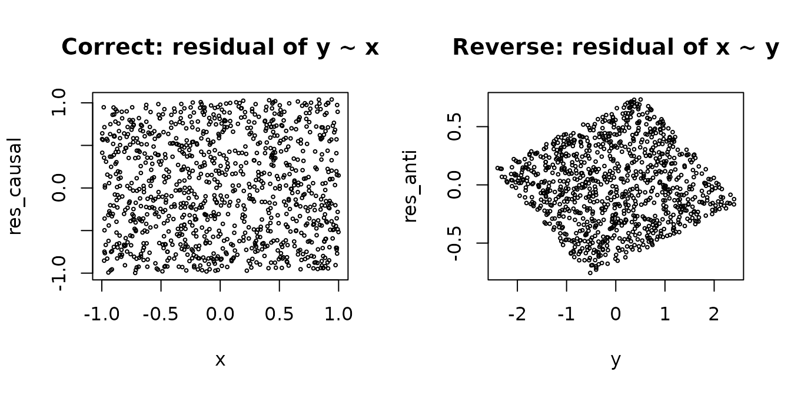

# Causal Discovery with lingamr

`lingamr` estimates **causal structure** — which variable causes which,
and how strongly — from purely observational data, using the LiNGAM
family of algorithms (an R port of the Python
[`lingam`](https://github.com/cdt15/lingam) package by the [Shimizu
lab](https://www.shimizulab.org/)).

This vignette explains the core idea behind LiNGAM and walks through a
minimal end-to-end workflow. Detailed guides for every method live on
the package website; see [Where to Go Next](#where-to-go-next).

``` r

library(lingamr)
```

## The Idea: Why Non-Gaussianity Reveals Causal Direction

Correlation alone cannot distinguish “x causes y” from “y causes x”:
both models can produce exactly the same covariance matrix. Classical
methods based on second-order statistics therefore return, at best, an
*equivalence class* of structures.

LiNGAM (Linear Non-Gaussian Acyclic Model; Shimizu et al. 2006) resolves
the direction by adding one assumption: the error terms are
**non-Gaussian**. The model for each variable is

``` math
x_i = \sum_{j:\ \mathrm{parent\ of\ } i} b_{ij}\, x_j + e_i,
```

with mutually independent, non-Gaussian errors $`e_i`$, arranged in a
DAG. Under these assumptions the full causal structure is **uniquely
identifiable** from observational data — not just up to an equivalence
class.

The intuition fits in one experiment. Take the true model
$`y = 1.5x + e`$ with a *uniform* (non-Gaussian) error, and regress in
both directions:

``` r

n <- 1000
x <- runif(n, -1, 1)
y <- 1.5 * x + runif(n, -1, 1)

res_causal <- residuals(lm(y ~ x)) # correct direction:  x -> y
res_anti   <- residuals(lm(x ~ y)) # reverse direction:  y -> x

oldpar <- par(mfrow = c(1, 2))
plot(x, res_causal, main = "Correct: residual of y ~ x", cex = 0.4)
plot(y, res_anti,   main = "Reverse: residual of x ~ y", cex = 0.4)
```



``` r

par(oldpar)
```

In the correct direction the residual is **independent** of the
regressor (left panel: a featureless band). In the reverse direction it
is not (right panel: the residual’s spread depends on $`y`$). Direct
LiNGAM turns this asymmetry into an algorithm: the variable whose
residuals are most independent of it is the most upstream (“exogenous”)
one; peel it off, regress it out, and repeat.

Had the error been Gaussian, both panels would look identical — this is
why non-Gaussianity is essential, and why the *basic* LiNGAM model rests
on four assumptions:

1.  **Linear** relationships,
2.  an **acyclic** graph (a DAG),
3.  **non-Gaussian**, mutually independent errors,
4.  **no latent confounder** (all common causes observed),

plus i.i.d. observations. `lingamr` also ships estimators that relax
each of these — see
[`vignette("method-selection")`](https://morimotoosamu.github.io/lingamr/articles/method-selection.md).

## A Minimal Workflow

### Estimate

[`generate_lingam_sample_6()`](https://morimotoosamu.github.io/lingamr/reference/generate_lingam_sample_6.md)
generates data from a known 6-variable LiNGAM model, so we can compare
estimates against the truth.
[`lingam_direct()`](https://morimotoosamu.github.io/lingamr/reference/lingam_direct.md)
runs Direct LiNGAM — by default, independence is assessed via mutual
information and coefficients are estimated with adaptive LASSO.

``` r

x1k <- generate_lingam_sample_6(n = 1000)

model <- lingam_direct(x1k$data)
model
#> Direct LiNGAM Result
#>   Variables : 6
#>   Causal order: x3 -> x2 -> x0 -> x4 -> x5 -> x1
#> 
#> Adjacency matrix (row = to, col = from):
#>       x0 x1     x2    x3 x4 x5
#> x0 0.000  0  0.000 3.033  0  0
#> x1 2.988  0  2.002 0.000  0  0
#> x2 0.000  0  0.000 5.993  0  0
#> x3 0.000  0  0.000 0.000  0  0
#> x4 8.000  0 -1.000 0.000  0  0
#> x5 4.015  0  0.000 0.000  0  0
```

The two key components of the result:

``` r

# The estimated causal order, upstream first
colnames(x1k$data)[model$causal_order]
#> [1] "x3" "x2" "x0" "x4" "x5" "x1"

# The adjacency matrix: B[i, j] is the direct effect of x_j on x_i
round(model$adjacency_matrix, 3)
#>       x0 x1     x2    x3 x4 x5
#> x0 0.000  0  0.000 3.033  0  0
#> x1 2.988  0  2.002 0.000  0  0
#> x2 0.000  0  0.000 5.993  0  0
#> x3 0.000  0  0.000 0.000  0  0
#> x4 8.000  0 -1.000 0.000  0  0
#> x5 4.015  0  0.000 0.000  0  0
```

### Visualize

[`plot_adjacency()`](https://morimotoosamu.github.io/lingamr/reference/plot_adjacency.md)
draws the causal graph; passing the true structure via `true_B`
color-codes the comparison (green = correct, red = false positive,
orange dashed = missed).

``` r

model$adjacency_matrix |>
  plot_adjacency(
    labels = colnames(x1k$data),
    true_B = x1k$true_adjacency,
    title  = "Estimated vs. true structure"
  )
```

### Intervene: Total Causal Effects

The total causal effect — how much a variable ultimately moves when
another is changed by one unit, through all paths — is what you need to
reason about interventions (a multiple-regression coefficient answers a
different question; see the [Direct LiNGAM
article](https://morimotoosamu.github.io/lingamr/articles/direct-lingam.html)).

``` r

total_effects <- estimate_all_total_effects(x1k$data, model)
round(total_effects, 2)
#>      x0 x1    x2    x3 x4 x5
#> x0 0.00  0  0.00  3.03  0  0
#> x1 2.87  0  1.94 21.06  0  0
#> x2 0.00  0  0.00  5.99  0  0
#> x3 0.00  0  0.00  0.00  0  0
#> x4 7.91  0 -1.13 18.28  0  0
#> x5 4.02  0  0.00 12.18  0  0
```

### Check the Assumptions

[`summary_lingam()`](https://morimotoosamu.github.io/lingamr/reference/summary_lingam.md)
bundles the two key diagnostics: residuals should be mutually
**independent** (assumption 4) and **non-Gaussian** (assumption 3 — so
normality being *rejected* is good news here).

``` r

summary_lingam(x1k$data, model)
#> === Direct LiNGAM Model Summary ===
#> Variables:    6
#> Observations: 1000
#> Edges:        7
#> Causal order: x3 -> x2 -> x0 -> x4 -> x5 -> x1
#> 
#> --- Assumption 1: Independence of residuals ---
#> Method:           spearman
#> Dependent pairs:  0 / 15  (p < 0.050)
#> Min p-value:      0.0510
#> => Residuals appear mutually independent (assumption supported).
#> 
#> --- Assumption 2: Non-Gaussianity of residuals ---
#> Method:           shapiro
#> Non-Gaussian:     6 / 6  (p <= 0.050)
#> => All residuals are non-Gaussian (assumption supported).
```

### Quantify Stability

The bootstrap re-runs the estimation on resampled data and reports how
often each edge recurs — low-probability edges should not be
over-interpreted:

``` r

bs <- lingam_direct_bootstrap(x1k$data, n_sampling = 50L, seed = 42)
#> Bootstrap: 50 iterations, method=adaptive_lasso (sequential)
#>   iteration 1 / 50
#>   iteration 10 / 50
#>   iteration 20 / 50
#>   iteration 30 / 50
#>   iteration 40 / 50
#>   iteration 50 / 50
#> Completed in 1.6 seconds.

round(get_probabilities(bs), 2)
#>      [,1] [,2] [,3] [,4] [,5] [,6]
#> [1,] 0.00 0.02 0.00 0.98 0.02    0
#> [2,] 0.98 0.00 0.98 0.00 0.00    0
#> [3,] 0.00 0.02 0.00 0.98 0.02    0
#> [4,] 0.00 0.00 0.02 0.00 0.00    0
#> [5,] 0.98 0.02 0.98 0.00 0.00    0
#> [6,] 1.00 0.00 0.00 0.00 0.00    0
```

## Where to Go Next

Which estimator fits your data — time series, latent confounders,
nonlinear relationships, mixed or missing data — is covered in
[`vignette("method-selection")`](https://morimotoosamu.github.io/lingamr/articles/method-selection.md).

Detailed worked examples live on the [package
website](https://morimotoosamu.github.io/lingamr/):

| Article | Covers |
|----|----|
| [Direct LiNGAM in depth](https://morimotoosamu.github.io/lingamr/articles/direct-lingam.html) | Prior knowledge, regression methods, non-Gaussianity experiments, high-dimensional data, failure modes |
| [Bootstrap and diagnostics](https://morimotoosamu.github.io/lingamr/articles/bootstrap-diagnostics.html) | Stability analysis, assumption checks, SEM fit, broom integration |
| [Time series](https://morimotoosamu.github.io/lingamr/articles/time-series.html) | VAR-LiNGAM, VARMA-LiNGAM |
| [Latent confounders](https://morimotoosamu.github.io/lingamr/articles/latent-confounders.html) | BottomUpParceLiNGAM, RCD |
| [Nonlinear methods](https://morimotoosamu.github.io/lingamr/articles/nonlinear.html) | RESIT, CAM-UV |
| [Special data](https://morimotoosamu.github.io/lingamr/articles/special-data.html) | Mixed data (LiM), multiple groups, missing values |

A Japanese translation of this vignette is available as
[`vignette("lingamr-ja")`](https://morimotoosamu.github.io/lingamr/articles/lingamr-ja.md);
the website articles are also available in Japanese.
