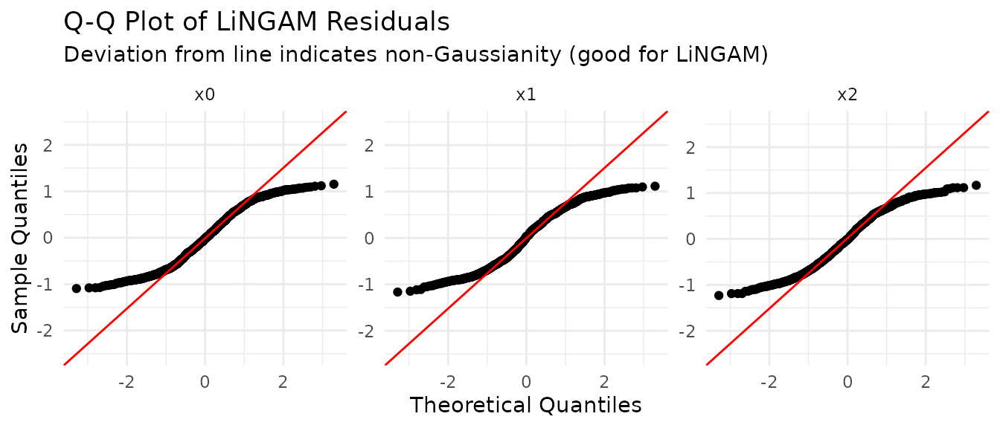

# Time Series: VAR-LiNGAM and VARMA-LiNGAM

Direct LiNGAM assumes that observations are **independent and
identically distributed (i.i.d.)**, a requirement that time series data
violate. This article covers the two time-series methods in `lingamr`:

- **VAR-LiNGAM**
  ([`lingam_var()`](https://morimotoosamu.github.io/lingamr/reference/lingam_var.md)):
  stationary time series whose temporal dependence is captured by an
  autoregressive (AR) part.
- **VARMA-LiNGAM**
  ([`lingam_varma()`](https://morimotoosamu.github.io/lingamr/reference/lingam_varma.md)):
  time series whose disturbances also have a moving-average (MA) part,
  so past shocks influence the present.

If your data are i.i.d. cross-sectional observations, start with the
[Direct LiNGAM
article](https://morimotoosamu.github.io/lingamr/articles/direct-lingam.md)
instead. For an overview of all methods, see the [method selection
guide](https://morimotoosamu.github.io/lingamr/articles/method-selection.md).

``` r

library(lingamr)
```

## VAR-LiNGAM: Causal Discovery in Time Series

**VAR-LiNGAM** (Hyvärinen et al., 2010) handles stationary time series
by first fitting a Vector Autoregression (VAR) model to absorb temporal
autocorrelation, then applying Direct LiNGAM to the VAR residuals to
recover the **instantaneous** causal structure $`B_0`$. The model is:

``` math
X_t = B_0\,X_t + \sum_{k=1}^{p} B_k\,X_{t-k} + e_t
```

where $`B_0`$ encodes contemporaneous causal effects (strictly acyclic),
$`B_1, \ldots, B_p`$ encode lagged effects, and $`e_t`$ are mutually
independent non-Gaussian disturbances.

### Sample Data

[`generate_varlingam_sample()`](https://morimotoosamu.github.io/lingamr/reference/generate_varlingam_sample.md)
produces a three-variable time series from a VAR(1)-LiNGAM model. The
instantaneous structure is $`x_0 \to x_1 \to x_2`$ (coefficients 0.6 and
−0.5), and the only cross-variable lag-1 effect is
$`x_2(t-1) \to x_0(t)`$ (coefficient 0.3).

``` r

s <- generate_varlingam_sample(n = 1000, seed = 42)

# True instantaneous coefficient matrix B0  (B0[i, j]: x_j -> x_i)
s$true_B0
#>      [,1] [,2] [,3]
#> [1,]  0.0  0.0    0
#> [2,]  0.6  0.0    0
#> [3,]  0.0 -0.5    0

# True lag-1 coefficient matrix  (M1[i, j]: x_j(t-1) -> x_i(t), structural)
s$true_M1
#>      [,1] [,2] [,3]
#> [1,]  0.4  0.0  0.3
#> [2,]  0.0  0.3  0.0
#> [3,]  0.0  0.0  0.5
```

### Fitting VAR-LiNGAM

Pass the data matrix to
[`lingam_var()`](https://morimotoosamu.github.io/lingamr/reference/lingam_var.md).
Rows must be in chronological order (earliest first).

``` r

model <- lingam_var(s$data, lags = 1)
model
#> VAR-LiNGAM Result
#>   Variables : 3
#>   Lag order : 1
#>   Causal order (instantaneous): x0 -> x1 -> x2
#> 
#> Instantaneous adjacency matrix B0 (row = to, col = from):
#>       x0     x1 x2
#> x0 0.000  0.000  0
#> x1 0.576  0.000  0
#> x2 0.000 -0.491  0
#> 
#> Lagged adjacency matrix B1 (row = to, col = from):
#>     x0    x1    x2
#> x0 0.4 0.000 0.309
#> x1 0.0 0.225 0.000
#> x2 0.0 0.000 0.495
```

The result object contains `adjacency_matrices`, a three-dimensional
array of shape `[1 + lags, n_features, n_features]`:

- **`[1, , ]` (`"lag0"`):** instantaneous matrix $`B_0`$. `B0[i, j]` is
  the direct effect of $`x_j`$ on $`x_i`$ at the *same* time step.
- **`[k + 1, , ]` (`"lag`*k*`"`):** lagged matrix $`B_k`$. `Bk[i, j]` is
  the direct structural effect of $`x_j(t-k)`$ on $`x_i(t)`$.

Both can be extracted by their dimension label:

``` r

B0 <- model$adjacency_matrices["lag0", , ]
B1 <- model$adjacency_matrices["lag1", , ]

round(B0, 2)  # compare with s$true_B0
#>      x0    x1 x2
#> x0 0.00  0.00  0
#> x1 0.58  0.00  0
#> x2 0.00 -0.49  0
round(B1, 2)  # compare with s$true_M1
#>     x0   x1   x2
#> x0 0.4 0.00 0.31
#> x1 0.0 0.23 0.00
#> x2 0.0 0.00 0.50
```

### Lag Order Selection

By default,
[`lingam_var()`](https://morimotoosamu.github.io/lingamr/reference/lingam_var.md)
automatically selects the lag order among `1:lags` using the Bayesian
Information Criterion (`criterion = "bic"`). The alternatives `"aic"`,
`"hqic"`, and `"fpe"` are also supported. To use a fixed lag order
without automatic selection, set `criterion = NULL`:

``` r

# Fix lag order to 2 without IC-based selection
model_lag2 <- lingam_var(s$data, lags = 2, criterion = NULL)
```

### Stationarity Check

VAR-LiNGAM is defined for **stationary** processes.
[`check_var_stationarity()`](https://morimotoosamu.github.io/lingamr/reference/check_var_stationarity.md)
inspects the eigenvalues of the VAR companion matrix: the process is
stationary when all moduli are **strictly less than 1**.

``` r

check_var_stationarity(model)
#> === VAR Stationarity Check ===
#> Lag order:         1
#> Max |eigenvalue|:  0.4942  (threshold 1.00)
#> Stationary:        YES
```

A `max_modulus` at or above 1 indicates a unit-root or explosive
process. In that case, differencing the series before analysis is
recommended.

### Residual Diagnostics

LiNGAM assumes that the error terms $`e_t`$ are **non-Gaussian**.
[`test_varlingam_residual_normality()`](https://morimotoosamu.github.io/lingamr/reference/test_varlingam_residual_normality.md)
tests whether the LiNGAM innovations $`e_t = (I - B_0)\,n_t`$ (where
$`n_t`$ are the stored VAR residuals) depart from normality. A small
p-value (reject $`H_0`$: Gaussian) supports the model assumption.

``` r

test_varlingam_residual_normality(model)
#> === Residual Normality Test ===
#> Method:         shapiro
#> Sample size:    999
#> Significance:   0.050
#> Non-Gaussian:   3 / 3 variables
#> 
#>  variable statistic   p_value is_non_gauss skewness kurtosis
#>        x0    0.9498 < 2.2e-16         TRUE    0.088   -1.220
#>        x1    0.9536 < 2.2e-16         TRUE   -0.007   -1.238
#>        x2    0.9518 < 2.2e-16         TRUE   -0.046   -1.221
#> 
#> Interpretation:
#>   is_non_gauss = TRUE  -> rejects normality (supports LiNGAM assumption)
#>   is_non_gauss = FALSE -> cannot reject normality (LiNGAM may not fit)
#> 
#> All residuals are non-Gaussian. LiNGAM assumption is supported.
```

[`test_varlingam_residual_normality_all()`](https://morimotoosamu.github.io/lingamr/reference/test_varlingam_residual_normality_all.md)
runs several tests at once and appends skewness and excess kurtosis
columns for a quick overview:

``` r

test_varlingam_residual_normality_all(model, methods = c("shapiro", "jb"))
#> Registered S3 method overwritten by 'quantmod':
#>   method            from
#>   as.zoo.data.frame zoo
#>   variable     skewness  kurtosis    p_shapiro         p_jb all_non_gauss
#> 1       x0  0.088013433 -1.219504 6.041150e-18 1.898481e-14          TRUE
#> 2       x1 -0.007060832 -1.238431 3.114110e-17 1.365574e-14          TRUE
#> 3       x2 -0.046381574 -1.220525 1.452023e-17 2.864375e-14          TRUE
```

[`plot_varlingam_residual_qq()`](https://morimotoosamu.github.io/lingamr/reference/plot_varlingam_residual_qq.md)
draws per-variable normal Q-Q plots. Deviations from the straight
reference line indicate non-Gaussianity.

``` r

plot_varlingam_residual_qq(model)
```


### Total Causal Effects

[`estimate_var_total_effect()`](https://morimotoosamu.github.io/lingamr/reference/estimate_var_total_effect.md)
estimates the **total** causal effect of one variable on another,
integrating over all direct and mediated paths. The `from_lag` argument
controls the time offset of the cause: `from_lag = 0` (default) gives
the contemporaneous total effect; `from_lag = 1` gives the
one-step-ahead effect of $`x_j(t-1)`$ on $`x_i(t)`$.

``` r

# Total effect x0 -> x2 (contemporaneous)
estimate_var_total_effect(s$data, model, from_index = 1, to_index = 3)
#> [1] -0.2582049

# Total effect x0(t-1) -> x2(t) (one-step-ahead)
estimate_var_total_effect(s$data, model, from_index = 1, to_index = 3, from_lag = 1)
#> [1] -0.2752551
```

Variable indices are **1-based** integers, or column names as character
strings.

### Bootstrap

[`lingam_var_bootstrap()`](https://morimotoosamu.github.io/lingamr/reference/lingam_var_bootstrap.md)
quantifies the uncertainty of the estimated structure by re-running
VAR-LiNGAM on **residual bootstrap** samples. Unlike the Direct LiNGAM
bootstrap (which resamples i.i.d. rows), VAR-LiNGAM holds the fitted
values fixed and resamples only the VAR residuals, preserving the
temporal structure of the series.

``` r

bs_var <- lingam_var_bootstrap(
  s$data,
  n_sampling = 100L,
  seed       = 42,
  verbose    = FALSE
)
```

[`get_var_probabilities()`](https://morimotoosamu.github.io/lingamr/reference/get_var_probabilities.md)
returns the proportion of bootstrap samples in which each directed edge
was detected. The column layout mirrors `adjacency_matrices`: the first
`n_features` columns correspond to the instantaneous structure (lag 0),
the next `n_features` to lag 1, and so on.

``` r

round(get_var_probabilities(bs_var), 2)
#>      [,1] [,2] [,3] [,4] [,5] [,6]
#> [1,] 0.00    0    0 1.00    0 1.00
#> [2,] 1.00    0    0 0.01    1 0.01
#> [3,] 0.02    1    0 0.00    0 1.00
```

[`get_var_paths()`](https://morimotoosamu.github.io/lingamr/reference/get_var_paths.md)
enumerates all causal paths between two variables found across bootstrap
samples, together with each path’s average total effect and detection
probability.

``` r

# Paths from x0 to x2 at the same time step (from_lag = 0)
get_var_paths(bs_var, from_index = 1, to_index = 3)
#>      path      effect probability
#> 1 1, 2, 3 -0.28289316        1.00
#> 2    1, 3  0.08085689        0.02
```

``` r

# Paths from x0(t-1) to x2(t)  (from_lag = 1)
get_var_paths(bs_var, from_index = 1, to_index = 3, from_lag = 1)
#>            path       effect probability
#> 1    4, 1, 2, 3 -0.112845948        1.00
#> 2    4, 5, 2, 3 -0.062338986        1.00
#> 3  4, 5, 6,....  0.024970830        1.00
#> 4    4, 5, 6, 3 -0.139242633        1.00
#> 5       4, 1, 3  0.034930592        0.02
#> 6  4, 5, 6,.... -0.007793044        0.02
#> 7  4, 6, 1,.... -0.007793044        0.02
#> 8    4, 6, 1, 3  0.002044126        0.02
#> 9       4, 6, 3  0.040411503        0.02
#> 10      4, 2, 3 -0.068176510        0.01
#> 11 4, 5, 6,.... -0.018273144        0.01
```

## VARMA-LiNGAM: Time Series with Moving-Average Errors

**VARMA-LiNGAM** (Kawahara et al., 2011) extends VAR-LiNGAM with a
moving-average (MA) part: the model is
$`x_t = B_0 x_t + \sum_{\tau=1}^{p} \psi_\tau x_{t-\tau} + e_t +
\sum_{\omega=1}^{q} \Omega_\omega e_{t-\omega}`$, so past disturbances
can influence the present alongside the lagged variables.
[`lingam_varma()`](https://morimotoosamu.github.io/lingamr/reference/lingam_varma.md)
estimates the reduced-form VARMA coefficients by the deterministic
two-stage Hannan-Rissanen procedure (the Python reference uses
state-space maximum likelihood), applies Direct LiNGAM to the residuals,
and returns the AR-side matrices `psis` (with `psis[1, , ]` = B0) and
the MA-side matrices `omegas`.

``` r

s_varma <- generate_varmalingam_sample(n = 1000, seed = 42)
model_varma <- lingam_varma(s_varma$data, order = c(1, 1))
print(model_varma)
#> VARMA-LiNGAM Result
#>   Variables : 3
#>   Order (p, q) : (1, 0)
#>   Causal order (instantaneous): x0 -> x1 -> x2
#> 
#> Instantaneous adjacency matrix B0 (row = to, col = from):
#>       x0     x1 x2
#> x0 0.000  0.000  0
#> x1 0.613  0.000  0
#> x2 0.000 -0.474  0
#> 
#> Lagged adjacency matrix psi1 (row = to, col = from):
#>        x0    x1     x2
#> x0  0.472 0.000  0.176
#> x1 -0.169 0.350 -0.166
#> x2  0.000 0.216  0.501
```

[`check_varma_stationarity()`](https://morimotoosamu.github.io/lingamr/reference/check_varma_stationarity.md)
checks the AR eigenvalues (stationarity) and also the MA eigenvalues
(invertibility), which Hannan-Rissanen does not enforce.

``` r

check_varma_stationarity(model_varma)
#> === VARMA Stationarity / Invertibility Check ===
#> Order (p, q):         (1, 0)
#> Max |AR eigenvalue|:  0.5507  (threshold 1.00)
#> Stationary:           YES
#> Max |MA eigenvalue|:  0.0000  (threshold 1.00)
#> Invertible:           YES
```

### Residual Diagnostics

As in VAR-LiNGAM, the error terms are assumed to be **non-Gaussian**.
[`test_varmalingam_residual_normality()`](https://morimotoosamu.github.io/lingamr/reference/test_varmalingam_residual_normality.md)
tests whether a VARMA-LiNGAM residual series departs from normality. By
default (`on = "innovations"`) it targets the LiNGAM innovations
$`e_t = (I - B_0)\,n_t`$, where $`n_t`$ are the stored VARMA residuals;
set `on = "varma"` to test $`n_t`$ directly instead. A small p-value
(reject $`H_0`$: Gaussian) supports the model assumption.

``` r

test_varmalingam_residual_normality(model_varma)
#> === Residual Normality Test ===
#> Method:         shapiro
#> Sample size:    999
#> Significance:   0.050
#> Non-Gaussian:   3 / 3 variables
#> 
#>  variable statistic   p_value is_non_gauss skewness kurtosis
#>        x0    0.9587  3.42e-16         TRUE    0.079   -1.164
#>        x1    0.9561 < 2.2e-16         TRUE    0.007   -1.223
#>        x2    0.9638  4.94e-15         TRUE   -0.050   -1.139
#> 
#> Interpretation:
#>   is_non_gauss = TRUE  -> rejects normality (supports LiNGAM assumption)
#>   is_non_gauss = FALSE -> cannot reject normality (LiNGAM may not fit)
#> 
#> All residuals are non-Gaussian. LiNGAM assumption is supported.
```

[`test_varmalingam_residual_normality_all()`](https://morimotoosamu.github.io/lingamr/reference/test_varmalingam_residual_normality_all.md)
runs several tests at once and appends skewness and excess kurtosis
columns for a quick overview:

``` r

test_varmalingam_residual_normality_all(model_varma, methods = c("shapiro", "jb"))
#>   variable     skewness  kurtosis    p_shapiro         p_jb all_non_gauss
#> 1       x0  0.079398790 -1.163565 3.422206e-16 3.425038e-13          TRUE
#> 2       x1  0.006503161 -1.223165 9.881994e-17 2.986500e-14          TRUE
#> 3       x2 -0.050016361 -1.139036 4.944104e-15 1.522893e-12          TRUE
```

[`plot_varmalingam_residual_qq()`](https://morimotoosamu.github.io/lingamr/reference/plot_varmalingam_residual_qq.md)
draws per-variable normal Q-Q plots (the same `on` argument selects the
residual series). Deviations from the straight reference line indicate
non-Gaussianity.

``` r

plot_varmalingam_residual_qq(model_varma)
```



### Total Causal Effects

[`estimate_varma_total_effect()`](https://morimotoosamu.github.io/lingamr/reference/estimate_varma_total_effect.md)
estimates the **total** causal effect of one variable on another, the
VARMA-LiNGAM counterpart of
[`estimate_var_total_effect()`](https://morimotoosamu.github.io/lingamr/reference/estimate_var_total_effect.md):
it integrates over both the AR (psi) and MA (omega) structure. As in
VAR-LiNGAM, `from_lag = 0` (default) gives the contemporaneous total
effect and `from_lag = 1` gives the one-step-ahead effect of
$`x_j(t-1)`$ on $`x_i(t)`$.

``` r

# Total effect x0 -> x2 (contemporaneous)
estimate_varma_total_effect(s_varma$data, model_varma, from_index = 1, to_index = 3)
#> [1] -0.2512211

# Total effect x0(t-1) -> x2(t) (one-step-ahead)
estimate_varma_total_effect(s_varma$data, model_varma, from_index = 1, to_index = 3, from_lag = 1)
#> [1] -0.1064222
```

### Bootstrap

[`lingam_varma_bootstrap()`](https://morimotoosamu.github.io/lingamr/reference/lingam_varma_bootstrap.md),
[`get_varma_probabilities()`](https://morimotoosamu.github.io/lingamr/reference/get_varma_probabilities.md),
and
[`get_varma_paths()`](https://morimotoosamu.github.io/lingamr/reference/get_varma_paths.md)
mirror their VAR-LiNGAM counterparts, re-running VARMA-LiNGAM on
residual bootstrap samples. In the probability matrix, the first `1 + p`
column blocks are the psi (lag) matrices and the final `q` blocks are
the omega (MA) matrices.

``` r

bs_varma <- lingam_varma_bootstrap(
  s_varma$data,
  n_sampling = 100L,
  order      = c(1, 1),
  criterion  = NULL,
  seed       = 42,
  verbose    = FALSE
)
round(get_varma_probabilities(bs_varma, min_causal_effect = 0.1), 2)
#>      [,1] [,2] [,3] [,4] [,5] [,6] [,7] [,8] [,9]
#> [1,] 0.00    0    0 0.99 0.00 0.93 0.73 0.00 0.00
#> [2,] 1.00    0    0 0.75 1.00 0.84 0.09 0.01 0.06
#> [3,] 0.07    1    0 0.16 0.08 0.89 0.11 0.00 0.99
```

### VAR or VARMA?

- Start with **VAR-LiNGAM**: it is simpler, faster, and its lag order
  can be selected automatically by information criteria.
- Switch to **VARMA-LiNGAM** when the VAR residuals remain
  autocorrelated even after increasing the lag order — a sign that the
  disturbances have an MA component that a finite-order VAR can only
  approximate with many lags.
- Both methods assume stationarity; check with
  [`check_var_stationarity()`](https://morimotoosamu.github.io/lingamr/reference/check_var_stationarity.md)
  /
  [`check_varma_stationarity()`](https://morimotoosamu.github.io/lingamr/reference/check_varma_stationarity.md),
  and difference the series when a unit root is suspected.

## Related Articles

- [Method selection
  guide](https://morimotoosamu.github.io/lingamr/articles/method-selection.md)
  — which method fits your data
- [Direct LiNGAM in
  depth](https://morimotoosamu.github.io/lingamr/articles/direct-lingam.md)
  — the i.i.d. building block
- [Bootstrap and
  diagnostics](https://morimotoosamu.github.io/lingamr/articles/bootstrap-diagnostics.md)
  — assessing the reliability of estimated structures
