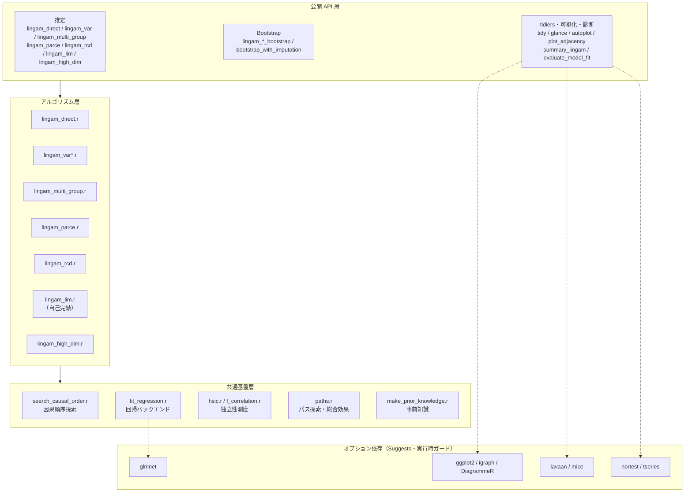
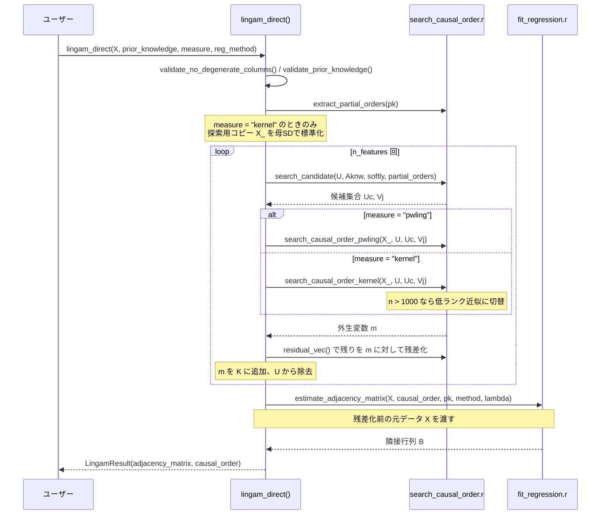

# lingamr アーキテクチャ

対象バージョン: 0.1.2（CRAN 公開済み）

このドキュメントは lingamr の内部構造を、新規コントリビュータと AI エージェントの双方が
コードを網羅的に読まずに把握できるようにまとめたもの。
コードは貼らず「何をするか」と「どこにあるか」を書く。参照は関数名とリポジトリ相対パスで行い、
行番号は使わない（リファクタリングで陳腐化するため）。

---

## 1. Overview

lingamr は LiNGAM（Linear Non-Gaussian Acyclic Model）系の因果探索アルゴリズムを R に移植した
パッケージ。移植元は Python の [cdt15/lingam](https://github.com/cdt15/lingam)。
7 種のアルゴリズム（Direct / VAR / MultiGroup / BottomUpParce / RCD / LiM / HighDim）を
共通基盤の上に載せる構成になっている。

### 最重要規約: 隣接行列の向き

隣接行列 `B` は **`B[i, j]` が変数 j → 変数 i の因果係数**を表す。行が to、列が from。
この規約はパッケージ全体で一貫しており、`prior_knowledge` 行列も同じ向きに従う
（`make_prior_knowledge()` に `(from, to)` で渡したパスは `pk[to, from]` に書かれる）。
`tidy()` が `from` / `to` 列に展開するとき（`adjacency_edges()`）も、この向きを前提にしている。

### 設計思想: `LingamResult` を共通の出口とする

結果クラスは 6 種あるが、単群・非時系列・潜在交絡なしの結果は可能な限り `LingamResult`
（`adjacency_matrix` と `causal_order` の 2 フィールドのみ）に集約する。

- `lingam_high_dim()` は専用クラスを作らず `LingamResult` を返す
- `get_group_result()` は `MultiGroupLingamResult` から 1 群を切り出して `LingamResult` を合成する
- VAR 診断は `zero_lingam_result()` でダミーの `LingamResult` を作り、単群向けの
  `test_residual_normality()` をそのまま再利用する

これにより `estimate_total_effect()` / `tidy()` / `glance()` / `autoplot()` /
`summary_lingam()` といった下流 API を 1 セットで済ませている。

---

## 2. Architecture Diagram



破線は「Suggests + `requireNamespace()` ガード」の関係。Imports は最小限に抑えられている
（詳細は 9 章）。

---

## 3. 共通基盤層

このレイヤの関数はすべて内部関数（`@keywords internal`、export なし）。
複数アルゴリズムから共有されるため、ここを変更すると影響範囲が広い。

### 3.1 因果順序探索 — `R/search_causal_order.r`

| 関数 | 役割 |
|------|------|
| `extract_partial_orders()` | 事前知識行列から `(from, to)` 対の行列を生成。双方向指定の矛盾はエラー |
| `search_candidate()` | 事前知識を反映した候補集合 `Uc` と soft 適用時の集合 `Vj` を返す |
| `search_causal_order_pwling()` | ペアワイズ尤度による外生変数の選出 |
| `search_causal_order_kernel()` | カーネル相互情報量による外生変数の選出 |
| `residual_vec()` | 単回帰残差。選ばれた外生変数で残りを残差化する |
| `entropy_approx()` | 最大エントロピー近似（pwling の目的関数の部品） |

`search_candidate()` は `lingam_multi_group()` からも共有される。ParceLiNGAM だけは
別ロジックの `parce_search_candidate()` を持つ。

**pwling の最適化**: `search_causal_order_pwling()` は全列を一括標準化してエントロピーを事前計算し、
相関行列を BLAS で一括計算する。残差 SD は解析的に求まるため回帰を回さない。
さらに相互情報量差の反対称性を利用し、両方が候補である対は片側だけ計算して双方に加算する。
相互情報量差の計算はこの最適化のためループ内にインライン展開されている
（独立した関数としては存在しない）。

**kernel 経路の低ランク切替**: 定数 `KERNEL_LOWRANK_MAX_N`（= 1000L）を閾値に、
`search_causal_order_kernel()` が `use_lowrank <- n > KERNEL_LOWRANK_MAX_N` を判定する。

| | n <= 1000（正確計算） | n > 1000（低ランク近似） |
|---|---|---|
| prepare | `kernel_mi_prepare()` | `kernel_mi_prepare_lowrank()` |
| core | `kernel_mi_core()` | `kernel_mi_core_lowrank()` |
| パラメータ | kappa = 2e-2, sigma = 1.0 | kappa = 2e-3, sigma = 0.5 |

低ランク版は `incomplete_cholesky_gauss()`（ピボット付き不完全 Cholesky、停止則は
「最大対角残差 <= tol」＋ rank 上限）で Gram 行列を因子化し、Woodbury 恒等式と行列式補題で
n×n の演算を d×d に落とす。rank 上限に到達した場合は warning を出す。

### 3.2 回帰バックエンド — `R/fit_regression.r`

入口は `estimate_adjacency_matrix()`。因果順序の各ターゲットについて先行変数を予測子とし、
`prior_knowledge[target, p] == 0` の予測子を除外したうえで、共通ディスパッチャ
`fit_coef_by_method(y, Xp, method, lambda, init_method)` により 4 つのバックエンドへ分岐する。
このディスパッチャは「ユーザー指定の回帰手法で y を Xp に回帰する」すべての箇所
（隣接行列推定・総合効果・Parce / RCD 変種）から共有される。引数検証は行わない
（各呼び出し元で済んでいる前提）。

| method | 実装 | glmnet |
|--------|------|--------|
| `"ols"` | `fit_ols()`（`stats::lm.fit`） | 不要 |
| `"lasso"` | `fit_lasso()` → `fit_penalized_regression(alpha = 1)` | 必要 |
| `"adaptive_lasso"`（既定） | `fit_adaptive_lasso()`（初期推定 → penalty.factor → LASSO の 3 段階） | 必要 |
| `"ridge"` | `fit_ridge_reg()` → `fit_penalized_regression(alpha = 0)` | 必要 |

例外は `estimate_all_total_effects()`（`R/estimate_total_effect.r`）で、OLS のときだけ
共分散ベースの一括計算経路に事前分岐し、非 OLS のみ `fit_coef_by_method()` を通る。

glmnet は Suggests なので `check_glmnet_available()` が実行時に検査する。
`reg_method = "ols"` なら glmnet なしで完結する。

このファイルには非自明な補正が 2 つある。どちらも消すと結果が壊れるので注意。

- **`lambda_scale_factor()`** — glmnet の `standardize = TRUE` は予測子しか標準化しない。
  固定の絶対 lambda グリッドをそのまま使うと、データ全体を定数倍しただけで選択されるエッジが変わる。
  レスポンスの母 SD を掛けてスケール不変性を担保している。
- **`fit_ols_ic_pruned()`** — glmnet は 2 列以上の予測子を要求するため、予測子が 1 本のときは
  OLS に落ちる。しかし素の OLS は厳密なゼロを出さない。因果順序の 2 番目の変数は必ず
  予測子 1 本になるので、これがないと独立データでも偽のエッジが残る。
  切片のみモデルとの情報量規準比較で改善しなければ係数を 0 にする。

補助として `ic_glmnet()`（lambda パスに対する AICc / BIC 表と最良インデックス）がある。
`lambda` が `"AIC"` / `"BIC"` のときは `glmnet` 一発 + 列インデックス直接抽出で補間を回避し、
それ以外は `cv.glmnet` を使う。

### 3.3 独立性測度 — `R/hsic.r` / `R/f_correlation.r`

どちらも **Direct LiNGAM 本体からは呼ばれない**。BottomUpParceLiNGAM と RCD 専用。

- `R/hsic.r`: `hsic_kernel_width()`（メディアンヒューリスティック、O(n^2) を抑えるため先頭 100 点のみ使用）、
  `hsic_gram_matrix()`、`hsic_test_gamma()`（ガンマ近似の独立性検定）。
  `hsic_test_gamma()` は `n < 6` でエラーにする。分散推定量が `(n-1)(n-2)(n-3)` で割るため、
  小標本で NaN の p 値が下流に伝播するのを防ぐため。定数入力は `list(stat = 0, p = 1)` を返す。
- `R/f_correlation.r`: `f_correlation()`（Bach & Jordan のカーネル正準相関）、
  `incomplete_cholesky_fcorr()`、`fcorr_svd_transform()`。

`incomplete_cholesky_fcorr()` は `incomplete_cholesky_gauss()` と**意図的に別実装**にしてある。
停止則が違い（前者は「残り対角残差の総和 <= tol」で rank 上限なし、後者は「最大対角残差 <= tol」＋
rank 上限）、ランクが変われば `f_correlation()` の数値が変わって上流 Python 実装と乖離するため。
共通化してはいけない。ファイル冒頭のコメントにも明記されている。

`f_correlation()` の低ランク切替も `search_causal_order.r` の定数 `KERNEL_LOWRANK_MAX_N` を
共有しており、閾値と kappa / sigma の組は kernel 経路と常に一致する。

### 3.4 パス探索 — `R/paths.r`

- `find_all_paths()` — DFS による全経路列挙。NA を 0 に、`|B| <= min_causal_effect` を 0 に
  落としてから探索する。再帰内で結果を貯めるため `new.env(parent = emptyenv())` を使う
- `calculate_total_effect()` — 経路効果（係数の積）の総和。経路がなければ 0

Direct LiNGAM 本体からは呼ばれず、Bootstrap 群と VAR の総合効果計算の共通基盤になっている。

### 3.5 事前知識 — `R/make_prior_knowledge.r`

`make_prior_knowledge()` は全要素 `-1L`（unknown）の行列を作り、次の順に上書きする。
**適用順序が意味を持つ**（後段が前段を上書きする）。

```
no_paths (= 0)  →  paths (= 1)  →  sink_variables (列全体を 0)
                →  exogenous_variables (行全体を 0)  →  対角を -1L
```

変数は名前（`labels` 指定時）でもインデックスでも渡せる。生成された行列は
`lingam_direct()` / `lingam_multi_group()` / `lingam_parce()` と各 Bootstrap の
`prior_knowledge` 引数に渡され、`validate_prior_knowledge()` で `-1` が `NA` に変換される。

### 3.6 `R/lingam_direct.r` 内の横断ユーティリティ

Direct LiNGAM のファイルに置かれているが、実際にはパッケージ全体で使われる。
ファイル名から所在が推測しにくいので注意。

| 関数 | 用途 | 主な利用側 |
|------|------|-----------|
| `validate_lingam_result()` | `LingamResult` かどうかの検査 | estimate_total_effect / summary_lingam / get_error_independence_p_values |
| `sd_pop()` | 母標準偏差（n 除算） | fit_regression / f_correlation / search_causal_order / lingam_high_dim |
| `validate_no_degenerate_columns()` | 定数列・完全共線列の拒否（QR ランク判定） | lingam_direct / lingam_bootstrap |
| `validate_prior_knowledge()` | 形状・値域検証と `-1` → `NA` 変換 | lingam_direct / lingam_bootstrap |
| `get_var_names()` | colnames が NULL なら `x0, x1, ...` にフォールバック | autoplot / tidiers / summary_lingam ほか |

---

## 4. Direct LiNGAM のコールパス



要点は 2 つ。

1. 因果順序探索は残差化を繰り返しながら進むが、**隣接行列の推定は残差化前の元データ `X`** に対して
   行う。探索用のコピー（`measure = "kernel"` のときは標準化済み）と推定用のデータは別物。
2. `LingamResult` のフィールドは `adjacency_matrix` と `causal_order` の 2 つだけ。
   残差やモデル選択情報は保持しない。必要になったら `lingam_residuals()`
   （`R/get_error_independence_p_values.r`）で再計算する。

---

## 5. アルゴリズム層

| アルゴリズム | メイン関数 | S3 クラス | 主要フィールド | 再利用する共通基盤 | Bootstrap |
|---|---|---|---|---|---|
| Direct LiNGAM | `lingam_direct()` | `LingamResult` | `adjacency_matrix`, `causal_order` | search_causal_order, fit_regression | あり |
| VAR-LiNGAM | `lingam_var()` | `VARLiNGAMResult` | `adjacency_matrices`（3 次元配列 `(lags+1) x p x p`、第 1 軸が `lag0`…）, `causal_order`, `residuals`, `lags` | `lingam_direct()` を VAR 残差に適用。剪定で `fit_adaptive_lasso()` | あり |
| MultiGroup | `lingam_multi_group()` | `MultiGroupLingamResult` | `adjacency_matrices`（群名付き **list**）, `causal_order`（全群共通） | search_causal_order 全般 + `estimate_adjacency_matrix()` | あり |
| BottomUpParce | `lingam_parce()` | `ParceLingamResult` | `adjacency_matrix`（NA あり）, `causal_order`（**list**）, `p_values`, `independence` | `extract_partial_orders()`, hsic / f_correlation, fit_* 各関数 | あり |
| RCD | `lingam_rcd()` | `RCDResult` | `adjacency_matrix`（NA あり）, `ancestors_list`。**`causal_order` を持たない** | hsic（低レベル API も）, f_correlation, `shapiro_subsample()` | あり |
| LiM | `lingam_lim()` | `LiMResult` | `adjacency_matrix`, `causal_order`, `is_continuous` | **なし（完全自己完結）** | なし |
| HighDim | `lingam_high_dim()` | **`LingamResult`** | `adjacency_matrix`, `causal_order` | 独自の因果順序探索 + n > p なら `estimate_adjacency_matrix()` | なし |

### 各アルゴリズムの特記事項

**VAR-LiNGAM** (`R/lingam_var.r` ほか 3 ファイル)
`build_lag_matrix()` → `select_var_lag()`（BIC / AIC / HQIC / FPE）→ `fit_var_ols()` で VAR を当てはめ、
その残差に `lingam_direct()` を適用して同時点構造 B0 と因果順序を得る。
`prune = TRUE` のとき `prune_var_lingam()` が `fit_adaptive_lasso()` で剪定する。
診断は `R/lingam_var_diagnostics.r`（`check_var_stationarity()`、残差正規性検定、QQ プロット）、
総合効果は `R/lingam_var_total_effect.r`（`estimate_var_total_effect()`）に分離されている。

**MultiGroup** (`R/lingam_multi_group.r`)
共通基盤を最も密に使う。`search_causal_order_pwling_multi()`（このファイルに定義）が
`entropy_approx()` を使って群ごとの pwling 目的関数をサンプルサイズ重み付き和にする。
隣接行列は群ごとに `estimate_adjacency_matrix()` を呼んで得る。

**BottomUpParce** (`R/lingam_parce.r`)
下流からシンク変数を剥がしていく方式（`parce_search_causal_order()`）。
`causal_order` が list なのは、**先頭要素が未解決ブロック（複数変数）** で、
以降が下流から確定した単一変数だから。隣接行列は `estimate_adjacency_matrix()` ではなく
専用の `estimate_adjacency_matrix_parce()` で組み立てる（未解決ブロックを扱う必要があるため）。

**RCD** (`R/lingam_rcd.r`)
`extract_ancestors()` → `extract_parents()` → `extract_vars_sharing_confounders()` →
`build_adjacency_matrix_rcd()` のパイプライン。因果順序を推定せず祖先関係を直接推定するのが
他と決定的に違う点。`search_causal_order.r` は一切使わない。
`MLHSICR = TRUE` のときは `mlhsicr_regression()` が `hsic_kernel_width()` /
`hsic_gram_matrix()` を直接使って Gram 行列を事前計算する。
非ガウス性判定には `shapiro_subsample()` を使う（Shapiro-Wilk の n <= 5000 制限への対処）。

**LiM** (`R/lingam_lim.r`)
混合離散連続データ向け。共通基盤を一切使わず、`lim_loss_mixed()` / `lim_h()`（非巡回性制約）/
`lim_obj_grad()` / `lim_global_optimize()`（拡張ラグランジュ）/ `lim_bic_loss()` /
`lim_local_search()` / `lim_topological_order()` という独自スタックで `optim` を回す。
`adjacency_matrix` は `t(W)`。巡回結果になった場合 `causal_order` に NA が入る。

**HighDim** (`R/lingam_high_dim.r`)
因果順序は独自の `high_dim_causal_order()`（`calc_tau` / `calc_taus` / `get_prune_stats` / `pinv`）。
隣接行列は n > p なら `estimate_adjacency_matrix(method = "adaptive_lasso", lambda = "BIC")`、
n <= p なら `estimate_adjacency_matrix_high_dim_np()` → `predict_adaptive_lasso_cv()` に分岐し警告を出す。
`estimate_adj_mat = FALSE` のときは隣接行列が全 NA になる。

---

## 6. Bootstrap 基盤

### 6.1 共通スケルトン

`lingam_direct_bootstrap()` / `lingam_multi_group_bootstrap()` / `lingam_parce_bootstrap()` /
`lingam_rcd_bootstrap()` / `lingam_var_bootstrap()` は同一の 8 ステップを踏む。
共通部分は `R/lingam_bootstrap.r` の内部ヘルパ群に括り出されており、
各ファイルにはアルゴリズム固有の処理だけが残る。

1. 引数バリデーション: reg_method / lambda / init_method のトリオは
   `validate_reg_args()`（oracle 排他チェック込み）。本体側と二重検証になっているのは
   **意図的**で、クラスタ起動前に fail-fast させるため（RCD は reg_method を持たないので対象外）
2. `run_one(i)` クロージャの定義: リサンプリング → アルゴリズム本体 → 総合効果 →
   `list(ok = TRUE, ...)`。全体を `tryCatch` で包み、失敗は `list(ok = FALSE, iteration, message)`
3. コア数解決: `resolve_bootstrap_cores(parallel, n_cores, n_sampling)`。
   `n_cores = NULL` なら**上限 2**、`min(n_cores, available, n_sampling)`、1 なら逐次実行に降格
4. `parallel::makePSOCKcluster(n_cores)` + `on.exit(parallel::stopCluster(cl), add = TRUE)`
5. `setup_cluster_worker(cl, fun)` でワーカーを準備
6. `parallel::clusterSetRNGStream(cl, seed)`（L'Ecuyer-CMRG）
7. 失敗処理: `filter_bootstrap_failures(res_list)`（失敗を `warning()` して除外、全滅時のみ `stop()`）
8. `create_bootstrap_result()` で結果オブジェクトを構築

verbose 出力も、開始メッセージの実行モード表記は `bootstrap_mode_string()`、
完了メッセージは `bootstrap_completion_message()` を共有する
（開始メッセージ本文はアルゴリズムごとに文言が違うため各ファイルに残る）。
`filter_bootstrap_failures()` と `bootstrap_completion_message()` は
`bootstrap_with_imputation()` からも使われる。

**再現性についての設計上の仕様**: 並列ストリームは `n_cores` の数だけ分割されるため、
**`n_cores` を変えると数値結果が変わる**。逐次実行（`set.seed()` + `lapply`）とも一致しない。
これは仕様であり、各ファイルの `@details` に明記されている。

**`setup_cluster_worker()`**（`R/lingam_bootstrap.r` に定義）は、ワーカーに `.libPaths()` を伝播し、
`requireNamespace()` が通れば `library()` する。通らない場合（`devtools::load_all()` での開発時）は
関数の namespace 環境の全オブジェクトを `clusterExport()` するフォールバックに落ちる。

### 6.2 バリアント別の差分

| 関数 | リサンプリング単位 | 返すクラス | 総合効果 | `causal_orders` |
|---|---|---|---|---|
| `lingam_direct_bootstrap()` | 行の i.i.d. 復元抽出 | `BootstrapResult` | `estimate_all_total_effects()`（回帰ベース） | 保存 |
| `lingam_var_bootstrap()` | **残差ブートストラップ**（VAR 残差行を復元抽出し、推定済み AR 係数で系列を再帰生成。ブロックブートストラップではない） | `VARBootstrapResult` | `calculate_total_effect()`（パス積） | 保存 |
| `lingam_multi_group_bootstrap()` | **群ごとに独立**に行を復元抽出 | `MultiGroupBootstrapResult`（群名付き `BootstrapResult` の list） | `multi_group_total_effect_matrix()`（パス積） | 保存（全群共有の同一行列を複製） |
| `lingam_parce_bootstrap()` | 行の i.i.d. 復元抽出 | `BootstrapResult`（専用クラスなし） | `calculate_total_effect()`（パス積） | **NULL**（causal_order が list で行列化できない） |
| `lingam_rcd_bootstrap()` | 行の i.i.d. 復元抽出 | `BootstrapResult`（専用クラスなし） | `ancestors_list` の要素のみ `calculate_total_effect()` | **NULL**（RCD に causal_order がない） |
| `bootstrap_with_imputation()` | 行の復元抽出（**NA を残したまま**）。**逐次実行のみ** | `ImputationBootstrapResult` | 計算しない（常に NULL） | 保存 |

**総合効果に 2 方式ある点**は把握しておくべき差異。Direct だけが回帰ベース
（`estimate_all_total_effects()`）で、他はすべてパス積ベース（`calculate_total_effect()`）。
`R/lingam_multi_group_bootstrap.r` の `@details` がその差を明示している。

**`causal_orders` が NULL になると**、`get_causal_order_stability()` が使えない。
適用可能なのは Direct の結果、MultiGroup の個別群（`bs[[i]]`）、
`as_bootstrap_result()` を通した `ImputationBootstrapResult` の 3 経路。
`VARBootstrapResult` はクラスが違うので対象外。

VAR だけは隣接行列の形状が違う（joined 行列 `cbind(B0, B1, ..., Bp)`）ため、
専用の `get_var_probabilities()` / `get_var_paths()` を持つ。

### 6.3 多重代入つき Bootstrap — `R/bootstrap_with_imputation.r`

`imputer` と `cd_fit` を差し替え可能なフックとして受け取る設計。

- `default_imputer()` — `mice::mice(method = "norm")` + `mice::complete()`。
  上流 Python の `sklearn.impute.IterativeImputer(sample_posterior = TRUE)` の R 相当として選んだもので、
  数値は一致しない。mice は Suggests なので `check_mice_available()` が遅延チェックする
- `default_cd_fit()` — `lingam_multi_group()`。補完済みデータセット群を「グループ」とみなして
  共通因果順序を推定する、というのがこの関数の核となるアイデア

**エラー方針が二層になっている**。推定呼び出し自体の失敗（mice の収束失敗など）は `tryCatch` で
回収して当該イテレーションをスキップする。一方、フックの返り値検証
（`validate_imputer_output()` / `validate_cd_fit_output()`）は `tryCatch` の**外**にあり、
違反時は `contract_violation()` で即座に全体を abort する。
「確率的失敗」と「契約違反」を意図的に区別している。

`ImputationBootstrapResult` は次元が深い（`adjacency_matrices` が
`n_sampling x n_repeats x p x p` の 4 次元、`imputation_results` が
`n_sampling x n_repeats x n x p` の 4 次元で欠測セル位置のみ埋める）。
`as_bootstrap_result(x, aggregate = "median" / "mean")` が `n_repeats` 軸を潰して
3 次元に落とし、`resampled_indices` を行列から list に変換して `BootstrapResult` を作る。
これにより `get_probabilities()` / `get_causal_direction_counts()` /
`get_directed_acyclic_graph_counts()` / `get_causal_order_stability()` / `tidy()` に接続できる。
`total_effects` は NULL のままなので `get_total_causal_effects()` はエラーになる。

### 6.4 因果順序の安定性 — `R/causal_order_stability.r`

`get_causal_order_stability()` は `causal_orders` 行列を逆置換してランク行列を作り、次を返す。

- `rank_summary`: 変数ごとの mean / sd / median / mode ランク（mean 昇順）
- `precedence_matrix`: `P[i, j]` = i が j より上流である確率
- `stability_score`: 上三角の `mean(2 * abs(P - 0.5))`。0 がランダム、1 が完全一致

---

## 7. 潜在交絡の NA 規約

BottomUpParce と RCD は「推定不能・交絡疑い」を隣接行列の **`NA`** で表現し、
0（エッジなし）と区別する。

| アルゴリズム | 書き込み箇所 | 意味 |
|---|---|---|
| Parce | `estimate_adjacency_matrix_parce()` が未解決ブロック `blk` に対し `B[blk, blk] <- NA`（対角は 0） | このブロック内の順序が決まらなかった |
| RCD | `build_adjacency_matrix_rcd()` が `extract_vars_sharing_confounders()` の結果に対し `B[xi, C[[xi]]] <- NA` | この 2 変数は潜在交絡を共有する |

**下流での扱いが 3 通りに分かれる**ので、新しい下流機能を書くときは方針を選ぶ必要がある。

1. **パス探索**: `find_all_paths()` が冒頭で NA を 0 に落とす。NA エッジは存在しないものとして探索する
2. **Bootstrap**: NA を含む行を持つ変数を source とする総合効果を `NA_real_` にしたうえで、
   集約直前に NA を 0 化する。つまり**「NA エッジは bootstrap 確率に寄与しない（不在扱い）」**。
   `get_var_probabilities()` も同様。両 bootstrap ファイルの `@details` に明記されている
3. **総合効果の直接推定**: `estimate_total_effect_parce()` / `estimate_total_effect_rcd()` は
   交絡変数が絡む場合 warning を出して `NA_real_` を返す（0 は返さない）

`print.ParceLingamResult` / `print.RCDResult` はそれぞれ末尾に NA の意味を注記する。
`tidy.ParceLingamResult` / `tidy.RCDResult` は `include_na = TRUE` で NA 行を残す。

---

## 8. ユーザー向け API 層

### 8.1 tidiers — `R/tidiers.r`

単一のバックエンド `adjacency_edges(B, threshold, include_na)` が `B` を
`data.frame(from, to, estimate)` に展開する。0 行のときも型付きの空 data.frame を返す。
この関数は autoplot からも共有される。

- `tidy`: 8 クラス（LingamResult / LiMResult / ParceLingamResult / RCDResult /
  MultiGroupLingamResult / BootstrapResult / MultiGroupBootstrapResult / ImputationBootstrapResult）
- `glance`: 5 クラス（LingamResult / LiMResult / ParceLingamResult / RCDResult /
  MultiGroupLingamResult）。**Bootstrap 系に glance がない**のが非対称点

`tidy.BootstrapResult` は `get_causal_direction_counts()` への委譲。
`tidy.ImputationBootstrapResult` は `as_bootstrap_result()` を挟んでから委譲する。
`glance.RCDResult` は causal_order を持たない代わりに `n_confounded_pairs` を出す
（NA は双方向に立つので無向ペアとして重複除去する）。

### 8.2 可視化: 2 系統の役割分担

| | `autoplot.*()`（`R/autoplot.r`） | `plot_adjacency()`（`R/plot_adjacency.r`） |
|---|---|---|
| 出力 | ggplot オブジェクト（静的） | HTML widget（対話的） |
| 依存 | ggplot2 + igraph | DiagrammeR |
| 入力 | 結果オブジェクト | **隣接行列そのもの** |
| 用途 | RMarkdown / Quarto で安定してレンダリングしたいとき | 画面上で拡大・確認したいとき |

`autoplot` の 5 メソッドはすべて `autoplot_causal_graph()` に委譲する薄いラッパー。
レイアウトは `igraph::layout_with_sugiyama()`（階層レイアウト、上流が上）で、
孤立ノードも `vertices=` で明示的に含める。NA エッジは破線・矢印なしの灰色セグメントで描き、
双方向 NA は重複除去して 1 本にする（レイアウト計算には寄与させない）。

`plot_adjacency()` は DOT 文字列を組み立てて `DiagrammeR::grViz()` に渡す。
目玉は `true_B` 比較モードで、対角外要素を TP（緑実線）/ FP（赤実線）/ FN（橙破線、真値の係数を表示）に
3 色分類する。`debug = TRUE` で生成された DOT を確認できる。

### 8.3 診断・適合度

**`summary_lingam()`**（`R/summary_lingam.r`）は LiNGAM の 2 大仮定を一括検証する。

- 残差の独立性: `get_error_independence_p_values()` を呼び、上三角から
  `n_pairs` / `n_dependent_pairs` / `min_independence_p` を算出
- 残差の非ガウス性: `test_residual_normality()` を呼び、`n_non_gaussian` を取得

BIC / AIC のような Gaussian 尤度ベースの指標は、非ガウス性が前提のモデルなので
**意図的に含めていない**。返り値 `lingam_summary` は設定値（alpha、検定手法）も保持するので
print で条件を再現できる。

**`get_error_independence_p_values()`**（`R/get_error_independence_p_values.r`）は残差ペアの
相関検定 p 値行列を返す。同ファイルに共有ヘルパの `lingam_residuals()`（入力検証込みの残差計算）、
`skewness_pop()` / `kurtosis_pop()`、`shapiro_subsample()`（Shapiro-Wilk の n 上限に対する
決定論的サブサンプル）、そして `test_residual_normality()` と `plot_residual_qq()` が同居する。

**`evaluate_model_fit()`**（`R/evaluate_model_fit.r`）は Python の
`lingam.utils.evaluate_model_fit`（semopy 依存）の移植だが、**semopy の代わりに `lavaan::sem()`** を使う。
`extract_adjacency_matrix()` がダックタイピングで行列も結果オブジェクトも受け付けるため、
S3 メソッドではなく `adjacency_matrix` 要素を持つ任意のオブジェクトに適用できる。
NA 要素（潜在交絡）は潜在変数ではなく**残差共分散 `xi ~~ xj`** で表現する
（semopy の two-indicator latent common cause と代数的に等価）。
`is_ordinal` 指定時は WLSMV 推定になり AIC / BIC / LogLik は NA になる。
semopy と数値が一致しないことは roxygen で断っている。

**VAR 診断の再利用トリック**: `compute_varlingam_residuals()` が `e_t = (I - B0) n_t` を計算し、
`zero_lingam_result(p)` でゼロ隣接行列のダミー `LingamResult` を合成して
`test_residual_normality()` に渡す。単群向けの診断コードを VAR で再利用するためのアダプタ。

### 8.4 サンプル生成関数

命名は `generate_<用途>_sample[_<変数数>]` で、ほぼすべてが `list(data, true_adjacency, ...)` を返し
`n` と `seed` を受ける。

`R/generate_lingam_sample.r` に 5 関数と共有ヘルパ（`make_noise_fn()` / `validate_sample_args()` /
`generate_noise_matrix()` / `build_true_adjacency()`）がある。
`generate_noise_matrix()` は変数ごとに独立してシードを進めるので、変数数を変えても再現性が保たれる。

**失敗例を意図的に作る関数**があるのがこのパッケージの特徴。

- `generate_lingam_sample_6()` / `_10()` は `noise_dist` で uniform（成功）と gaussian（失敗）を切り替えられ、
  vignette の非ガウス性の章で対比に使う
- `generate_lingam_hard_sample()` — OLS 初期推定が不安定になる条件（adaptive LASSO の初期重み検証用）
- `generate_lingam_paradox_data()` — 測定誤差を注入して DirectLiNGAM が ICA-LiNGAM に負けるケース
- `generate_lingam_large_sample()` — スケーラビリティの壁を示すベンチ用

アルゴリズム別には `generate_lim_sample()` / `generate_multi_group_sample()` /
`generate_parce_sample()` / `generate_rcd_sample()` / `generate_varlingam_sample()` があり、
いずれも `R/generate_*.r` の命名規約に従って独立ファイルに置かれている。

---

## 9. 依存関係とガード方針

**Imports は最小限**: `generics` / `grDevices` / `parallel` / `stats` / `utils`。
いずれも base R 同梱かごく軽量。`Depends: R (>= 4.1.0)` はネイティブパイプ `|>` を使うため。

**それ以外はすべて Suggests + 実行時ガード**。

| パッケージ | ガードするファイル | 用途 |
|---|---|---|
| glmnet | `R/fit_regression.r`, `R/lingam_high_dim.r` | lasso / ridge / adaptive lasso |
| ggplot2 | `R/autoplot.r`, `R/get_error_independence_p_values.r` | autoplot、QQ プロット |
| igraph | `R/autoplot.r` | Sugiyama レイアウト |
| DiagrammeR | `R/plot_adjacency.r`, `R/lingam_bootstrap.r` | 対話的 DAG |
| lavaan | `R/evaluate_model_fit.r`（`check_lavaan_available()`） | SEM 適合度 |
| mice | `R/bootstrap_with_imputation.r`（`check_mice_available()`）, `R/tidiers.r` | 多重代入 |
| nortest / tseries | `R/get_error_independence_p_values.r` | 正規性検定の method 別 |
| igraph / pcalg | vignette | 比較用 |

ガードは `requireNamespace()` → `stop("Package 'X' is required...", call. = FALSE)` の形に統一されている。

`autoplot` は `@exportS3Method ggplot2::autoplot` による遅延登録を使うため、
**ggplot2 が未インストールでもパッケージ自体はロードできる**。
examples は `\donttest{}` + `requireNamespace` の二重ガードにしてある。

---

## 10. Testing / CI

### テスト構成

`tests/testthat/` に 24 ファイル（testthat edition 3）。エントリポイントは
`tests/testthat.R` と `tests/spelling.R`。`helper-*.R` は置かず、各ファイルが
`generate_*` 関数を直接呼んでフィクスチャを作る。

構成の軸は「アルゴリズム 1 つ = ファイル 1 つ」＋横断機能＋UI 層。

- アルゴリズム別: `test-lingam_direct.R`, `test-lingam_high_dim.R`, `test-lingam_lim.R`,
  `test-lingam_multi_group.R`, `test-lingam_parce.R`, `test-lingam_rcd.R`, `test-lingam_var*.R`
- 横断: `test-bootstrap.R`, `test-bootstrap_with_imputation.R`, `test-causal_order_stability.R`,
  `test-total_effects.R`, `test-residual_diagnostics.R`, `test-summary_lingam.R`,
  `test-evaluate_model_fit.R`, `test-prior_knowledge.R`, `test-hsic.R`
- UI 層: `test-tidiers.R`, `test-autoplot.R`, `test-plot_adjacency.R`, `test-generate_samples.R`

### 数値回帰の検出方針

`_snaps/` は使わない。**期待値をテストコード内に直書きする手動 golden 方式**を採る。
明示的な golden test は `test-lingam_var_snapshot.R` の 1 本で、
`expected_order` / `expected_B0` / `expected_B1` をハードコードし `tolerance = 1e-6` で比較する。

それ以外は「真の生成係数に対する緩い許容誤差」方式（`tolerance = 0.1` 〜 `1.0`）。
数値的恒等性の確認（パス積の手計算との一致など）だけ `1e-8` を使う、という使い分け。
`test-lingam_var_total_effect.R` には許容誤差を緩めた根拠がコメントで残されている。
新しいテストを書くときもこの方針を踏襲すること。

### skip の使い方

`skip_if_not_installed()` が 41 箇所・12 ファイルにあり、Suggests の各パッケージに正確に対応する
（ggplot2 9 / DiagrammeR 8 / glmnet 7 / igraph 7 / mice 7 / lavaan 1 / nortest 1 / tseries 1）。
重い bootstrap・HSIC 系には `skip_on_cran()` を 10 箇所置いている。

### CI

- `.github/workflows/R-CMD-check.yaml` — Ubuntu（devel / release / oldrel-1）・Windows・macOS
- `.github/workflows/pkgdown.yaml` — main / master への push またはリリース時に gh-pages へデプロイ

`_pkgdown.yml` の reference は 12 セクション。アルゴリズム単位でグルーピングし、
そのアルゴリズムに紐づく `estimate_total_effect_*` / `get_error_independence_p_values_*` を
同じセクションに置く方針。後半の 3 セクションは `starts_with("generate_")` /
`starts_with("tidy.")` のパターン指定なので、**命名規約を守る限り新規関数が自動的に載る**。

---

## 11. Code References

| コンポーネント | ファイル | 主要シンボル |
|---|---|---|
| Direct LiNGAM 本体 | `R/lingam_direct.r` | `lingam_direct()`, `print.LingamResult()` |
| 横断ユーティリティ | `R/lingam_direct.r` | `validate_lingam_result()`, `sd_pop()`, `validate_no_degenerate_columns()`, `validate_prior_knowledge()`, `get_var_names()` |
| 因果順序探索 | `R/search_causal_order.r` | `KERNEL_LOWRANK_MAX_N`（f_correlation と共有）, `extract_partial_orders()`, `search_candidate()`, `search_causal_order_pwling()`, `search_causal_order_kernel()`, `residual_vec()`, `entropy_approx()`, `kernel_mi_prepare()`, `kernel_mi_core()`, `kernel_mi_prepare_lowrank()`, `kernel_mi_core_lowrank()`, `incomplete_cholesky_gauss()` |
| 回帰バックエンド | `R/fit_regression.r` | `estimate_adjacency_matrix()`, `fit_coef_by_method()`, `fit_ols()`, `fit_lasso()`, `fit_adaptive_lasso()`, `fit_ridge_reg()`, `fit_penalized_regression()`, `fit_ols_ic_pruned()`, `lambda_scale_factor()`, `ic_glmnet()`, `check_glmnet_available()` |
| HSIC | `R/hsic.r` | `hsic_kernel_width()`, `hsic_gram_matrix()`, `hsic_test_gamma()` |
| f-correlation | `R/f_correlation.r` | `f_correlation()`, `incomplete_cholesky_fcorr()`, `fcorr_svd_transform()` |
| パス探索 | `R/paths.r` | `find_all_paths()`, `calculate_total_effect()` |
| 事前知識 | `R/make_prior_knowledge.r` | `make_prior_knowledge()` |
| VAR-LiNGAM | `R/lingam_var.r` | `lingam_var()`, `build_lag_matrix()`, `select_var_lag()`, `fit_var_ols()`, `prune_var_lingam()` |
| VAR 診断 | `R/lingam_var_diagnostics.r` | `check_var_stationarity()`, `compute_varlingam_residuals()`, `zero_lingam_result()`, `test_varlingam_residual_normality()`, `plot_varlingam_residual_qq()` |
| VAR 総合効果 | `R/lingam_var_total_effect.r` | `estimate_var_total_effect()`, `var_total_effect_graph()`, `roll_rows()`, `resolve_var_index()` |
| MultiGroup | `R/lingam_multi_group.r` | `lingam_multi_group()`, `search_causal_order_pwling_multi()`, `get_group_result()` |
| BottomUpParce | `R/lingam_parce.r` | `lingam_parce()`, `parce_search_causal_order()`, `parce_search_candidate()`, `parce_eval_independence()`, `estimate_adjacency_matrix_parce()`, `estimate_total_effect_parce()` |
| RCD | `R/lingam_rcd.r` | `lingam_rcd()`, `extract_ancestors()`, `extract_parents()`, `extract_vars_sharing_confounders()`, `build_adjacency_matrix_rcd()`, `mlhsicr_regression()` |
| LiM | `R/lingam_lim.r` | `lingam_lim()`, `lim_loss_mixed()`, `lim_h()`, `lim_global_optimize()`, `lim_local_search()`, `lim_topological_order()` |
| HighDim | `R/lingam_high_dim.r` | `lingam_high_dim()`, `high_dim_causal_order()`, `calc_tau()`, `calc_taus()`, `estimate_adjacency_matrix_high_dim_np()` |
| Bootstrap 基盤 | `R/lingam_bootstrap.r` | `lingam_direct_bootstrap()`, `setup_cluster_worker()`, `resolve_bootstrap_cores()`, `filter_bootstrap_failures()`, `bootstrap_mode_string()`, `bootstrap_completion_message()`, `validate_reg_args()`, `create_bootstrap_result()`, `get_probabilities()`, `get_causal_direction_counts()`, `get_directed_acyclic_graph_counts()`, `get_total_causal_effects()`, `get_paths()`, `plot_bootstrap_probabilities()` |
| VAR Bootstrap | `R/lingam_var_bootstrap.r` | `lingam_var_bootstrap()`, `create_var_bootstrap_result()`, `get_var_probabilities()`, `get_var_paths()` |
| MultiGroup Bootstrap | `R/lingam_multi_group_bootstrap.r` | `lingam_multi_group_bootstrap()`, `multi_group_total_effect_matrix()` |
| 多重代入 Bootstrap | `R/bootstrap_with_imputation.r` | `bootstrap_with_imputation()`, `as_bootstrap_result()`, `default_imputer()`, `default_cd_fit()`, `validate_imputer_output()`, `contract_violation()` |
| 順序安定性 | `R/causal_order_stability.r` | `get_causal_order_stability()` |
| 総合効果 | `R/estimate_total_effect.r` | `estimate_total_effect()`, `estimate_all_total_effects()` |
| 残差診断 | `R/get_error_independence_p_values.r` | `get_error_independence_p_values()`, `lingam_residuals()`, `test_residual_normality()`, `shapiro_subsample()`, `plot_residual_qq()` |
| 適合度 | `R/evaluate_model_fit.r` | `evaluate_model_fit()`, `build_lavaan_model()`, `extract_adjacency_matrix()`, `check_lavaan_available()` |
| サマリー | `R/summary_lingam.r` | `summary_lingam()`, `print.lingam_summary()` |
| tidiers | `R/tidiers.r` | `adjacency_edges()`, `tidy.*()`（8 クラス）, `glance.*()`（5 クラス） |
| 静的描画 | `R/autoplot.r` | `autoplot_causal_graph()`, `autoplot.*()`（5 クラス） |
| 対話的描画 | `R/plot_adjacency.r` | `plot_adjacency()` |
| サンプル生成 | `R/generate_lingam_sample.r`, `R/generate_varlingam_sample.r` ほか | `generate_lingam_sample_6()`, `generate_lingam_paradox_data()`, `generate_varlingam_sample()`, `make_noise_fn()`, `generate_noise_matrix()` |

---

## 12. Glossary

| 用語 | 定義 |
|---|---|
| 因果順序（causal order） | 変数を上流（外生側）から下流へ並べた順列。1-based の整数ベクトル。先頭ほど上流 |
| 外生変数 | どの観測変数からも影響を受けない変数。DirectLiNGAM は各反復でこれを 1 つ選び、残りを残差化する |
| pwling | pairwise likelihood ratio。ペアワイズの尤度比で因果方向を判定する測度（`measure = "pwling"`） |
| HSIC | Hilbert-Schmidt Independence Criterion。カーネルベースの独立性尺度。計算量 O(n^2) |
| f-correlation | Bach & Jordan (2002) のカーネル正準相関。値が大きいほど従属 |
| adaptive LASSO の初期重み | penalty.factor を「初期係数の絶対値の gamma 乗の逆数」で作るための初期推定量。`init_method` で OLS / ridge を選ぶ |
| 未解決ブロック | ParceLiNGAM が順序を決められなかった変数集合。`causal_order` の先頭要素として list に入り、隣接行列では NA になる |
| joined 行列 | VAR-LiNGAM の `cbind(B0, B1, ..., Bp)`。`n_features x n_features * (1 + lags)` の横長行列 |
| 残差ブートストラップ | 観測行ではなく残差を復元抽出し、推定済み係数で系列を再生成する方式。VAR で時系列依存を壊さないために使う |
| L'Ecuyer ストリーム | `parallel::clusterSetRNGStream()` が使う並列乱数生成器。ワーカー数に応じてストリームが分割されるため、`n_cores` が変わると結果が変わる |
| golden value | 期待値をテストコード内に直書きして数値回帰を検出する方式。testthat の `expect_snapshot` は使わない |

---

## 13. Known rough edges

かつてこの章に挙げていた重複・不整合（回帰 switch の 6 箇所重複、Bootstrap 共通ブロックの
逐語コピー、低ランク閾値の二重管理、呼び出し元のない参照実装、`generate_varlingam_sample()` の
配置、`@importFrom stats` の分散宣言、`.bak` 残存）は 2026-07-27 のリファクタリングで解消した。
現在残っているのは以下のみ。

- **ファイル拡張子の混在**: `R/` 配下が `.r`（小文字、大多数）と `.R`
  （`R/lingamr-package.R` のみ）で混在している。機能影響はないため意図的に見送り
- **本体関数側の引数バリデーション**: `lingam_direct()` 等の本体側にも
  reg_method / lambda / init_method の `match.arg` トリオがあり、Bootstrap 側の
  `validate_reg_args()` とロジックが重複している。二重「検証」自体は fail-fast のための
  意図的な設計だが、本体側のコードは共通ヘルパ化していない（roxygen の choices 表記との
  兼ね合いによるスコープ判断）

---

## 付録: このドキュメントの前提

- 対象コミット時点で `R/` 配下 37 ファイル、`tests/testthat/` 24 テストファイル
- `dev/` は `.Rbuildignore` の `^dev$` によりビルド対象外。したがってこのファイルは
  R CMD check にも CRAN 提出物にも含まれない
- アルゴリズムごとの移植の経緯・仕様の詳細は `dev/*-implementation.md`（実装指示書）を参照
