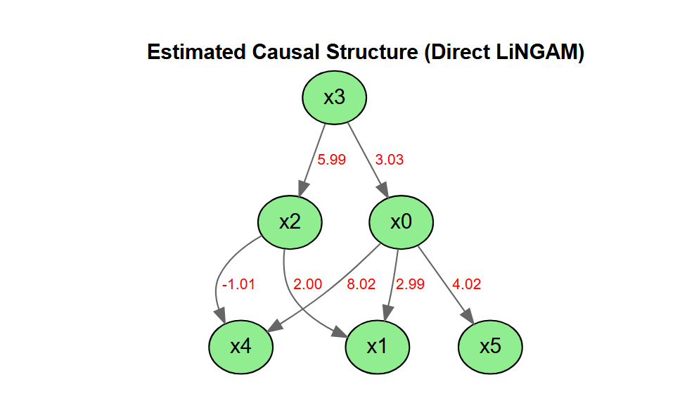

# lingamr

LiNGAM is a method for estimating structural equation models or linear
Bayesian networks. It is based on using the non-Gaussianity of the data.

`lingamr` is a port to R of the
[LiNGAM](https://github.com/cdt15/lingam) package (LiNGAM: Linear
Non-Gaussian Acyclic Model), which is available in Python.

- [The LiNGAM Project](https://sites.google.com/view/sshimizu06/lingam)
- [lingam (Python)](https://github.com/cdt15/lingam)

This is currently an alpha version under development, and we are
releasing it for the purpose of testing and gathering feedback.

## Features

- Implementation of the Direct LiNGAM algorithm
- Stability assessment of causal structures using the bootstrap method,
  including causal-order stability
- Model diagnostics: residual independence / normality tests and a
  one-call
  [`summary_lingam()`](https://morimotoosamu.github.io/lingamr/reference/summary_lingam.md)
- Visualization with DiagrammeR (interactive) and ggplot2 `autoplot()`
  (static)
- broom-style tidiers
  ([`tidy()`](https://generics.r-lib.org/reference/tidy.html) /
  [`glance()`](https://generics.r-lib.org/reference/glance.html))

This package does not include all the features of the Python version,
and it also includes some features that are not present in the Python
version.

## Installation

You can install the development version of `lingamr` from
[GitHub](https://github.com/morimotoosamu/lingamr) with:

``` r

# install.packages("pak")
pak::pak("morimotoosamu/lingamr")
```

Some functionality relies on the following suggested packages:
`DiagrammeR` (interactive plots), `igraph` and `ggplot2` (static
`autoplot()` graphs and QQ plots), `glmnet` (adaptive LASSO), and
`nortest` / `tseries` (residual tests).

## Quick start

``` r

library(lingamr)

# Generate sample data from a 6-variable LiNGAM model
x <- generate_lingam_sample_6(n = 1000)

# Estimate the causal structure with Direct LiNGAM
model <- lingam_direct(x$data)

# Estimated causal order (as variable names)
colnames(x$data)[model$causal_order]
#> [1] "x3" "x2" "x0" "x4" "x5" "x1"
```

``` r

# Visualize the estimated causal graph
model$adjacency_matrix |>
  plot_adjacency(
    labels    = colnames(model$adjacency_matrix),
    title     = "Estimated Causal Structure (Direct LiNGAM)",
    rankdir   = "TB",
    shape     = "ellipse",
    fillcolor = "lightgreen"
  )
```



## Learn more

For a full walkthrough — prior knowledge, total causal effects, residual
independence and normality tests, and bootstrap (including parallel
execution) — see the vignette:

``` r

vignette("lingamr")
```

It is also available online at the [package
website](https://morimotoosamu.github.io/lingamr/).

## Licence

MIT License

Original work: Copyright (c) 2019 T.Ikeuchi, G.Haraoka, M.Ide,
W.Kurebayashi, S.Shimizu

Portions of this work: Copyright (c) 2026 O.Morimoto

## References

### Algorithm

- Shimizu, S. et al. (2011). DirectLiNGAM: A direct method for learning
  a linear non-Gaussian structural equation model. *Journal of Machine
  Learning Research*, 12, 1225-1248.

### Original Implementation (Python)

- Ikeuchi, T. et al. (2023). Python package for LiNGAM algorithms.
  *Journal of Machine Learning Research*, 24(14), 1-7.
  <https://github.com/cdt15/lingam>

### Books

- 清水昌平(2017)『統計的因果探索』講談社.
- 梅津佑太・西村龍映・上田勇祐(2020)『スパース回帰分析とパターン認識』講談社.
- 鈴木譲(2025)『グラフィカルモデルと因果探索100問 with R』共立出版.

### R Packages Referenced

- G. Kikuchi (2020). rlingam <https://github.com/gkikuchi/rlingam>

## Feedback

Please submit bug reports and feature requests via GitHub Issues.
